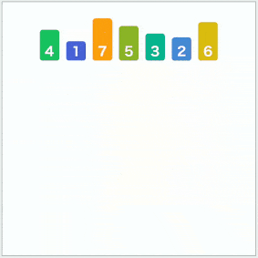
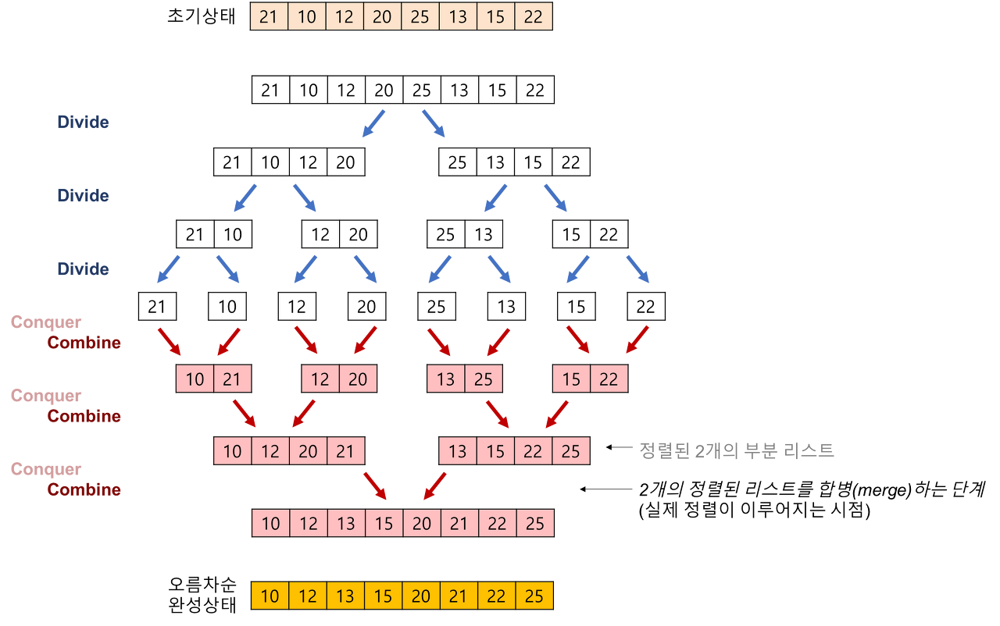

# Merge Sort를 재귀를 사용하지 않고 구현할 수 있을까요? (지정 질문)





### 언제 반복문을 사용할까?

1️⃣ 스택 오버플로우 방지
재귀 Merge Sort는 분할할 때마다 함수 호출이 계속 쌓여.
호출 깊이: O(log n)
n이 매우 클 경우 → 스택 메모리 초과 가능성
특히:
임베디드 환경
JVM 스택 크기 제한
온라인 저지에서 재귀 제한
이런 환경에서는 반복문 방식이 더 안전함.
2️⃣ 함수 호출 오버헤드 제거 (성능 미세 개선)
재귀는 매번:
스택 프레임 생성
매개변수 복사
복귀 주소 저장
이게 누적되면 상수 시간 오버헤드가 생김.
복잡도는 동일하게:
코드 복사

O(n log n)
이지만,
실무에서는 Iterative 방식이 조금 더 빠른 경우가 많음.
3️⃣ 메모리 사용을 더 명확하게 제어 가능
Top-Down(재귀) 방식:
코드 복사

divide → 재귀 호출 → merge
Bottom-Up(반복) 방식:
코드 복사

size = 1
size = 2
size = 4
size = 8 ...
이렇게 블록 크기를 2배씩 늘려가며 병합함.
👉 반복 방식은:
추가 배열을 한 번만 생성
호출 스택 없이
메모리 흐름이 예측 가능
즉, 캐시 친화적 구현이 가능
4️⃣ 실제 라이브러리 구현은 대부분 반복 기반
예를 들어:
Java의 Arrays.sort() (객체 정렬)
Python의 Timsort
C++ STL stable_sort
👉 내부적으로 Bottom-Up 또는 Hybrid 방식을 사용함.
이유:
안정성 유지
스택 문제 없음
성능 최적화에 유리
📌 비교 정리
항목
재귀 Merge Sort
반복 Merge Sort
구현 난이도
쉬움
조금 더 복잡
스택 사용
O(log n)
없음
스택 오버플로우 위험
있음
없음
함수 호출 오버헤드
있음
없음
실무 사용
거의 안씀
많이 사용
💡 언제 재귀를 쓰는 게 좋음?
알고리즘 이해/학습용
코드 가독성 중요
데이터 크기 작음
💡 언제 반복을 쓰는 게 좋음?
대용량 데이터
라이브러리 구현
성능 최적화
스택 제한 환경

### 왜 2? 

# ✅ Merge Sort를 재귀 없이 구현할 수 있을까?

## ✔ 가능하다.

재귀를 사용하지 않는 병합 정렬을

> **Bottom-Up Merge Sort (상향식 병합 정렬)**

또는

**Iterative Merge Sort (반복적 병합 정렬)**

이라고 한다.

---

# 📌 1. Top-Down vs Bottom-Up 차이

| 구분 | Top-Down 방식 | Bottom-Up 방식 |
| --- | --- | --- |
| 구현 방식 | 재귀(Recursion) | 반복문(Iteration) |
| 동작 방향 | 큰 문제 → 작은 문제로 분할 | 작은 문제 → 큰 문제로 병합 |
| 스택 사용 | Call Stack 사용 | 스택 사용 X |
| 시간 복잡도 | O(n log n) | O(n log n) |
| 공간 복잡도 | O(n) | O(n) |

---

# 📌 2. Bottom-Up Merge Sort 동작 원리

### 🔹 핵심 아이디어

재귀 방식이 배열을 반으로 계속 쪼갠 후(Top-down) 합친다면 반복 방식은 반대!

1. **크기 1**의 부분 배열(subarray)들을 정렬된 상태로 보고인접한 것끼리 병합하여 크기 2의 정렬된 배열을 만듭니다.

1. **크기 2**의 정렬된 배열들을 인접한 것끼리 병합하여 크기 4의 정렬된 배열을 만듭니다.

1. 이 과정을 전체 배열 크기에 도달할 때까지 **2배씩 증가**시키며 병합을 반복합니다.

길이 1짜리 배열은 이미 정렬되어 있다고 가정하고 시작한다.

---

## 단계별 진행

### ① 크기 1 → 크기 2

```plain text
[5] [2] [9] [1] [5] [6]
→
[2 5] [1 9] [5 6]
```

---

### ② 크기 2 → 크기 4

```plain text
[2 5] [1 9]
→
[1 2 5 9]
```

---

### ③ 전체 크기까지 반복

```plain text
[1 2 5 9] [5 6]
→
[1 2 5 5 6 9]
```

---

## 🔹 반복 구조 핵심

- 부분 배열 크기(size)를

`1 → 2 → 4 → 8 → ...`

이렇게 2배씩 증가시키면서 병합

---

# 📌 3. 코드 구조 핵심 부분

```plain text
for (intsize=1;size<n;size*=2) {
for (intleft=0;left<n-size;left+=2*size) {
intmid=left+size-1;
intright=Math.min(left+2*size-1,n-1);
merge(a,temp,left,mid,right);
    }
}
```

### ✔ 바깥 루프

- 부분 배열의 크기를 2배씩 증가

### ✔ 안쪽 루프

- 인접한 두 부분 배열을 병합

---

# 📌 4. 시간 / 공간 복잡도

## ⏱ 시간 복잡도

- 병합 단계: O(n)

- 단계 수: log n

👉 **O(n log n)**

(재귀 버전과 동일)

---

## 💾 공간 복잡도

- 병합용 임시 배열 필요

👉 **O(n)**

---

# 📌 5. 장점

✅ 재귀 스택 사용하지 않음

✅ Stack Overflow 위험 없음

✅ 구현이 명확하고 반복 구조라 디버깅 쉬움

---

# 🎯 한 줄 정리

> Merge Sort는 재귀 없이 반복문만으로 구현할 수 있으며, 이를 Bottom-Up Merge Sort라고 한다.

부분 배열 크기를 1부터 시작하여 2배씩 증가시키며 병합을 반복한다.

시간 복잡도는 O(n log n), 공간 복잡도는 O(n)으로 재귀 방식과 동일하다.

```java
public class NonRecursiveMergeSort {
    public static void sort(int[] a) {
        int n = a.length;
        int[] temp = new int[n]; // 병합용 임시 배열

        // 부분 배열 크기를 1, 2, 4..., n/2로 증가
        for (int size = 1; size < n; size *= 2) {
            // 인접한 두 부분 배열을 병합
            for (int left = 0; left < n - size; left += 2 * size) {
                int mid = left + size - 1;
                int right = Math.min(left + 2 * size - 1, n - 1);
                merge(a, temp, left, mid, right);
            }
        }
    }

    private static void merge(int[] a, int[] temp, int left, int mid, int right) {
        int i = left, j = mid + 1, k = left;

        while (i <= mid && j <= right) {
            if (a[i] <= a[j]) temp[k++] = a[i++];
            else temp[k++] = a[j++];
        }

        while (i <= mid) temp[k++] = a[i++];
        while (j <= right) temp[k++] = a[j++];

        // 정렬된 부분 배열을 원본 배열에 복사
        for (int l = left; l <= right; l++) {
            a[l] = temp[l];
        }
    }

    public static void main(String[] args) {
        int[] arr = {5, 2, 9, 1, 5, 6};
        sort(arr);
        for (int val : arr) System.out.print(val + " "); // 출력: 1 2 5 5 6 9
    }
}

```
