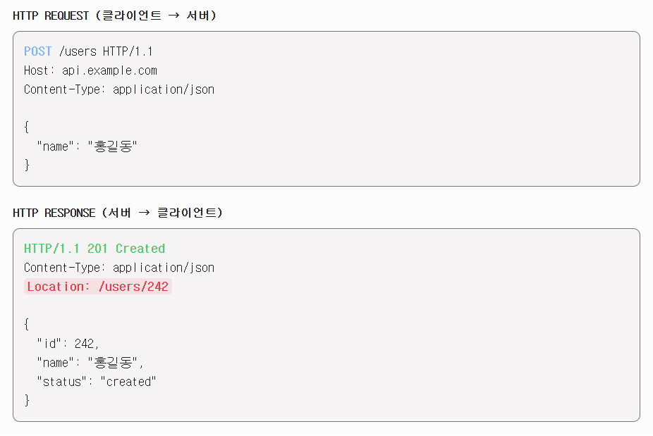

# 2-2. 200 (ok) 와 201 (created) 의 차이에 대해 설명해 주세요.

> 💡 

## 먼저 알아두어야 할 필수 용어 사전

  - **클라이언트 (Client):** 요청을 보내는 쪽입니다. (예: 웹 브라우저, 스마트폰 앱)

  - **서버 (Server):** 요청을 받아서 처리하고 응답을 돌려주는 쪽입니다.

  - **HTTP 상태 코드 (HTTP Status Code):** 클라이언트가 보낸 요청을 서버가 어떻게 처리했는지 알려주는 **3자리 숫자**입니다. (예: 200, 404, 500)

    - `2xx`: 성공 (Success)

    - `4xx`: 클라이언트 에러 (Client Error - 잘못된 요청)

    - `5xx`: 서버 에러 (Server Error - 서버 내부 문제)

  - **리소스 (Resource):** 서버가 관리하는 '데이터의 단위' 또는 '객체'입니다. (예: 회원 정보, 게시글 1개, 이미지 파일 등)

  - **응답 본문 (Response Body):** 서버가 상태 코드와 함께 클라이언트에게 실제로 보내주는 데이터 내용입니다. (주로 JSON 형식으로 보냅니다.)

  - **헤더 (Header):** 요청이나 응답에 대한 '메타 데이터(부가 정보)'가 담긴 편지봉투 같은 곳입니다. (예: 데이터의 길이, 타입 등)

## 🔹 2-2. 200 (OK) 와 201 (Created) 의 차이점

- 공통점

  - 요청이 성공적으로 처리됨

- 차이점

  - 성공의 **결과**가 무엇인가

### ✅ 200 (OK): "요청 성공" (일반적인 성공)

- **의미:** 클라이언트가 요청한 동작을 서버가 **에러 없이 무사히 수행**

- **언제 사용하나요?**

  - **조회 (GET):** 게시글 목록을 달라고 했을 때, 목록을 성공적으로 반환한 경우.

  - **수정 (PUT / PATCH):** 내 프로필 이름을 성공적으로 변경한 경우.

  - **삭제 (DELETE):** 특정 댓글을 성공적으로 삭제한 경우.

- **특징:** 가장 흔하게 볼 수 있는 기본적이고 포괄적인 성공 코드

### ✨ 201 (Created): "요청 성공 + 새로운 데이터 생성됨"

- **의미:** 클라이언트의 요청이 성공적으로 처리되었으며, 서버에 **'새로운 리소스(데이터)'가 확실하게 만들어졌음**을 의미

- **언제 사용하나요?**

  - **생성 (POST):** 클라이언트가 회원가입을 요청해서 **새로운 회원 데이터**가 DB에 만들어진 경우.

  - **생성 (POST):** 사용자가 글쓰기 버튼을 눌러 **새로운 게시글**이 등록된 경우.

- **특징:** 201 응답을 보낼 때는, 새로 만들어진 데이터가 어디에 있는지 알려주기 위해 응답 헤더(Header)의 **`Location`** 이라는 항목에 새로 생성된 리소스의 주소(URI)를 담아서 보내주는 것이 표준 규칙입니다.

### 💡 보너스 지식: 요즘은 숫자 대신 '이것'도 많이 씁니다!

과거에는 방금 말씀하신 `456`처럼 1, 2, 3 순서대로 늘어나는 숫자(Auto Increment)를 PK로 가장 많이 썼습니다. 하지만 최근 규모가 큰 서비스에서는 숫자가 아닌 다음과 같은 형태도 많이 봅니다.

- **UUID 방식:** `Location: /posts/123e4567-e89b-12d3-a456-426614174000`

- **왜 쓸까요?** 숫자를 1번부터 쓰면 경쟁사나 해커가 "아, 이 사이트는 하루에 글이 100개쯤 올라오는구나" 하고 시스템의 규모나 정보를 쉽게 유추할 수 있습니다. 이를 막고 보안을 높이기 위해 DB에서 절대 겹치지 않는 무작위 문자열(UUID 등)을 PK로 발급하게 만드는 추세입니다.

### 📊 한눈에 보는 비교 표

| **구분** | **200 (OK)** | **201 (Created)** |
| --- | --- | --- |
| **핵심 의미** | "요청을 성공적으로 처리했음" | "요청 성공 + **새로운 데이터가 만들어졌음**" |
| **주로 쓰이는 메서드** | `GET`, `PUT`, `PATCH`, `DELETE` | 주로 `POST` (생성 요청) |
| **결과물** | 요청한 데이터 또는 처리 완료 메시지 반환 | 새로 생성된 데이터 정보 + `Location` 헤더 반환 |
