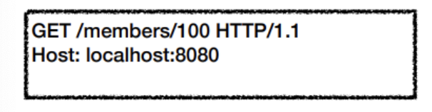
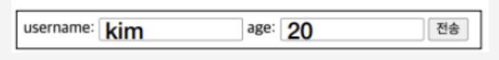
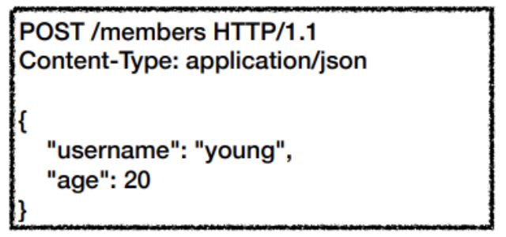
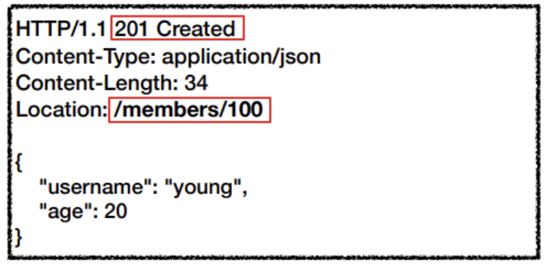
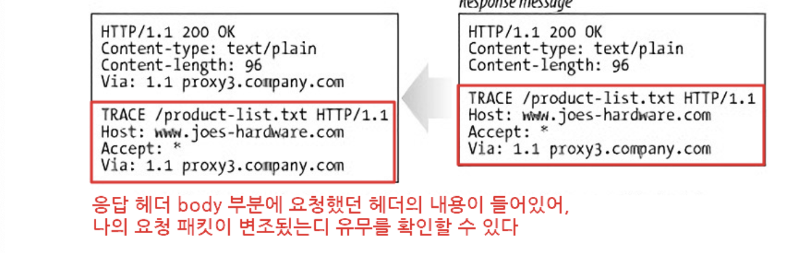

# 3-0. HTTP Method에 대해 설명해주세요.

## 1. HTTP Method란?

클라이언트 - 서버 구조에서 요청(`request`)과 응답(`response`)이 이루어지는 방식을 의미하며,

서버가 수행해야 할 동작을 지정해 요청을 보내는 방법

HTTP Method는 단순히 데이터를 조회/생성하는 명령어가 아니라,

> 클라이언트가 서버에게 "이 리소스에 대해 어떤 행위를 수행할 것인지"를 표현하는 규약

사용하는 이유 : 리소스와 동작을 분리하기 위해

→ 서버가 수행해야 할 동작을 Http Method를 통해 지정하면, URI는 리소스만 식별하면 되기 때문

즉, REST 에서는

```javascript
/users/create
/users/delete
/users/update

이렇게 URI에 동작을 넣는 것이 아니라,

POST /users
DELETE /users/1
PUT /users/1

이렇게 HTTP Method로 행위를 표현한다.
```

---

## 2. HTTP Method의 종류

- 주요 메소드

  - GET : 리소스 조회

    - 정적 데이터 : 리소스 경로로 단순 조회



    - 동적 데이터 : 보통은 쿼리스트링을 통해 전달

주로 검색/목록에서 검색어로 사용하며, 쿼리 파라미터를 사용해 데이터를 전달

`key1=value1&key2=value2` 구조



→ input 태그 안의 값들이 쿼리스트링으로 서버에 전달

`?username=kim&age=20`

    - 메시지 바디를 사용해 데이터 전달도 가능하나, 서버에서 따로 구성해야 하기 때문에 지원하는 곳이 많지 않아 권장하지 않음

    - 조회 시 POST도 사용가능하지만, GET은 캐싱이 가능하여 유리

  - POST:  요청 데이터 처리, 주로 등록에 사용

메시지 바디를 통해 서버로 요청 데이터 전달 시 서버가 이를 처리하여 업데이트

    - 요청



    - 응답



  - PUT : 리소스를 대체(전체교체), 해당 리소스가 없으면 생성

주의 : 일부 리소스만 변경하기 원할 경우, 기존 데이터가 완전히 대체되므로 주의

→ PATCH 사용해야함

(예시)

```javascript
/members/100
{
	"username" : "jiwoo",
	"age" : 50
}
-> 데이터가 존재한다면 수정, 없다면 신규 생성

이후
{
	"age" : 20
}
요청 시, username 데이터가 삭제됨
```

  - PATCH : 리소스 부분 변경 (PUT이 전체 변경, PATCH는 일부 변경)

  - DELETE : 리소스 삭제

- 기타 메소드

  - HEAD : GET과 동일하지만 메시지 부분(body 부분)을 제외하고, 상태 줄과 헤더만 반환

응답 상태 코드만 확인하는 등 리소스를 받지 않고 오직 확인만 원할 때(검사용)

```plain text
HEAD /image.jpg
Content-Length: 1048576 (응답)
```

→ 파일 크기 확인 등에 사용

  - OPTIONS : 대상 리소스에 대한 통신 가능 옵션(메서드)을 설명(주로 CORS에서 사용)

→ 서버가 어떤 method, header, content-type를 제공하는지 확인

```javascript
(응답예시)
Allow: GET, POST, PUT, DELETE
```

특히 CORS에서 중요. 브라우저는 본 요청 전 OPTIONS 요청을 보내 허용 여부 확인

= `Preflight Request` (예비 요청)

  - CONNECT : 대상 자원으로 식별되는 서버에 대한 터널을 설정(=연결 요청)

  - TRACE : 대상 리소스에 대한 경로를 따라 메시지 루프백 테스트를 수행



클라이언트의 요청 패킷이 `방화벽`, `Proxy 서버`, `Gateway` 등을 거치면서 **패킷의 변조**가 일어날 수 있는데, 그래서 TRACE 메서드를 통해 요청했던 패킷 내용과 응답 받은 요청 패킷 내용을 비교하여 **변조 유무를 확인** 할 수 있다

---

## 3. Safe Method

서버의 상태를 변경하지 않는 메서드를 의미하며, 대표적으로

GET / HEAD / OPTIONS 가 있음

즉 여러 번 호출해도 데이터가 변하지 않는 메서드를 의미함.

→ 이런 메서드의 경우, 브라우저나 프록시 서버가 캐싱/미리조회(prefetch)/최적화 수행이 가능

그렇다면, Safe Method와 멱등성은 같은 의미일까???
