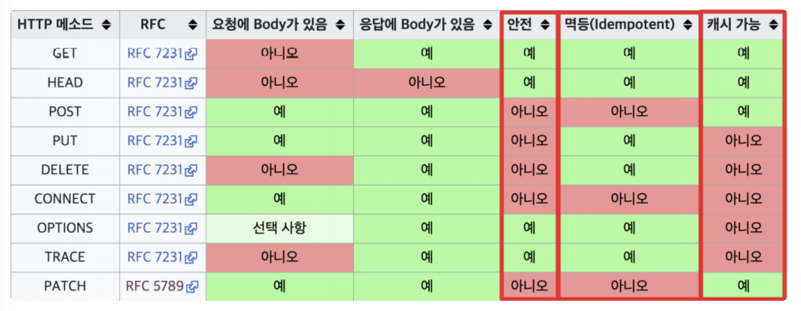
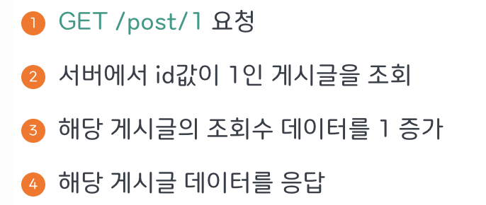

# 3-1. HTTP Method의 멱등성에 대해 설명해 주세요.

## 0. HTTP 메서드의 속성 3가지



- 안전(Safe) : 호출해도 리소스가 변경되지 않는 성질, 데이터의 일관성 유지

- 멱등(Idempotent) : 여러 번 요청해도 결과가 같음을 의미

- 캐싱(cacheable) : 응답 결과 리소스를 캐싱해 효율적으로 사용할 수 있는지 여부

---

## 1. 멱등성이란?

같은 요청을 여러 번 보내도 결과 상태가 동일한 성질을 의미

### 멱등성이 중요한 이유

실무에서는 네트워크 장애가 발생 가능

```plain text
POST 요청 전송
↓
서버는 처리 완료
↓
응답이 네트워크에서 유실
↓
클라이언트는 실패한 줄 알고 재전송
```

POST라면

```plain text
주문이 2번 생성
```

그래서 결제 API에서는 `Idempotency Key`를 사용하여 중복 요청을 방지

**동작 원리**:

클라이언트가 요청 시 고유한 키(일반적으로 UUID)를 생성해 헤더(`Idempotency-Key`)에 담아 보냄

서버는 해당 키를 기록하고, 동일한 키가 다시 들어오면 첫 번째 요청의 결과(응답값)를 그대로 반환

**사례**:

결제 시스템, 주문 생성, 이메일 발송 등 서버의 상태를 영구적으로 변경하거나 비용이 발생하는 중요한 API 호출에 적용

---

## 2. Safe와 멱등은 같은 개념인가? 아니오

```javascript
Safe ⊂ Idempotent
```

Safe하면 무조건 Idempotent지만, 멱등하다고 Safe인 것은 아니다.

Safe : 서버 상태를 변경하지 않는다. 즉 수정자체가 일어나지 않음 !

→ GET / HEAD / OPTIONS 등 조회만 하므로 서버 상태가 바뀌지 않음

Idempotent : 여러 번 요청해도 최종 서버 상태가 동일하다. 수정이 발생해도 결과가 같음!

→ (예시) DELETE는 두 번째 요청에서 이미 삭제되어 404가 뜨지만, 최종 상태는 `사용자없음` 으로 동일함

> 중요한 차이 : `호출을 실행한 결과` 가 의미하는 것은, 응답 상태코드가 아닌 서버상태임!

---

## 3. Safe / Idempotent 차이 정리표

| Method | Safe | Idempotent |
| --- | --- | --- |
| GET | O | O |
| HEAD | O | O |
| OPTIONS | O | O |
| PUT | X | O |
| DELETE | X | O |
| POST | X | X |
| PATCH | X | 보통 X |

> 사실 PUT과 PATCH 메소드의 진짜 중요한 차이점은 전체 교체, 일부 교체 행위의 차이가 아니라, PUT 메소드는 반드시 멱등성을 보장하지만 PATCH 메소드는 멱등성을 보장하지 않을 수도 있다는 것

- GET : 리소스 조회

```javascript
GET /users/1
```

  - 요청 본문(바디)없이 주로 Query Parameter 사용

  - 데이터를 변경하지 않음(Safe)

  - 여러번 호출해도 결과가 동일(Idempotent, 멱등성)

  - 캐싱 가능

- POST : 데이터 추가 / 등록

  - 요청 데이터를 본문(바디)에 담아 전송

  - 여러 번 요청 시 리소스가 계속 생성될 수 있음(=멱등성 보장 X)

- PUT : 리소스 대체 & 수정 / 해당 리소스가 없는 경우에만 새로 생성

  - 리소스 전체 수정, 리소스가 없다면 신규 생성

  - 같은 요청을 여러 번 보내도 결과가 동일(=멱등성 보장)

- DELETE : 리소스 삭제

  - 여러 번 호출해도 삭제 상태는 동일(=멱등성 보장)

```javascript
DELETE → 200 OK
DELETE → 404 NOT FOUND
```

- PATCH : 리소스 부분 변경(수정)

  - 여러 번 호출할 시 리소스가 달라질 수 있음(=멱등성 보장 X)

```javascript
// 동일 요청을 보내는 경우 -> 멱등하다고 착각할 수 있음
PATCH → {name: ”MangKyu”}
PATCH → {name: ”MangKyu”}

// 값을 추가하는 요청을 보낼 때 PATCH 사용 시, 매번 결과가 달라짐
PATCH → name: [”MangKyu”]
PATCH → name: [”MangKyu”, ”MangKyu”]
PATCH → name: [”MangKyu”, ”MangKyu”, ”MangKyu”]
```

---

## 4. 멱등적이지 않은 메서드 설계 예시

1. GET 조회수 구현

게시글을 조회할 때 조회수도 올라가도록 구현할 때,



→ GET 요청을 보낼 때마다 서버 데이터 상태가 변경됨. 멱등성을 가지지 않는 로직이 탄생한 것. HTTP 스펙에 부합하지 않게 API를 잘못 구현한 것임.

해결 : 조회수 컬럼 값 증가 요청을 PATCH 요청으로 따로 분리

1. 마지막 글 DELETE 구현

`DELETE /posts/last` : 조금 더 유연하게 처리하고자 게시글 ID값이 아닌 최근 글 삭제 로직을 구현했다고 했을 때, 요청을 보낼 때마다 마지막 게시글이 삭제되어 상태가 변경됨

해결 : 멱등성을 가지지 않는 POST 사용

---
