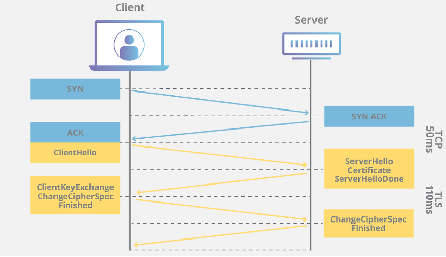

# 4-2. 왜 HTTPS Handshake 과정에서는 인증서를 사용하는 것 일까요?

# 1. HTTPS Handshake란?

- 웹 브라우저와 웹 서버가 실제 데이터를 주고받기 전에, 데이터를 안전하게 암호화하기 위해 **서로의 신원을 확인하고 비밀키를 나누어 가지는 보안 준비 과정**



> Note [클라이언트]                                              [서버]
|                                                                      |
| --------- 1. Client Hello ------------->      | (지원하는 암호화 방식 목록 등)
|                                                                      |
| <------- 2. Server Hello --------------  | (선택한 암호화 방식, 인증서 등)
|                   + Certificate                            |
|                                                                      |
| ------- 3. Key Exchange -------------> | (인증서 검증 후, 대칭키 생성용 데이터 전송)
|                                                                      |
| <------- 4. Finished -----------------     | (암호화 통신 준비 완료)
|                                                                      |

- Client Hello (인사 및 탐색)

  - 자신이 지원하는 TLS 버전은 이러한 것이고 사용할 수 있는 암호화 방식의 리스트는 이러한 것이 있다고 보내며 동시에 랜덤 데이터를 보냄.

- Server Hello & Certificate (신원 증명 및 공개키 전달)

  - 지원되는 암호화 방식 중 하나를 선택하고, 서버측이 믿을 수 있다는 사이트라고 증명하기 위해 인증서와 공개키를 보냄. 동시에 랜덤 데이터도 보냄.

- Certificate Verification & Key Exchange (검증 및 비밀키 공유)

  - 서버가 보낸 인증서가 진짜인지 브라우저에 내장된 CA(인증기관) 정보를 통해 확인.

  - 동시에 서로 주고받은 랜덤 데이터를 조합해서 앞으로 데이터를 암호화할 '대칭키(Premaster Secret)'를 만듬. 이것을 서버측의 공개키로 암호화 해서 보냄.

- Finished (준비 완료)

  - 클라이언트와 서버 모두 동일한 대칭키를 안전하게 가지게 됨.

---

# 2. 인증서를 사용하는 이유

1. 웹사이트의 신원 확인

  - **인증서는 국가에서 발급한 '주민등록증'이나 '인감증명서' 같은 역할**을 합니다.

  - 아무나 발급할 수 없고, 신뢰할 수 있는 공인 기관(CA, Certificate Authority)의 엄격한 심사를 거쳐 발급됩니다.

  - 즉, 클라이언트는 서버가 보낸 CA의 개인키로 암호화된 이 SSL 인증서를 이미 모두에게 공개된 CA의 공개키를 사용하여 복호화합니다.

  - 인터넷 세상에서는 누구나 특정 웹사이트와 똑같은 가짜 사이트를 만들거나, 중간에서 통신을 가로채서 자신이 해당 서버인 척 위장할 수 있습니다.

  - 이러한 중간자 공격(MITM) 방지하기 위해 인증서를 사용합니다.

1. 서버의 진짜 '공개키'의 안전한 배포

  - 암호화 통신을 시작하려면 서버의 **공개키**가 필요합니다. 하지만 해커가 중간에서 가짜 공개키를 가로채서 주면, 이후의 모든 암호화 통신은 해커에게 노출됩니다.

  - 인증서 내부에는 **서버의 진짜 공개키**가 포함되어 있습니다.

  - 이 인증서 자체가 공인 기관(CA)의 디지털 서명으로 꽁꽁 묶여 있기 때문에, 중간에 해커가 인증서에 포함된 공개키를 조작하거나 위조하는 것이 불가능합니다.

  - 클라이언트는 인증서 덕분에 "이 공개키는 오염되지 않은 진짜 서버의 공개키가 확실하다"는 것을 보장받습니다.

1. 암호화에 사용할 대칭키의 안전한 전달

  - 서버와 클라이언트가 데이터를 주고받을 때는 연산이 빠른 '대칭키'라는 비밀번호를 사용해야 합니다. 하지만 이 비밀번호를 그냥 인터넷에 날려 보내면 누구나 가로챌 수 있습니다.

  - 클라이언트는 인증서 안에서 꺼낸 안전한 **서버의 공개키**로 이 비밀번호(대칭키)를 암호화해서 서버에 보냅니다.

  - 이 암호는 오직 서버가 가진 **비밀키**로만 풀 수 있기 때문에, 전송되는 과정에서 해커가 훔쳐보더라도 절대 열어볼 수 없습니다.

1. 요약

  - **대화 상대방이 진짜인지 확인하고, 암호화에 필요한 열쇠를 안전하게 전달받기 위해** 인증서를 반드시 사용해야 합니다.

맞아 ㅋㅋ **Certbot이 Let’s Encrypt 인증서를 대신 신청하고, 서버에 설치하고, 갱신까지 자동화해주는 도구**였어.

관계를 딱 나누면:

```plain text
Let's Encrypt
= 인증서를 실제로 발급하는 인증기관(CA)

Certbot
= Let's Encrypt에 발급을 요청하고 설정해주는 프로그램

Nginx
= 발급받은 인증서와 개인키를 사용해 HTTPS 통신을 처리

AWS EC2
= Nginx와 Certbot이 실행되는 서버
```

그래서 예전에 실행했던 이런 명령이:

```bash
sudo certbot --nginx -d sabottatge.co.kr
```

사실상 다음 일을 한 번에 처리한 거야.

```plain text
도메인 제어권 검증
→ Let's Encrypt에 인증서 발급 요청
→ 인증서와 개인키를 EC2에 저장
→ Nginx HTTPS 설정 수정
→ 자동 갱신 등록
```

즉, **AWS에서 서버 만들 때 자동으로 생긴 인증서가 아니라, EC2 안에서 Certbot을 실행해서 Let’s Encrypt로부터 받은 것**이야.

지금까지는 “HTTPS 적용하려고 명령어 실행했다” 정도로 느꼈겠지만, 실제로는 **CA에 신분증 발급 신청하고 Nginx에 장착한 작업**이었던 거지.
