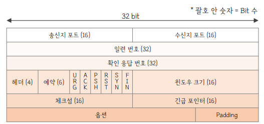
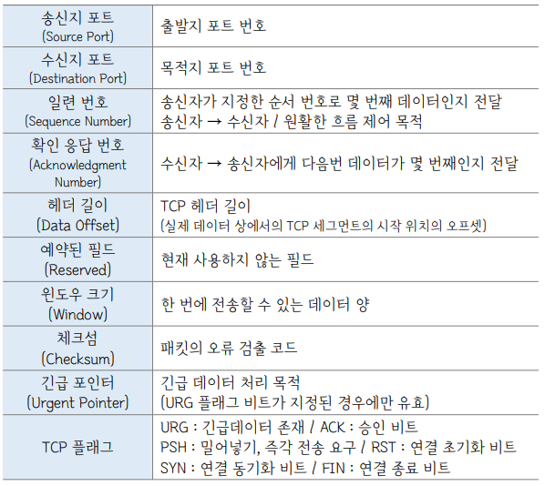

# 7-4. TCP가 신뢰성을 보장하는 방법에 대해 설명해 주세요.

# 0. TCP 헤더

1. TCP 헤더의 구조

1. 세부 설명

---

# 1. 신뢰성을 보장하는 4가지 방법

1. 순서 번호(Sequence Number)

1. 확인 응답 번호(Acknowledgment Number)

1. 재전송 (Retransmission) 메커니즘

1. 체크섬 (Checksum)

---

# 2. 순서 번호(Sequence Number)

1. 순서 번호란?

> Note 송신자가 보내는 데이터 조각(패킷)들에 부여하는 고유한 일련번호입니다.

단순히 1, 2, 3번이 아니라, 전송하는 데이터의 **'바이트(Byte)' 크기를 기준**으로 번호를 매깁니다.

1. 작동 방식

> Note 데이터의 첫 번째 바이트에 임의의 초기 순서 번호(ISN)를 할당하고, 데이터의 바이트 크기만큼 번호를 증가시킵니다.

예를 들어 1000바이트 크기의 데이터를 보낼 때, **첫 번째 패킷(100바이트)의 순서 번호가 1**이라면, **두 번째 패킷의 순서 번호는 101**이 됩니다.

1. 역할

> Note 수신자가 순서가 뒤바뀐 패킷을 올바르게 재조립하고, 중간에 유실된 데이터를 파악하도록 돕습니다. 

---

# 3. 확인 응답 번호(Acknowledgment Number)

1. 확인 응답 번호란?

> Note 수신자가 데이터를 성공적으로 수신했음을 송신자에게 알리는 신호입니다.

동시에 "다음에는 이 번호부터 보내주면 돼"라고 요청하는 번호입니다.

1. 작동 방식

> Note 수신자는 자신이 정상적으로 받은 데이터의 마지막 바이트 다음 번호(다음에 받을 데이터 번호)를 응답 번호로 지정해 송신합니다.

예를 들어 수신자가 순서 번호 1~100까지의 데이터를 정상적으로 받았다면, 송신자에게 확인 응답 번호 '101'을 보냅니다.

1. 역할 

> Note 송신자는 이 번호를 통해 자신이 보낸 데이터가 목적지에 무사히 도착했음을 확신할 수 있습니다.

만약 특정 번호의 응답이 오지 않으면 데이터가 중간에 유실되었음을 파악하게 됩니다.

---

# 4. 재전송 (Retransmission) 메커니즘

1. 재전송 매커니즘이란?

> Note 데이터가 유실되었을 때 이를 복구하기 위해 똑같은 데이터를 다시 보내는 내부 알고리즘입니다.

1. 작동 방식

  - 타임 아웃

> Note 데이터를 보낼 때 내부적으로 타이머를 켭니다.

정해진 시간 내에 수신자로부터 ACK(확인 응답)가 오지 않으면, 데이터가 중간에 사라졌다고 판단하고 똑같은 데이터를 다시 보냅니다.

  - 빠른 재전송

> Note 타임아웃이 끝나기 전이라도, 수신자로부터 **똑같은 확인 응답 번호(중복 ACK)를 연속으로 3번** 받게 되면 해당 패킷이 유실되었다고 확신하고 즉시 재전송합니다.

---

# 5. 체크섬 (Checksum)

1. 체크섬이란?

> Note 전송 과정에서 데이터가 깨지거나 변조되지 않았는지(무결성) 검증하는 장치입니다.

1. 작동 방식

> Note 송신자가 데이터를 보낼 때 데이터 내용을 바탕으로 특정한 수학적 계산을 하여 16비트짜리 체크섬 값을 만들어 헤더에 붙입니다.

수신자도 데이터를 받은 후 똑같은 계산을 해서 두 값이 일치하는지 비교합니다.

1. 역할

> Note 값이 다르면 네트워크 케이블 노이즈 등의 이유로 데이터가 손상된 것입니다.

이 경우, 수신자는 이 불량 패킷을 즉시 버리고(폐기) 응답을 보내지 않습니다.

결국 송신자는 타임아웃이 발생하여 데이터를 재전송하게 됩니다.

---

# 6. 추가 내용

네트워크  효율 최적화를 위한 흐름 제어 (Flow Control)

  1. 흐름 제어란?

> Note **수신자의 처리 능력**에 맞춰서 송신자가 데이터를 보내는 속도와 양을 조절하는 기법입니다.

  1. 작동 방식

> Note 수신자는 자신의 메모리(버퍼)에 남은 빈 공간의 크기를 윈도우 사이즈(Window Size)라는 헤더 필드에 담아 송신자에게 지속적으로 알려줍니다.

송신자는 수신자가 허용하는 여유 공간만큼만 데이터를 보냅니다.

  1. 역할

> Note 송신자가 너무 빠르게 데이터를 쏟아내어 수신자의 메모리가 꽉 차서 넘쳐버리는(오버플로우) 현상을 막고, 이로 인한 패킷 유실을 원천 차단합니다.
