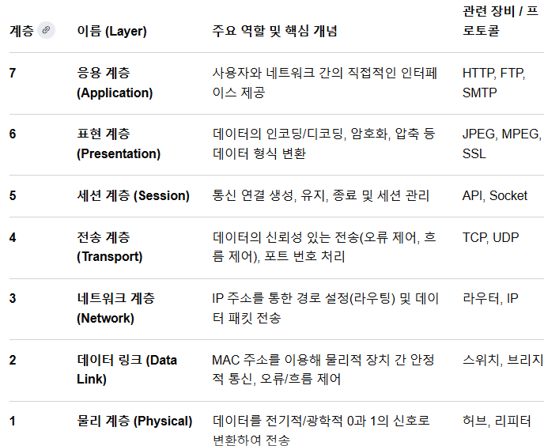

# 7-6. 왜 HTTP는 TCP를 사용하나요?

## 0. 들어가기 전: 사전 지식과 용어

컴퓨터끼리 대화하는 규칙인 '네트워크 프로토콜'의 기본

- **프로토콜 (Protocol)**

  - 컴퓨터끼리 데이터를 주고받기 위해 약속한 '대화 규칙' (우리가 한국어로 대화하기로 약속한 것처럼)

  

  
OSI 7계층이란?

국제표준화기구(ISO)에서 제정한 네트워크 통신 표준 모델. 데이터가 컴퓨터끼리 전달되는 과정을 7개의 논리적 단계로 나누어, 통신 장애 원인 파악과 네트워크 구조 설계를 쉽게 만든 것.

    - 데이터를 보낼 때, 이 계층을 7계층 → 1계층

    - 데이터를 받을 때, 이 계층을 1계층 → 7계층

    - 단, 모든 경우가 반드시 마지막 계층까지 가는 것은 아님

      - L2 스위치: 1계층으로 신호를 받아서 2계층 헤더(MAC 주소)까지만 열어보고 어디로 보낼지 확인해. 그리고 다시 1계층 신호로 만들어서 다음 장비로 던짐.

      - L3 라우터: 1계층으로 신호를 받아 3계층 헤더(IP 주소)까지만 열어보고 목적지 경로를 찾은 뒤, 다시 2계층과 1계층으로 포장해서 내려보냄.
  

- **HTTP (HyperText Transfer Protocol) : **애플리케이션 계층(L7) 프로토콜

  - 웹 브라우저(크롬, 사파리 등)와 웹 서버가 HTML 페이지, 이미지, 동영상 등을 주고받기 위해 사용하는 '애플리케이션(응용) 계층'의 규칙. 쉽게 말해 **"무엇을(어떤 내용을) 주고받을지"** 정하는 역할

- **애플리케이션 계층(Application Layer)과 전송 계층(Transport Layer)**

  - L7은 데이터의 내용과 형식을 정의

  - L4는 그 데이터를 목적지까지 어떻게 보낼지 전달 방식 결정

  - HTTP는 독립적으로 데이터를 전송할 수 없기 때문에 반드시 L4 프로토콜의 하부 지원을 받아야 함

- **패킷 (Packet)과 세그먼트(Segment)**

  - **세그먼트:** L4 계층에서 TCP가 **헤더를 붙여 쪼갠 단위**

  - **패킷:** 네트워크를 통해 전송되는 '데이터의 작은 조각'으로, **세그먼트가 L3(네트워크 계층)으로 내려가서 IP 헤더가 붙은 형태**

  - 통칭하여 ‘데이터 블록’으로 이해하면 됨

| **용어** | **정의 및 핵심 역할** |
| --- | --- |
| **L7 애플리케이션 계층** | 데이터의 내용과 형식을 정의 (예: **HTTP** - "어떤 데이터를 보낼 것인가") |
| **L4 전송 계층** | 데이터를 목적지까지 전달하는 방식을 결정 (예: **TCP / UDP** - "어떻게 보낼 것인가") |
| **RTT (Round Trip Time)** | 패킷이 송신측에서 출발하여 수신측에 도착하고, 다시 응답이 돌아오기까지 걸리는 **왕복 지연 시간** |
| **데이터 무결성** | 전송 중 데이터가 오염, 누락, 변형되지 않고 원래 상태 그대로 유지되는 성질 |

## 🔹 7-6. 왜 HTTP는 TCP를 사용하나요?

> **핵심 요약**
HTTP가 처리하는 웹 데이터(HTML, CSS, JS)는 단 1비트의 손실이나 순서 뒤바뀜도 허용하지 않는 **데이터 무결성**이 필수

따라서 전송 계층 레벨에서 이를 자체적으로 보장하는 **TCP(Transmission Control Protocol)**를 사용해 옴

### TCP의 신뢰성 보장 메커니즘

- **연결 지향성 (3-way Handshake)**

  - 데이터 전송 전, `SYN(동기화)`과 `ACK(확인 응답)` 패킷을 3회 주고받으며 논리적인 통신 채널을 개설

    - TCP 헤더 내부에 존재하는 1비트짜리 제어 플래그.

    - **SYN(Synchronize):** 송신측이 자신의 초기 패킷 번호, 즉 시퀀스 번호(Sequence Number)를 상대방에게 알리고 동기화하자는 요청

    - **ACK(Acknowledgment):** 상대방이 보낸 패킷을 오류 없이 잘 받았으니, 다음 패킷을 보내라는 확인 응답입니다.

  - 이를 통해 송수신측의 준비 상태를 확인하고 시퀀스 번호를 동기화

  

  
뚜리 웨이 핸드쉐이크 예시

정의: TCP 프로토콜에서 송수신 측 간에 신뢰성 있는 논리적 연결을 수립하고, 패킷 번호(Sequence Number)를 동기화하기 위한 3단계 과정

클라이언트와 서버가 처음 연결을 맺을 때, 난수 형태로 초기 시퀀스 번호(ISN)를 생성해. 여기서는 계산하기 쉽게 **클라이언트의 초기 번호를 1000, 서버의 초기 번호를 5000**이라고 가정해 볼게.

    - 단계 1: 클라이언트 -> 서버 (SYN)
클라이언트가 TCP 헤더의 `SYN` 플래그를 1로 켜고, `Sequence Number = 1000`을 담아서 서버로 보내.

> "내 번호 체계는 1000번부터 시작할게. 연결하자."라는 뜻이야.

    - 단계 2: 서버 -> 클라이언트 (SYN + ACK)
서버는 클라이언트의 요청을 받고, `SYN` 플래그와 `ACK` 플래그를 동시에 1로 켜서 응답해.
이때 `Sequence Number = 5000`을 지정하고, `Acknowledgment Number = 1001`을 담아.
여기서 Ack 번호가 1001인 이유는 "네가 보낸 1000번 잘 받았으니, 다음번엔 1001번부터 보내줘"라는 의미야.

> "그래, 네 1000번 패킷 잘 받았으니 다음엔 1001번 보내(ACK 1001). 그리고 내 번호 체계는 5000번부터 시작할게(SYN 5000)."라는 뜻이지.

    - 단계 3: 클라이언트 -> 서버 (ACK)
클라이언트는 서버의 응답을 확인하고 `ACK` 플래그를 1로 켜서 최종 응답을 보내.
이때 `Sequence Number = 1001`이 되고, `Acknowledgment Number = 5001`이 돼.

> "서버 네가 보낸 5000번 잘 받았으니 다음엔 5001번 보내(ACK 5001). 약속대로 내 1001번 패킷 보낸다."라는 뜻이야.

이 과정이 끝나야 비로소 양쪽의 번호 체계가 동기화되고 데이터 전송이 시작돼.
  

- **시퀀스 번호 및 재전송 (ARQ)**

  - 송신측은 각 세그먼트에 고유 번호(Sequence Number)를 부여하여 전송

  - 수신측이 정상 수신 확인(`ACK`)을 보내지 않거나 무응답(Timeout)인 경우, 송신측이 해당 패킷을 **자동으로 재전송**하여 데이터 유실 방지

- **흐름 제어 (Flow Control)**

  - **슬라이딩 윈도우(Sliding Window)** 알고리즘으로 수신측의 버퍼 남은 용량만큼만 송신측이 데이터를 보내도록 조절 (오버플로우 방지) → 남은 버퍼는 서버가 TCP 헤더에 적어서 보내줌

- **혼잡 제어 (Congestion Control)**

  - 네트워크 경로의 혼잡도를 감지하여 전송 속도를 동적으로 조절. 네트워크 마비로 인한 패킷 드롭을 최소화

> **💡 결론**
초기 웹 환경에서는 속도보다 **정확한 화면 렌더링과 데이터 전달**이 중요했기 때문에, 애플리케이션 개발자가 데이터 유실을 신경 쓰지 않도록 하부 계층에서 완벽한 신뢰성을 보장하는 TCP가 강제되었습니다.

### 그럼 UDP는 뭐가 문젠데?

## 1. 전송 신뢰성 부재 (Unreliable Transport)

UDP의 가장 근본적인 문제. 데이터가 목적지에 올바르게 도착했는지 확인하는 메커니즘이 전혀 없음

  - 송신측은 패킷을 전송한 후 수신측으로부터 **확인 응답(ACK)을 받지 않음**

  - 패킷이 네트워크 장비의 과부하나 선로 오류로 인해 중간에 증발(Packet Loss)하더라도, 송신측과 수신측 모두 **이 사실을 인지할 수 없음**

  - 타임아웃이나 **재전송(ARQ) 로직이 전송 계층 레벨에서 아예 누락**되어 있기 때문에 데이터의 100% 전달을 보장 못함.

## 2. 순서 보장 없음 (No Ordering)

인터넷에서 패킷들은 저마다 다른 라우팅 경로를 통해 목적지로 이동. 이로 인해 먼저 보낸 패킷이 나중에 보낸 패킷보다 늦게 도착하는 **역전 현상이 빈번**

  - TCP는 헤더에 **시퀀스 번호(Sequence Number)**가 있어 수신측에서 순서대로 재조합(Reordering)함.

  - 반면 UDP 헤더에는 순서를 식별할 수 있는 번호 필드 **X**

  - 따라서 수신측 전송 계층은 도착한 순서 그대로 상위 애플리케이션 계층으로 데이터를 밀어 올림. 파일 다운로드 같은 상황이라면 데이터의 앞뒤가 뒤죽박죽 섞여 파일이 깨짐

## 3. 흐름 제어 부재 (No Flow Control)

흐름 제어는 수신측의 처리 속도(수신 버퍼 남은 용량)에 맞춰 송신측이 전송량을 조절하는 기능

  - UDP는 수신측의 상태를 전혀 고려하지 않고, 송신측이 보낼 수 있는 최대 속도로 패킷을 냅다 쏘아 보냄

  - 만약 수신측 컴퓨터의 CPU나 애플리케이션이 바빠서 소켓 버퍼(Socket Buffer)에 쌓이는 데이터를 제때 읽어가지 못하면, 버퍼가 가득 참

  - 이 상태에서 UDP 패킷이 계속 밀려 들어오면, 수신측 운영체제는 버퍼 오버플로우(Buffer Overflow)를 일으키며 새로 도착하는 패킷들을 상위 계층으로 올리지 못하고 **전부 강제로 버림(Packet Drop)**

## 4. 혼잡 제어 부재 (No Congestion Control)

혼잡 제어는 라우터나 스위치 등 네트워크 경로 자체의 혼잡도를 감지하여 전송 속도를 줄이는 네트워크 보호 메커니즘

  - 네트워크 망이 혼잡하여 패킷 지연이 발생하더라도, **UDP는 이를 감지하는 알고리즘(예: Slow Start 등) X**

  - **망이 막히든 말든 일정한 속도** 혹은 **최고 속도**로 패킷을 계속 밀어 넣기 때문에, 해당 네트워크 경로에 있는 라우터들의 혼잡을 더욱 심화

  - 이로 인해 **본인 패킷뿐만 아니라 같은 경로를 쓰는 다른 통신(TCP 등)의 패킷 드랍까지 유발**하는 이기적인 프로토콜로 작동

## 5. 오류 제어의 한계 (Limited Error Control)

UDP 헤더에는 최소한의 데이터 오염을 확인하기 위한 체크섬(Checksum) 필드가 존재하나, 하지만 이 역시 한계가 명확

  - 수신측에서 체크섬을 계산해 본 결과 데이터가 전송 중에 변조되거나 깨진 것을 확인하면, 해당 패킷을 그 자리에서 즉시 폐기(Drop)

  - 하지만 폐기한 후가 문제. TCP처럼 재전송 메커니즘이 없기 때문에, 오류가 난 패킷은 그냥 영원히 사라진 채로 통신 끝

### 📋 UDP 헤더 구조로 보는 문제점의 원인

UDP가 위의 기능들을 제공하지 못하는 이유는 헤더 구조를 보면 명확. 헤더 크기가 20바이트 이상인 TCP와 달리, UDP 헤더는 단 8바이트(64비트)

  - Source Port (16비트)

  - Destination Port (16비트)

  - Length (16비트)

  - Checksum (16비트)

보이는 것처럼 **시퀀스 번호, ACK 번호, 윈도우 크기(Window Size), 제어 플래그** 등 신뢰성과 흐름 제어를 위해 필요한 필드가 헤더에 아예 물리적으로 존재하지 않기 때문에 위의 기능들 수행 불가

### 💡 면접용 최종 결론 답변안

UDP는 전송 계층에서 신뢰성, 순서 보장, 흐름 제어, 혼잡 제어를 수행하는 메커니즘이 전혀 없기 때문에 패킷 유실과 순서 뒤바뀜, 수신 버퍼 오버플로우 등의 문제가 발생합니다.

따라서 순수 UDP를 그대로 사용하면 데이터 무결성이 깨지므로 가볍고 빠른 특성이 필요한 실시간 스트리밍(VoIP, 화상통화)이나 DNS 요청 등에만 제한적으로 사용되며, 신뢰성이 필요한 서비스에서 UDP를 쓰려면 HTTP/3(QUIC)처럼 상위 애플리케이션 레벨에서 이 모든 신뢰성 로직을 직접 구현해 주어야 합니다.
