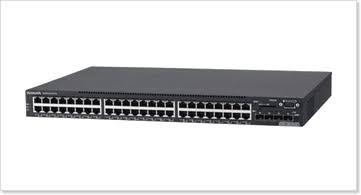
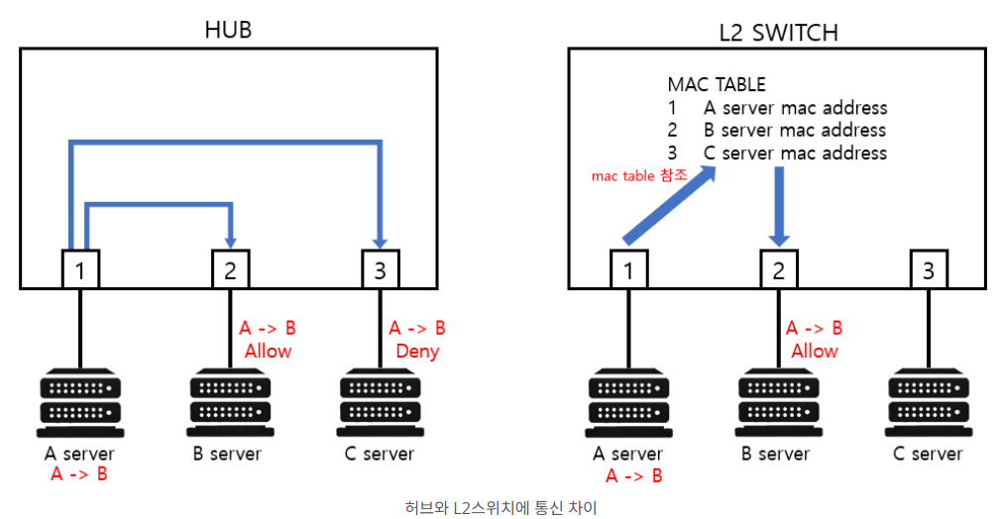
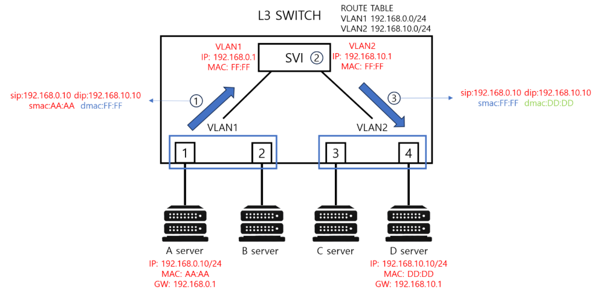

# 10-2. L3 Switch와 Router의 차이에 대해 설명해 주세요.

# 0. L3 Switch와 Router의 공통점

> Note 

  - **L3 Switch**와 **Router**는 모두 OSI 3계층(네트워크 계층)에서 동작합니다.

  - 두 장비 모두 데이터의 목적지 주소인 IP 주소를 읽고, 최적의 경로를 찾아 데이터 패킷을 전송하는 공통점을 가지고 있습니다.

# 1. L3 Switch

1. L3 Switch란?

> Note 기존의 L2 Switch(동일 네트워크 내에서 MAC 주소로 통신을 중계하는 장비)에 **IP 주소를 인식하고 경로를 배정하는 라우팅 기능을 추가한 장비**

그래서 L2 Switch가 뭐야?

> Note 

    - L2 스위치는 데이터 링크 계층에서 **MAC 주소를 기반으로 데이터를 처리하고 전송하는 기능**을 수행합니다.

    - 즉, 수신된 데이터 프레임을 MAC 주소 테이블을 참조하여 적절한 포트로 전달합니다.

    - 장점 : 매우 빠르게 패킷을 전달할 수 있습니다. 이는 주로 물리적 네트워크 내에서 같은 네트워크 세그먼트에 속한 장치 간의 통신에서 강점을 보입니다.

1. 어떻게 처리되는가?

> Note 

  - 라우팅 연산은 CPU가 처리

  - 하드웨어 칩셋인 ASIC(Application Specific Integrated Circuit, 주문형 반도체)을 사용하여 패킷 전송을 처리.

  - 즉, 라우팅 처리가 하드웨어 수준에서 이루어지기 때문에 데이터 전송 속도가 매우 빠릅니다.

1. 스위칭 허브의 확장판

> Note 

  - 본질은 LAN(Local Area Network, 근거리 통신망) 내부에서 고속으로 데이터를 전환하는 장비에 라우팅 기능을 추가한 것입니다.

  - 이 때문에 기본적으로 많은 수의 LAN 포트를 가지고 있습니다.

1. VLAN 간의 라우팅

- L3 스위치의 가장 핵심적인 존재 이유

> Note 

  - VLAN(Virtual LAN) 기능으로 사내 네트워크를 여러 부서로 분할했을 때, 이 분리된 네트워크 간의 통신을 연결해 줍니다.

  - 데이터를 외부 라우터까지 보낼 필요 없이 스위치 내부에서 직접 라우팅을 수행하므로, 부서 간 대용량 데이터 전송을 병목 지연 없이 초고속으로 처리할 수 있습니다.

---

# 2. Router

1. Router란?

> Note 자신이 속한 내부 네트워크(LAN)와 아예 다른 외부 네트워크(Wide Area Network)를 연결하여 **최적의 경로로 데이터를 멀리 보내주는 장비**

1. Router의 특징

> Note 

  - L3 Switch가 하드웨어(ASIC) 기반이라면, Router는 범용 CPU와 고도화된 운영체제(OS)를 기반으로 동작합니다.

  - 소프트웨어 연산을 통해 전 세계 네트워크의 이정표 역할을 하는 '라우팅 테이블'을 계산하고 유지합니다.

  - 속도 자체는 L3 스위치보다 느릴 수 있지만, **데이터를 정밀하게 검사하고 가공**하며, 이더넷뿐만 아니라 광선로, 시리얼 등 외부망 연결을 위한 다양한 포트를 지원합니다.

1. 주요 용도

> Note 사내 망을 인터넷망(KT, SKT 등)에 연결하거나, 서울 본사와 부산 지사를 원격으로 연결할 때 사용.

1. 주의할 점

> Note 내부와 외부 망을 연결하는 것이므로 보안(방화벽), 주소 변환(NAT), 암호화(VPN) 등 다양한 부가 기능이 필수적입니다.

---

# 3. 요약

| **구분** | **L3 스위치 (L3 Switch)** | **라우터 (Router)** |
| --- | --- | --- |
| **태생적 목적** | 내부망(LAN)의 초고속 연결 및 분할 | 내부망과 외부망(WAN/인터넷)의 연결 |
| **패킷 처리 방식** | **하드웨어 기반 (ASIC 칩)**으로 대량 트래픽 초고속 처리 | **소프트웨어 기반 (CPU)**으로 복잡하고 다양한 정책 처리 |
| **포트 밀도** | 매우 높음 (보통 24~48포트 이상) | 낮음 (보통 수 개~십여 개 내외) |
| **인터페이스 종류** | 주로 이더넷(LAN선 포트) 중심 | 이더넷, 시리얼, 광선로 등 다양함 |
| **고급 기능 지원** | NAT, VPN, 고도화된 보안 기능 미지원 또는 제한적 | NAT, VPN, 방화벽, 정밀한 QoS 등 완벽 지원 |
