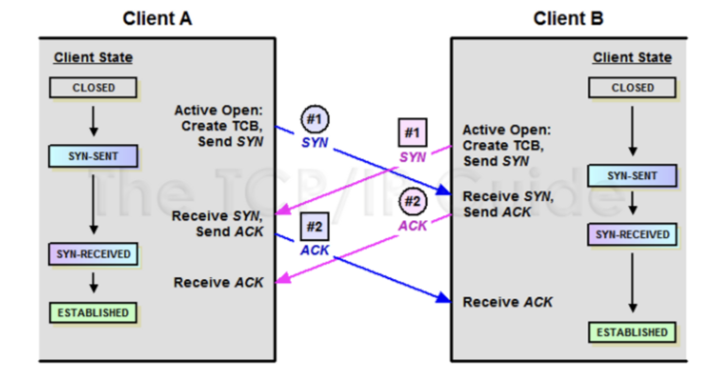

# 11-3. 두 호스트가 동시에 연결을 시도하면, 연결이 가능한가요? 가능하다면 어떻게 통신 연결을 수행하나요?

## 0. 결론

가능하다 !

**Simultaneous Open(동시 연결)**이라고도 하며, 흔한 상황은 아니지만 TCP에서 공식적으로 지원하는 동작임

---

## 1. 과정



편의를 위해,

- 연결을 먼저 요청하는 Host ⇒ **클라이언트**

- 연결을 요청받는 Host ⇒ **서버**

라고 둔다.

TCP 는 두 개의 파이프를 사용하는 양방향 전이중 통신에 해당하며, 연결이 된 후에는 자연스럽게 양방향 데이터 전송이 가능하다.

이 때, 실제로 TCP는 양방향 통신이기에 ‘**클라이언트**-**클라이언트**’의 형태가 존재하기도 함

**순서**

1. 서로 **SYN Segment 전송**

**→ SYN-SENT**

1. **SYN 수신 후** ACK Segment 전송

→ **SYN-RCVD**

1. ACK Segment 수신 후 각자 **Established**

⇒ 양쪽이 동시에 연결을 시도해도 연결을 성립시키기 위한 기능일 뿐, 성능 향상을 위한 기술은 아님

### 일반적인 3-way-handshake

```javascript
Client                    Server

SYN(seq=x) -------------->
        <-------- SYN+ACK(seq=y, ack=x+1)
ACK(ack=y+1) ------------>
```

Simultaneous Open(동시 연결)

```javascript
A                                    B

SYN ------------------------------->
                    <--------------- SYN

SYN+ACK --------------------------->
                    <--------------- SYN+ACK

ACK ------------------------------->
                    <--------------- ACK

        연결 완료 (ESTABLISHED)
```

---

## 2. 성능 차이도 없는데, 동시 연결을 그럼 왜 사용할까?

실제로 **99.9%의 경우에는 한쪽이 ****`connect()`**** 다른 쪽이 ****`listen()`**

→ Simultaneous Open은 거의 볼 일이 없음

그럼에도 TCP에 이 기능이 있는 이유는,

**특정 네트워크 환경에서는 누가 클라이언트이고 누가 서버인지 정하기 어려운 경우가 있기 때문 !**

### 1. P2P(Peer-to-Peer)

예를 들어 두 PC가 직접 연결하려고 하는 상황

```plain text
A <---------> B
```

둘 다 "서버"를 띄우고 기다리는 것이 아니라, 서로 직접 연결을 시도

특히 NAT 뒤에 있는 경우에는 둘 다 거의 동시에 SYN을 보내는 방식을 사용하기도 함

### 2. NAT Traversal

```plain text
A ---- NAT ---- Internet ---- NAT ---- B
```

둘 다 공유기에 있어서 외부에서 먼저 접속하기 어려움

그래서

- A도 connect()

- B도 connect()

를 거의 동시에 수행하면 NAT에 연결 정보가 생성 → TCP 연결이 성립될 가능성

이때 Simultaneous Open이 사용될 수 있음

### 3. TCP 표준의 완전성

TCP는 RFC에서 다양한 상황을 모두 정의함

예를 들어

- 동시에 SYN을 보냈을 때

- 동시에 FIN을 보냈을 때

- ACK가 유실됐을 때

- SYN이 중복됐을 때

처럼 현실에서는 드물지만 발생 가능한 상황도 모두 처리하도록 설계되어 있기 때문

왜 일반 웹에서는 안 쓰나요?

웹 브라우저를 예로 들면 역할이 명확함

```plain text
브라우저(connect)
        ↓
웹 서버(listen)
```

따라서 Simultaneous Open이 발생할 이유가 거의 X

---

## 3. 왜 가능한가?

TCP는 **양방향(Full Duplex)** 프로토콜로,

한 호스트는 동시에

- 연결을 요청하는 클라이언트 역할

- 연결을 받아들이는 서버 역할

을 모두 수행할 수 있음

따라서 두 호스트가 동시에 SYN을 보내더라도, 서로의 SYN을 수신하면 각각 SYN+ACK를 보내고 마지막 ACK를 교환하여 정상적으로 연결을 수립할 수 있음

---

## 4. 면접용 멘트

> 가능합니다. TCP에서는 이를 **Simultaneous Open**이라고 합니다. 두 호스트가 동시에 SYN을 보내면 둘 다 `SYN_SENT` 상태가 되고, 서로의 SYN을 수신하면 각각 `SYN+ACK`를 응답합니다. 이후 서로 `ACK`를 교환하면 양쪽 모두 `ESTABLISHED` 상태가 되어 연결이 정상적으로 수립됩니다. 일반적인 3-way handshake와 달리 양쪽 모두가 클라이언트이자 서버 역할을 동시에 수행하는 형태입니다.
