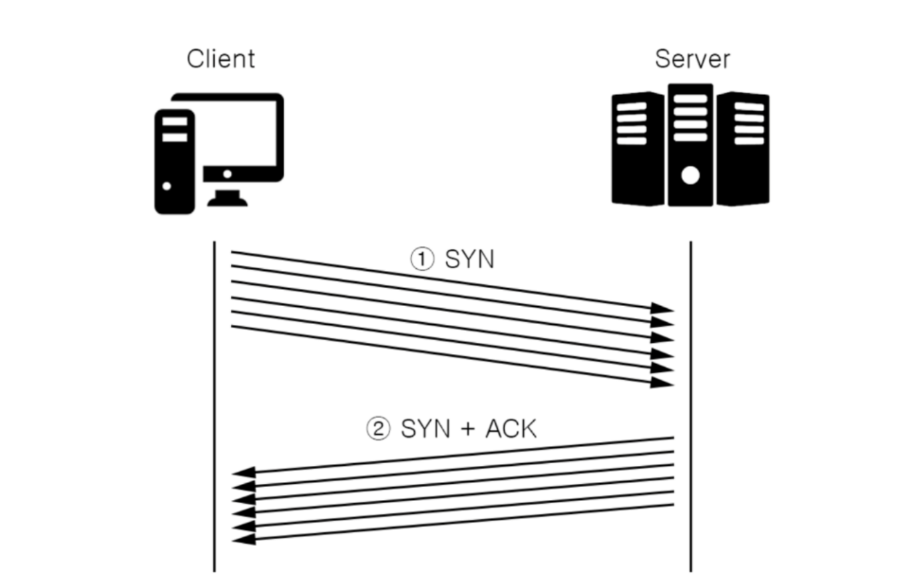
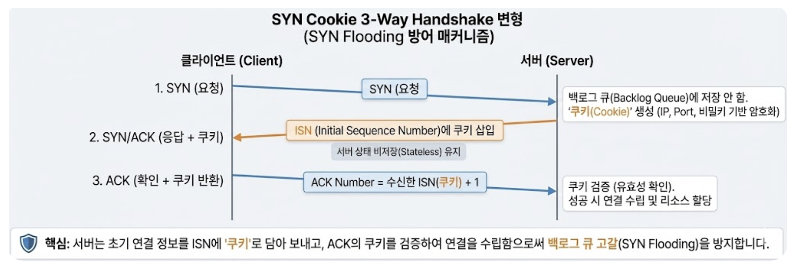

# 11-4. SYN Flooding에 대해 설명해주세요.

## 0. SYN Flooding이란?

SYN flooding은 네트워크 보안 공격 중 하나로,

공격자가 대상 서버에 대량의 TCP SYN 요청 패킷을 보내서 서버의 리소스를 고갈시키는 공격이다.

TCP의 3-Way Handshake를 악용하는 대표적인 DoS(서비스 거부 공격)으로 불림

---

## 1. 동작 과정



### 순서

1. **공격자** ————(**SYN**)———-—> **서버**

  - 대량의 SYN 패킷 전송 → 대량 연결 요청 자체에서 **서버**에 부담

  - **서버** 리소스 소진 시, 응답 불가 상태(**서비스 거부 - Denial Of Service,DoS)**

**→ 이 때, 서버**는 SYN 패킷을 받으면 SYN 패킷 관련 정보를 백 로그 큐에 저장해 관리

1. **공격자** <———(**SYN+ACK**)——— **서버**

- SYN+ACK 패킷 전송 후, 공격자로부터 ACK를 받을 때까지 대기

**→ 서버**는 **half-open** 상태

- 하지만 **공격자**는 ACK를 전송 X, **서버**를 계속 기다리게 함

**→ ****half-open** 연결이 계속 쌓임 & **서버** 연결 테이블이 고갈되어 **서비스 거부 상태**

즉, 아래 과정을 수천~수백만 번 반복하는 것

```javascript
   공격자                    서버

1. SYN ---------------------->

2.  <------------------- SYN+ACK

3. ACK ---------X ----------->

=> Half-Open Connection 생성
```

---

## 2. 문제가 되는 이유

서버는 각각에 대해

- 메모리 할당

- 연결 상태 관리

- 일정 시간 대기

를 수행하므로 자원이 계속 소모되며, 정상적인 사용자의 연결 요청 처리가 어려워짐

즉, TCP 서버는 SYN을 받으면 바로 연결 정보를 생성하며 `LISTEN` → `SYN_RECEIVED` 상태가 되는데, 이때

- 연결 정보(TCB, Transmission Control Block) 생성

- 백로그 Queue에 저장

- ACK가 올 때까지 일정 시간 대기

함

물론 ACK가 오지 않으면 일정 시간 후 제거되지만, 그 전에 큐가 가득 차면 정상 사용자의 SYN도 거부함

---

## 3. 방어 방법

### 1. SYN Cookie 

3-Way Handshake와 유사하지만, SYN Cookie 를 사용한다는 점에서 다르다.

기존 방식

```plain text
SYN 수신
    ↓
메모리 할당
    ↓
SYN+ACK
```

SYN Cookie

```plain text
SYN 수신
    ↓
메모리 할당 안 함
    ↓
SYN+ACK(쿠키 포함)
```



1. **클라이언트: 연결 요청**

  - 백로그 큐에 저장하지 않고, 쿠키 생성(IP 주소, Port 번호, 비밀키 기반 암호화, 시간 정보 등)

→ 쿠키는 일시적으로 서버 메모리에 저장되며, 연결 수립 후에는 즉시 제거됨

1. **서버: SYN + ACK** (**SYN Cookie) 응답**

  - **서버는 SYN+ACK 패킷의 ISN에 Cookie 값을 넣어 전송**

**→ 이 때, 서버**는 **클라이언트**로 부터 받은 SYN 패킷과 연결 정보를 저장하지 않음(Stateless)

    - Cookie 정보를 저장하지만 메모리 사용량이 적다.

1. **클라이언트: ACK 응답 및 쿠키 반환**

  - **서버**는 Sequence Number(Cookie 값 + SYN 패킷의 크기)가 올바른지 유효성 확인

→ 일치하면 연결 수립 및 리소스 할당, 일치하지 않으면 패킷 무시

⇒ 즉, 클라이언트가 ACK를 보내오면 `ACK + Cookie` 검증한 뒤에만 연결 정보 생성

**= 연결이 실제로 완료될 때까지 서버 자원을 사용하지 X**

**특징**

- **정상적인 상황에서는 작동하지 X**

  - 처리한계 초과 or SYN Flooding 공격이 가해질 때만 반응

  - 백로그 큐가 차기 시작하면 경고 메시지를 뿌리고, 이후 새로운 연결 요청부터 SYN Cookie 작동

- DOS 공격(1대에서 공격)은 막을 수 있지만 DDOS공격(여러 대에서 공격)은 막을 수 X

- 완벽한 해결방법은 아니므로, 다른 방식과 결합하여 사용해야

(예시) 연결 요청 수 제어 / 캐싱 / 로드밸런싱 등으로 버퍼가 가득차는 현상 막기

### 2. Backlog Queue 크기 증가

대기 가능한 연결 수를 늘려 공격에 조금 더 버틸 수 있게 하지만, 
시간을 잠깐 늦추는 것 뿐, 결국 가득차게 되어 근본적인 해결방법 X

### 3. SYN Timeout 단축

ACK가 오지 않는 연결을 더 빨리 제거해 자원 회수

### 4. 방화벽 / Rate Limiting

IP별 SYN 요청 수 제한 or 비정상 트래픽 차단

---

## 4. 면접 멘트

> SYN Cookie는 SYN Flooding으로 인해 백로그 큐가 부족해질 때, 연결 정보를 메모리에 저장하지 않고 쿠키를 시퀀스 번호에 담아 응답하는 기술입니다. 이후 클라이언트가 ACK를 보내면 쿠키를 검증한 뒤에만 연결 정보를 생성하므로 메모리 고갈을 방지할 수 있습니다. 다만 CPU와 네트워크 대역폭은 여전히 사용되기 때문에 대규모 DDoS 공격에는 한계가 있으며, 실제 환경에서는 Rate Limiting, 방화벽, 로드밸런서, DDoS 방어 서비스와 함께 사용합니다. 다만, **SYN Cookie는 메모리 사용을 줄여주는 기술이지 모든 자원 고갈을 막는 만능 기술은 아닙니다.**
