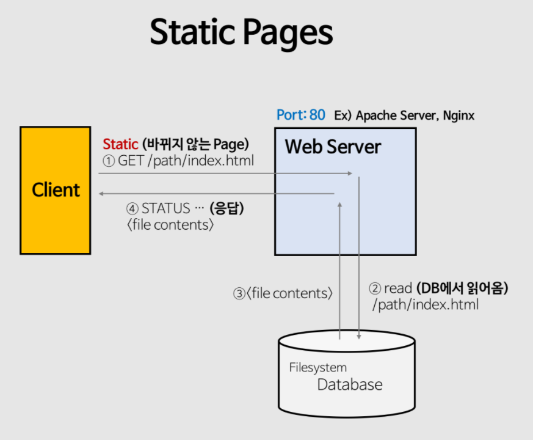
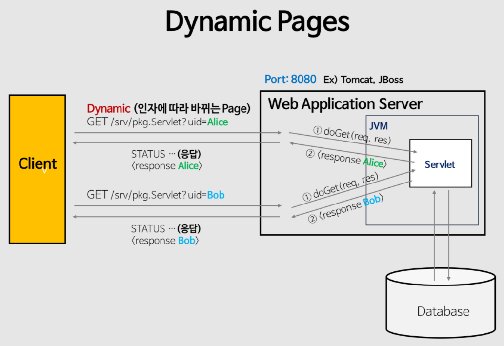
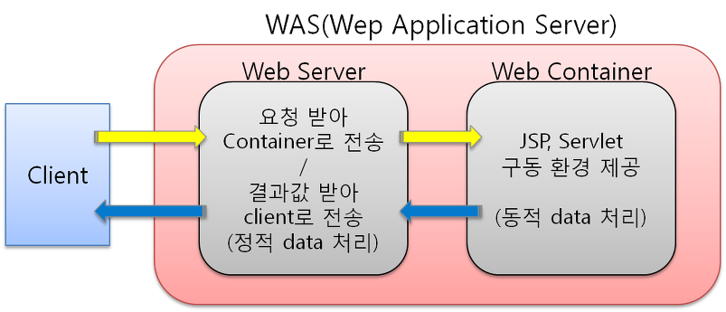

# 13-2. Web Server와 Web Application Server의 차이에 대해 설명해 주세요.

### **웹 서비스 구조의 발전 과정
**

## 1. 클라이언트가 DB에 직접 접근하던 시절

가장 처음에는 프로그램이 DB와 직접 통신했습니다.

```plain text
사용자
   │
   ▼
클라이언트 프로그램
   │
   ▼
 DBMS
```

예를 들어 쇼핑몰이라면

  - 로그인

  - 상품 조회

  - 주문

  - 결제

이 모든 로직이 클라이언트 프로그램 안에 있었습니다.

### 문제점

❌ 클라이언트가 너무 무거워짐

  - 프로그램 크기가 커짐

  - 복잡한 비즈니스 로직 포함

❌ 보안 취약

  - DB 접근 정보가 클라이언트에 존재

  - 악의적인 접근 위험

❌ 유지보수 어려움

예를 들어 할인 정책이 바뀌면

```plain text
10,000명의 사용자

↓

프로그램 다시 설치
```

해야 했습니다.

---

# 2. 미들웨어(WAS)의 등장

그래서 생각한 것이

> **"비즈니스 로직을 서버에서 처리하자."**

입니다.

```plain text
사용자
    │
    ▼
클라이언트
    │
    ▼
WAS
    │
    ▼
DBMS
```

이제 클라이언트는

```plain text
로그인 요청
```

만 보내면

WAS가

  - 로그인 검사

  - 권한 확인

  - DB 조회

  - 결과 생성

을 수행합니다.

### 장점

✅ 클라이언트가 가벼워짐

✅ 로직 변경 시 서버만 수정하면 됨

✅ 보안 향상

✅ 여러 클라이언트(웹, 앱)가 같은 서버를 사용 가능

---

# 3. 웹(Web)의 등장

인터넷이 보편화되면서

클라이언트 프로그램 대신

```plain text
웹 브라우저
```

가 클라이언트 역할을 하게 됩니다.

```plain text
브라우저
    │
    ▼
WAS
    │
    ▼
DB
```

이 구조로도 충분히 서비스가 가능합니다.

실제로 Spring Boot만 실행해도 이런 구조입니다.

---

# 4. 그런데 또 문제가 발생

브라우저는 API만 요청하지 않습니다.

페이지 하나를 열면

```plain text
index.html
style.css
main.js
logo.png
banner.png
```

등 수많은 **정적 파일(Static Resource)** 을 요청합니다.

예를 들어

```plain text
사용자 1000명

↓

이미지 수만 장 요청

↓

CSS 수천 개 요청

↓

JS 수천 개 요청
```

이걸 모두 WAS가 처리하면

```plain text
로그인도 해야 하고

DB 조회도 해야 하고

이미지도 보내야 하고

CSS도 보내야 하고

JS도 보내야 한다.
```

즉,

**WAS가 너무 바빠집니다.**

---

# 5. 그래서 Web Server를 따로 둠

Web Server는

> **정적 파일만 빠르게 제공하는 전문 서버**

입니다.

```plain text
            브라우저
                 │
                 ▼
          Web Server
          /         \
         /           \
정적 파일 요청      동적 요청(API)
      │                │
      ▼                ▼
   바로 응답          WAS
                         │
                         ▼
                        DB
```

### Web Server 역할

  - HTML

  - CSS

  - JS

  - 이미지

  - 동영상

등을 빠르게 제공

---

### WAS 역할

  - 로그인

  - 회원가입

  - 게시판

  - 주문

  - 결제

  - DB 조회

등 **비즈니스 로직 수행**

---

# 최종 구조

```plain text
사용자(브라우저)
        │
        ▼
   Web Server
(Nginx, Apache)
        │
        ▼
      WAS
(Spring Boot + Tomcat)
        │
        ▼
      DBMS
(MySQL 등)
```

각자의 역할은 다음과 같습니다.

| 구성 요소 | 역할 |
| --- | --- |
| **Web Server** | 정적 파일 제공, 요청 분배(리버스 프록시), HTTPS 처리 |
| **WAS** | 비즈니스 로직 실행, 동적 콘텐츠 생성, DB 연동 |
| **DBMS** | 데이터 저장 및 관리 |

---

# 핵심 흐름 한눈에 보기

```plain text
① 클라이언트 → DB 직접 접근
      │
      └─ 클라이언트가 너무 무겁고 보안 문제 발생

                ↓

② WAS(미들웨어) 등장
      │
      └─ 비즈니스 로직을 서버로 이동

                ↓

③ 웹 서비스 확산
      │
      └─ 브라우저가 수많은 정적 파일을 요청

                ↓

④ WAS 과부하 발생

                ↓

⑤ Web Server 추가
      │
      ├─ Web Server → 정적 파일 처리
      └─ WAS → 동적 요청 및 비즈니스 로직 처리
```

---

> **처음에는 클라이언트가 DB에 직접 접근하며 비즈니스 로직을 수행했지만, 유지보수와 보안 문제를 해결하기 위해 WAS(미들웨어)가 등장했습니다. 이후 웹 서비스가 발전하면서 정적 리소스 요청이 급증하자, WAS의 부담을 줄이고 성능을 높이기 위해 Web Server를 앞단에 두어 정적 요청과 동적 요청을 분리하는 현재의 구조가 만들어졌습니다.**

- **클라이언트 → DBMS** (문제 발생)

- **WAS(미들웨어) 등장** → 비즈니스 로직을 서버로 이동

- **WAS만 쓰다 보니 정적 파일 처리 비효율**

- **Web Server 추가** → 정적 요청과 동적 요청을 분리

> **Web Server는 HTTP 요청을 받아 HTML, CSS, JavaScript, 이미지와 같은 정적 콘텐츠를 제공하는 서버입니다. 반면 Web Application Server(WAS)는 웹 서버의 기능에 더해 애플리케이션을 실행하여 로그인, 회원가입, 게시글 조회와 같은 비즈니스 로직을 수행하고 DB와 연동해 동적인 콘텐츠를 생성합니다. 실무에서는 Web Server가 정적 요청을 처리하고, 동적 요청은 WAS로 전달하는 구조를 사용합니다. 이를 통해 WAS는 비즈니스 로직 처리에 집중할 수 있어 성능과 확장성을 높일 수 있습니다.**

### **웹 서버(Web Server)**



Web Server는 **클라이언트의 HTTP 요청을 받아 정적(Static) 콘텐츠를 제공하는 서버**입니다.

정적 콘텐츠란 이미 만들어져 있는 파일로, 요청이 들어오면 별도의 비즈니스 로직을 수행하지 않고 그대로 전달합니다.

대표적인 정적 콘텐츠는 다음과 같습니다.

- HTML

- CSS

- JavaScript

- 이미지(PNG, JPG)

- 동영상

예를 들어 사용자가 다음과 같이 요청하면

```plain text
GET /logo.png
```

Web Server는 서버에 저장된 `logo.png` 파일을 찾아 그대로 응답합니다.

```plain text
브라우저
    │
    ▼
Web Server
    │
    ├── logo.png
    ├── style.css
    └── index.html
```

대표적인 Web Server로는 **Nginx**, **Apache HTTP Server** 등이 있습니다.

### **웹 어플리케이션 서버(Web Application Server)**



Web Application Server는 **웹 서버의 기능에 더해 애플리케이션을 실행하여 동적인(Dynamic) 콘텐츠를 생성하는 서버**입니다.

즉, 사용자의 요청에 따라 프로그램을 실행하고, 데이터베이스와 연동하여 결과를 생성한 뒤 응답합니다.

예를 들어 사용자가 로그인 요청을 보내면

```plain text
POST /login
```

WAS는

1. 아이디와 비밀번호 확인

1. DB 조회

1. 로그인 검증

1. 결과 생성

과정을 수행한 후 응답을 반환합니다.

```plain text
브라우저
      │
      ▼
     WAS
      │
Controller
      │
Service
      │
Repository
      │
     DB
```

대표적인 WAS로는 **Tomcat**, **Jetty** 등이 있으며, Spring Boot는 기본적으로 **내장 Tomcat**을 사용하여 애플리케이션을 실행합니다.

---

# Web Server와 WAS를 분리하는 이유

초기에는 WAS만으로도 웹 서비스를 운영할 수 있었습니다.

```plain text
브라우저
    │
    ▼
   WAS
    │
    ▼
   DB
```

하지만 웹 서비스가 발전하면서 브라우저는 HTML뿐 아니라 CSS, JavaScript, 이미지 등 수많은 정적 파일을 요청하게 되었습니다.

만약 WAS가 이러한 정적 파일까지 모두 처리한다면 로그인, 회원가입, 주문 처리와 같은 중요한 비즈니스 로직에 사용할 자원이 줄어들어 성능이 저하될 수 있습니다.

그래서 **정적 콘텐츠는 Web Server가 처리하고, 동적 요청은 WAS가 처리하도록 역할을 분리**하게 되었습니다.

```plain text
             브라우저
                 │
                 ▼
          Web Server
          /        \
         /          \
정적 파일 요청    동적 요청(API)
      │              │
      ▼              ▼
   바로 응답        WAS
                     │
                     ▼
                    DB
```

---

# Web Server와 WAS의 차이

| 구분 | Web Server | Web Application Server |
| --- | --- | --- |
| 주요 역할 | 정적 콘텐츠 제공 | 동적 콘텐츠 생성 및 비즈니스 로직 수행 |
| 처리 대상 | HTML, CSS, JS, 이미지 등 | 로그인, 회원가입, 주문, 게시글 조회 등 |
| 프로그램 실행 | 하지 않음 | 애플리케이션 실행 |
| DB 연동 | 일반적으로 하지 않음 | 수행 |
| 비즈니스 로직 | 없음 | 있음 |
| 대표 제품 | Nginx, Apache HTTP Server | Tomcat, Jetty |

---

# 실제 서비스 구조

실무에서는 Web Server와 WAS를 함께 사용하는 경우가 대부분입니다.

```plain text
사용자(브라우저)
        │
        ▼
Web Server (Nginx)
        │
   ┌────┴────┐
   │         │
정적 파일   동적 요청
   │         │
   ▼         ▼
 바로 응답   WAS(Spring Boot + Tomcat)
                 │
                 ▼
               MySQL
```

- **Web Server**는 정적 파일 제공, 리버스 프록시, HTTPS 처리 등을 담당합니다.

- **WAS**는 비즈니스 로직 실행, 동적 콘텐츠 생성, DB 연동을 담당합니다.


