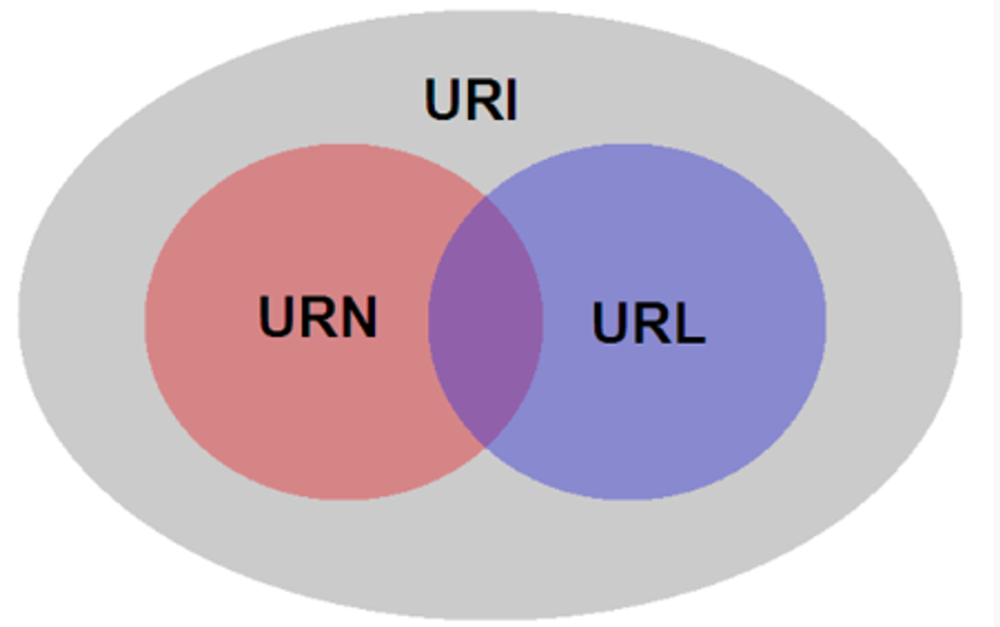
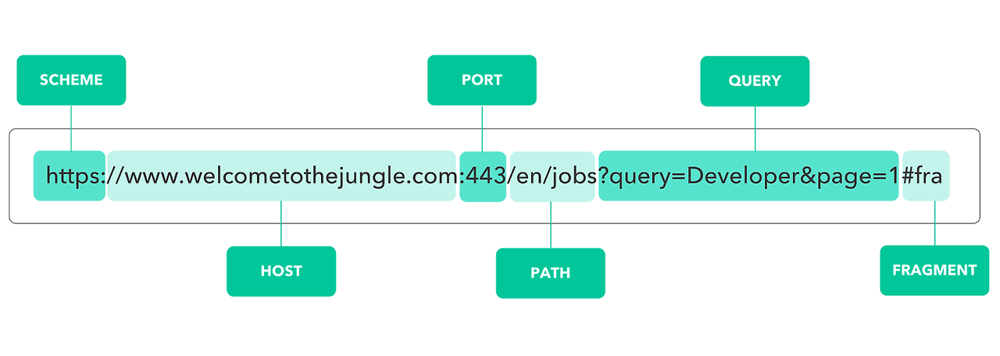
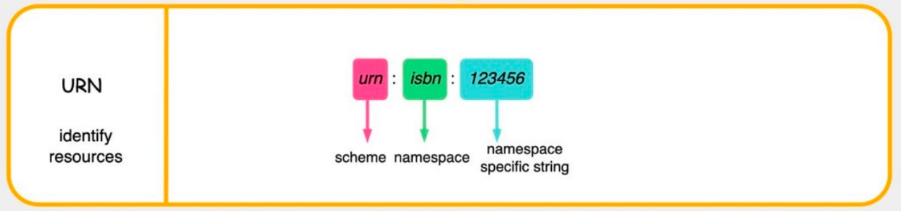

# 13-3. URL, URI, URN은 어떤 차이가 있나요?



**URI는 자원을 식별하는 모든 방법**

**URL은 자원의 위치를 알려주는 것**

**URN은 자원의 이름(고유 식별자)을 알려주는 것**

URI
├── URL
└── URN

# 1. URI (Uniform Resource Identifier)

URI는 **인터넷에 있는 자원을 식별(Identify)하기 위한 모든 문자열**입니다.

"이게 누구냐?"를 알려주는 개념입니다.

예를 들어

```plain text
https://www.google.com/search?q=java
```

이것도 URI입니다.

또

```plain text
urn:isbn:9780134685991
```

이것도 URI입니다.

즉 **URL과 URN을 모두 포함하는 상위 개념**입니다.

---

# 2. URL (Uniform Resource Locator)

URL은 **자원의 위치(Location)를 알려주는 URI**입니다.

브라우저가

```plain text
https://github.com
```

를 보면

- https 프로토콜 사용

- github.com 서버 접속

- 해당 경로 요청

까지 모두 가능합니다.

예시

```plain text
https://naver.com

https://github.com/user/project

http://localhost:8080/api/users
```

모두 URL입니다.

URL에는 보통

```plain text
프로토콜
+
도메인
+
경로
```

가 들어갑니다.

예시

```plain text
https://example.com/images/cat.jpg
```

```plain text
https://   ← 프로토콜
example.com ← 서버
/images/cat.jpg ← 경로
```

> **"어디 있는지" 알려주는 주소**



```plain text
<URL 구성요소>

1. Scheme

- 자원에 접근하기 위한 통신 프로토콜

- http, https, ftp, sftp 등이 있다.


2. Host

- 자원이 호스팅 되고 있는 서버 도메인 이름 또는 IP


3. Port

- 자원에 대한 요청을 수신하는데 사용되는 서버의 포트 번호

- 일반적으로 http 요청은 80, https 요청은 443을 기본 포트로 사용한다.

- 만약 URL에 포트 번호를 생략할 시 기본 포트로 매핑된다.


4. Path

- 서버 내에 자원이 위치하는 경로

-/경로/파일명.확장자 형식이다.


5. Query

- 자원에 대한 추가 질의를 위해 서버에 전달되는 매개변수와 값의 쌍을 말한다.

- [KEY=VALUE] 형식으로 표현하고, 여러개의 매개변수가 있을 때는 &(앤퍼센트) 구분자로 구분한다.


6. Fragment

- 자원의 특정 부분을 가르키기 위해 사용된다.

- 서버에는 전송되지 않고, 클라이언트 측에서만 사용되는 개념이다
```

---

# 3. URN (Uniform Resource Name)

URN은 **위치와 상관없이 자원의 이름만으로 식별**합니다.

실제 자원에 접근하기 까다롭다는 단점이 있어서 거의 사용하지 않는다.

예시

```plain text
urn:isbn:9780134685991
```

ISBN 번호는

```plain text
9780134685991
```

만 알면

어느 서점에 있든

어느 서버에 있든

같은 책입니다.

즉

> 위치는 몰라도 "이 책이다"를 식별할 수 있습니다.

대표 예시

```plain text
urn:isbn:9780134685991
```

```plain text
urn:uuid:550e8400-e29b-41d4-a716-446655440000
```



```plain text
<URN 구성요소>

1. Scheme

- 다른 URI과 구별하기 위해 "urn"으로 고정해서 사용한다 (RFC 2141 표준)


2. NID (Namespace Identifier)

- 각 URN이 속한 namespace로, 자원이 저장된 저장소를 의미한다.

- 특정 도서에 대한 URN인 경우, NID는 isbn으로 저장된다.

- 이 식별자를 통해 어떤 종류의 자원인지 확인할 수 있다.


3. NSS (Namespace Specific String)

- namespace 내에서 고유한 자원을 식별하는 문자열이다.

- 특정 도서에 대한 NSS인 경우, ISBN의 일련번호를 나타낸다
```

---

# 비유하면

책을 찾는다고 생각하면

### URL

```plain text
서울도서관
3층
A-12 책장
```

→ 위치를 알려줌

---

### URN

```plain text
ISBN : 9780134685991
```

→ 이름(고유번호)만 알려줌

---

### URI

```plain text
책을 식별하는 모든 방법
```

둘 다 포함

---

# 웹 개발에서는?

우리가 사용하는 대부분은 URL입니다.

예를 들어

```plain text
https://www.naver.com

https://chat.openai.com

http://localhost:8080/users

https://api.github.com/repos
```

전부 URL입니다.

---

# REST API에서 URI라고 부르는 이유

Spring에서 자주 보이는

```plain text
@GetMapping("/users")
```

또는

```plain text
@GetMapping("/users/{id}")
```

여기서 흔히 "URL"이라고 말하기도 하지만, REST에서는 **리소스를 식별하는 문자열**이라는 의미를 강조하기 위해 **URI**라는 표현을 더 많이 사용합니다.

예를 들어

```plain text
/users/1
```

은 "1번 사용자"라는 **리소스를 식별**하는 URI이고,

실제로 요청을 보내는 전체 주소는

```plain text
http://localhost:8080/users/1
```

처럼 URL이 됩니다.

---

# 면접 답변 예시

> **URI는 인터넷 상의 자원을 식별하기 위한 상위 개념입니다. URL과 URN을 모두 포함하며, URL은 자원의 위치를 나타내어 해당 자원에 접근할 수 있게 해주고, URN은 위치와 관계없이 자원의 고유한 이름으로 식별합니다. 실무에서는 웹 주소를 의미하는 URL을 많이 사용하지만, REST API에서는 리소스를 식별한다는 의미를 강조하기 위해 URI라는 용어를 주로 사용합니다.**
