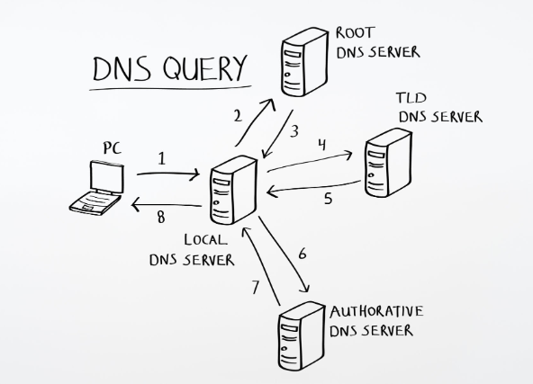

# 14-0. DNS에 대해 설명해 주세요.

## 0. 사전 지식 및 핵심 용어 정의

> 

  - **IP 주소**와 **도메인 네임**의 관계

    - 인터넷 상의 컴퓨터들은 서로를 찾기 위해 123.456.7.8과 같은 숫자로 구성된 **IP 주소**를 식별자로 사용

    - 하지만 대형 포털이나 서비스의 **도메인 이름(예: naver.com)**을 문자로 기억하는 것이 훨씬 직관적

    - 이 두 영역 사이에서 가교 역할을 수행하는 시스템이 필요

정확한 인프라 이해를 위해 먼저 적립해야 할 핵심 용어들입니다.

- **네임 서버 (Name Server)**: `도메인 이름`과 그에 매칭되는 `실제 IP 주소` 레코드 데이터를 데이터베이스로 보유하고 관리하는 서버 소프트웨어

- **리커시브 리졸버 (Recursive Resolver)**: 클라이언트(브라우저)의 요청을 대신 받아서 `최종 IP 주소`를 알아낼 때까지 상위 네임 서버들을 차례대로 전전하며 질문을 던지는 대리인 서버.

  - 주로 통신사가 제공하는 기본 DNS 서버나 구글 공용 DNS(8.8.8.8)가 이에 해당

- **존 트랜스퍼 (Zone Transfer)**: 하나의 도메인 영역을 관리하는 기본(Master) 네임 서버의 `원본 데이터베이스 내용`을, 백업 및 부하 분산용 보조(Slave) 네임 서버로 그대로 `복사`하여 동기화하는 전송 규격

## 14. DNS에 대해 설명해 주세요.

### 개념 정의

DNS(Domain Name System)는 문자로 구성된 **도메인 이름**을 컴퓨터가 네트워크 통신에서 인식할 수 있는 숫자인** IP 주소로 변환**해 주거나, 그 반대의 역방향 조회를 수행하는 거대한 전 세계 `분산형 데이터베이스 시스템`입니다. 인터넷 세계의 전화번호부 시스템이라고 비유할 수 있습니다.

### 계층적 구조

DNS는 전 세계의 단 한 대의 슈퍼컴퓨터가 모든 도메인 정보를 독점하여 처리하지 않습니다. 트래픽의 집중을 막고 서버 장애 시 전 세계 인터넷이 마비되는 것을 방지하기 위해 **계층적인 정점 구조로 분산 관리**됩니다.

- **루트 네임 서버 (Root Name Server)** 

  

  
예시

루트 네임 서버는 전 세계에 딱 13개의 논리적 주소만 존재. 주소는 알파벳 A부터 M까지를 따서 다음과 같은 형태

    - a.root-servers.net

    - b.root-servers.net

    - c.root-servers.net

    - ...

    - m.root-servers.net
  

  - DNS 계층 구조의 최상위 노드

  - 전 세계에 고정된 IP 주소 집합으로 존재

  - 도메인의 확장자 정보(ex. com)를 기반으로 TLD 서버의 위치(해당 TLD의 IP 주소)를 안내

- **TLD 네임 서버 (Top-Level Domain Server)**

  

  
예시

인터넷 도메인 주소 체계는 **오른쪽에서 왼쪽으로 갈수록 계층이 낮아**지는 역트리 구조로, 이 구조에서 뿌리(루트) 바로 아래에 위치한 가장 높은 계층의 도메인을 의미

쉽게 말해, 인터넷 주소창에 치는 **도메인 이름의 가장 오른쪽**에 붙는 마침표 뒤의 문자열들이 모두 TLD에 해당

## 1. 도메인 구조 내에서의 위치

도메인 주소가 어떻게 쪼개지는지 실제 예시를 통해 살펴보면 이해하기 쉽습니다.

### 예시 1: google.com

    - com : 최상위 도메인 (TLD)

    - google : 차상위 도메인 (SLD, Second-Level Domain)

### 예시 2: naver.co.kr

    - kr : 최상위 도메인 (TLD)

    - co : 차상위 도메인 (SLD)

    - naver : 3단계 도메인 (Third-Level Domain)

## 2. TLD의 주요 분류

TLD는 목적과 성격에 따라 국제 인터넷 주소자원 관리기구(ICANN)에 의해 크게 **두 가지 종류로 분류**되어 관리됩니다.

### generic TLD (gTLD, 일반 최상위 도메인)

등록자의 국적과 상관없이 전 세계 누구나 특정 목적에 맞게 등록할 수 있는 도메인입니다. 초기에는 7개로 시작했으나 현재는 수백 개 이상으로 확장되었습니다.

    - .com : 기업이나 상업적 목적 (Commercial)

    - .net : 네트워크 관련 기관 (Network)

    - .org : 비영리 단체나 조직 (Organization)

    - .edu : 미국의 교육 기관 (Education)

    - 신규 gTLD : 최근에 추가된 .app, .tech, .dev, .seoul 등 특정 산업이나 지역을 나타내는 도메인

### country code TLD (ccTLD, 국가 코드 최상위 도메인)

세계 각 국가나 독자적인 영토를 식별하기 위해 ISO 표준 국가 코드를 기반으로 부여된 도메인입니다. 일반적으로 해당 국가의 거주자나 법인만 등록할 수 있는 제한이 있습니다.

    - .kr : 대한민국

    - .jp : 일본

    - .us : 미국

    - .uk : 영국

## 3. DNS 조회 프로세스에서의 TLD 네임 서버의 역할

DNS 조회 과정에서 TLD 네임 서버는 아주 중요한 이정표 역할을 합니다.

> **TLD 네임 서버의 역할**
루트 네임 서버가 "com으로 끝나는 도메인은 여기로 가라"고 알려주면, 리커시브 리졸버는 해당 com TLD 네임 서버로 이동합니다. com TLD 네임 서버는 전 세계 모든 com 도메인의 정보를 들고 있는 것이 아니라, google.com의 실제 주소(웹 서버의 IP 주소)를 알고 있는 **권한 있는 네임 서버(Authoritative Name Server)**의 위치 주소를 보관하고 있다가 리졸버에게 토스해 주는 역할을 수행합니다.
  

  - .com, .net, .kr 등 국가 코드나 일반 최상위 도메인 영역을 관리

  - 해당 도메인의 하위 영역을 책임지는 서버의 주소(권한 있는 네임 서버)를 안내

- **권한 있는 네임 서버 (Authoritative Name Server)**

  - 도메인 등록 대행업체나 개인이 직접 운영하는 최종 서버

  - 특정 도메인의 `실제 IP 주소 값`이 기록된 레코드를 직접 보유하고 있어 **최종 정답을 반환**

### 조회 프로세스 (Resolution Process)

브라우저가 주소를 요청하면 리커시브 리졸버가 중심이 되어 다음 순서로 데이터를 추적합니다.

1. 클라이언트 호스트가 리커시브 리졸버에게 주소 해석을 요청합니다.

1. 리커시브 리졸버는 로컬 캐시에 데이터가 없다면 먼저 루트 네임 서버에게 질의를 던집니다.

1. 루트 네임 서버는 주소의 확장자를 보고 com을 관리하는 TLD 서버 주소를 리턴합니다.

1. 리커시브 리졸버는 다시 해당 TLD 서버로 이동하여 세부 도메인을 질의합니다.

1. TLD 서버는 도메인의 권한 있는 네임 서버 주소를 응답합니다.

1. 리커시브 리졸버가 권한 있는 네임 서버에 도달하여 마침내 실제 IP 주소 정답을 얻어냅니다.

1. 리커시브 리졸버는 클라이언트에게 최종 IP 주소를 반환하고, 향후 고속 조회를 위해 자체 **캐시 메모리에 이를 저장**합니다.
