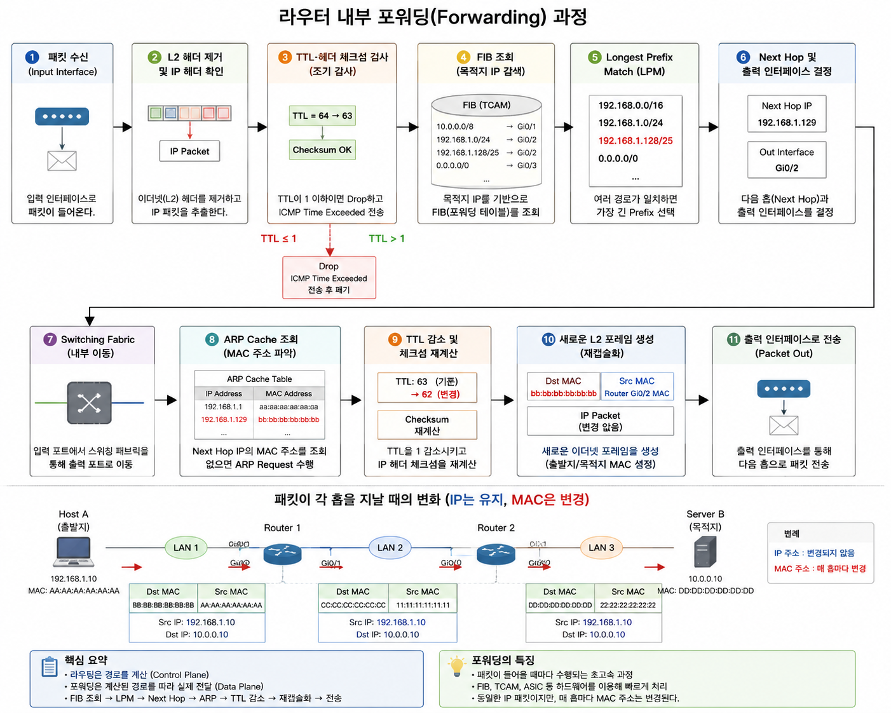

# 17-0. 라우터 내의 포워딩 과정에 대해 설명해 주세요.

# 17-0. 라우터 내의 포워딩(Forwarding) 과정



## 1. 포워딩(Forwarding)이란?

포워딩(Forwarding)은 **라우팅(Routing)을 통해 계산된 경로를 이용하여 실제로 패킷을 적절한 출력 인터페이스로 전달하는 과정**이다.

- **라우팅(Routing)** : 목적지까지의 최적 경로를 계산하는 과정 (Control Plane)

- **포워딩(Forwarding)** : 계산된 경로를 따라 실제 패킷을 전달하는 과정 (Data Plane)

쉽게 말하면 **라우팅이 내비게이션으로 길을 찾는 과정이라면, 포워딩은 그 길을 따라 실제로 운전하는 과정**이다.

---

# 2. 포워딩 과정

```plain text
패킷 수신(Input Interface)
        │
        ▼
L2 헤더 제거 및 IP 헤더 확인
        │
        ▼
TTL·헤더 체크섬 검사
(TTL ≤ 1이면 Drop 및 ICMP Time Exceeded 전송)
        │
        ▼
FIB(Forwarding Information Base) 조회
        │
        ▼
Longest Prefix Match(LPM)
        │
        ▼
Next Hop 및 출력 인터페이스 결정
        │
        ▼
Switching Fabric을 통해 출력 포트로 이동
        │
        ▼
ARP Cache 조회
(MAC 주소 없으면 ARP Request 수행)
        │
        ▼
TTL 1 감소 및 IP Header Checksum 재계산
        │
        ▼
새로운 L2 프레임 생성
        │
        ▼
출력 인터페이스로 전송
```

---

# 3. 단계별 설명

### ① 패킷 수신 (Packet Reception)

패킷이 입력 인터페이스(Input Interface)로 들어온다.

---

### ② L2 헤더 제거 및 IP 헤더 확인

이더넷 프레임의 L2 헤더를 제거(Decapsulation)하고 IP 패킷을 추출한다.

---

### ③ TTL 및 헤더 체크섬 검사

- IP 헤더의 체크섬을 확인하여 헤더 손상 여부를 검사한다.

- TTL(Time To Live)이 **1 이하이면 더 이상 전달하지 않고 폐기(Drop)** 한다.

- 이 경우 **ICMP Time Exceeded** 메시지를 송신자에게 전송한다.

> **왜 먼저 검사할까?**

어차피 버릴 패킷이라면 FIB 조회 등의 불필요한 연산을 수행하지 않기 위해서이다.

---

### ④ FIB(Forwarding Information Base) 조회

목적지 IP 주소를 이용하여 **FIB(포워딩 테이블)** 를 조회한다.

FIB는 라우팅 테이블(RIB)을 기반으로 생성된 **실제 포워딩용 테이블**이다.

---

### ⑤ Longest Prefix Match(LPM)

여러 경로가 일치하는 경우 **가장 긴 Prefix(가장 구체적인 경로)** 를 선택한다.

예시)

```plain text
192.168.1.0/24
192.168.1.128/25
```

목적지가 **192.168.1.130** 이라면

→ **/25**가 더 많이 일치하므로 해당 경로를 선택한다.

---

### ⑥ Next Hop 및 출력 인터페이스 결정

선택된 경로를 이용하여

- 다음 라우터(Next Hop)

- 출력 인터페이스

를 결정한다.

---

### ⑦ Switching Fabric 이동

입력 포트에서 출력 포트까지 라우터 내부의 **Switching Fabric(Crossbar 등)** 을 통해 패킷을 이동시킨다.

<details>
<summary>Switching Fabric 종류</summary>

### ① Memory Switching

```plain text
Input

↓

메모리 복사

↓

Output
```

가장 단순하지만 느립니다.

---

### ② Bus Switching

```plain text
Input

↓

공유 Bus

↓

Output
```

버스를 공유하기 때문에 동시에 하나씩만 사용할 수 있습니다.

---

### ③ Crossbar Switching ⭐⭐⭐

```plain text
Input1 ───── Output3

Input2 ───── Output1

Input3 ───── Output4
```

여러 입력과 출력이 **동시에 연결**될 수 있어 가장 빠르며, 현대의 고성능 라우터에서 주로 사용됩니다.
</details>

---

### ⑧ ARP Cache 조회

Next Hop IP의 MAC 주소를 확인한다.

- ARP Cache에 존재 → 바로 사용

- 없으면 → ARP Request를 보내 MAC 주소를 알아낸다.

---

### ⑨ TTL 감소 및 체크섬 재계산

실제 전송 직전에

- TTL을 1 감소

- 변경된 IP 헤더의 Checksum을 재계산

한다.

---

### ⑩ 새로운 L2 프레임 생성 및 전송

다음 홉으로 보내기 위해 새로운 이더넷 프레임을 생성한다.

- **출발지 MAC** : 현재 라우터의 출력 인터페이스 MAC

- **목적지 MAC** : Next Hop의 MAC 주소

이후 출력 인터페이스를 통해 전송한다.

---

# 4. Longest Prefix Match(LPM)

여러 경로가 동시에 일치할 경우 **가장 긴 Prefix를 가진 경로를 선택**하는 방식이다.

예시

| 목적지 | 선택되는 경로 |
| --- | --- |
| 192.168.1.130 | 192.168.1.128/25 |
| 192.168.1.50 | 192.168.1.0/24 |

즉, **더 구체적인 경로가 항상 우선된다.**

---

# 5. TCAM (Ternary Content Addressable Memory)

라우터는 FIB 조회를 매우 빠르게 수행하기 위해 **TCAM**을 사용한다.

### 특징

- 일반 RAM은 **주소 → 데이터**를 찾는다.

- TCAM은 **데이터(IP 주소) → 일치하는 엔트리**를 찾는다.

- `0`, `1`뿐 아니라 **X(Don't Care)** 를 지원하여 서브넷 마스크 비교에 적합하다.

- 수만 개의 경로를 **1클록 수준**에서 동시에 비교할 수 있다.

---

# 6. 포워딩의 특징

- **Data Plane**에서 수행된다.

- **패킷마다 수행**된다.

- **FIB(Forwarding Table)** 를 사용한다.

- **Longest Prefix Match**를 이용하여 최적의 경로를 선택한다.

- **TCAM** 등의 하드웨어를 활용하여 매우 빠르게 처리한다.

---

# 7. 핵심 요약 (면접 답변)

> **패킷이 입력 인터페이스로 들어오면 L2 헤더를 제거하고 IP 헤더를 확인한다. TTL과 헤더 체크섬을 검사한 뒤 목적지 IP를 이용해 FIB를 조회하고 Longest Prefix Match를 수행한다. 이후 Next Hop과 출력 인터페이스를 결정하고 Switching Fabric을 통해 출력 포트로 이동한다. ARP 캐시에서 Next Hop의 MAC 주소를 확인한 뒤 TTL을 1 감소시키고 체크섬을 재계산한다. 마지막으로 새로운 L2 프레임으로 재캡슐화하여 출력 인터페이스를 통해 전송한다.**

---

## ⭐ 암기 한 줄

> **패킷 수신 → L2 제거 → TTL·체크섬 검사 → FIB 조회 → LPM → Next Hop 결정 → Switching Fabric → ARP → TTL 감소 및 체크섬 재계산 → L2 재캡슐화 → 전송**
