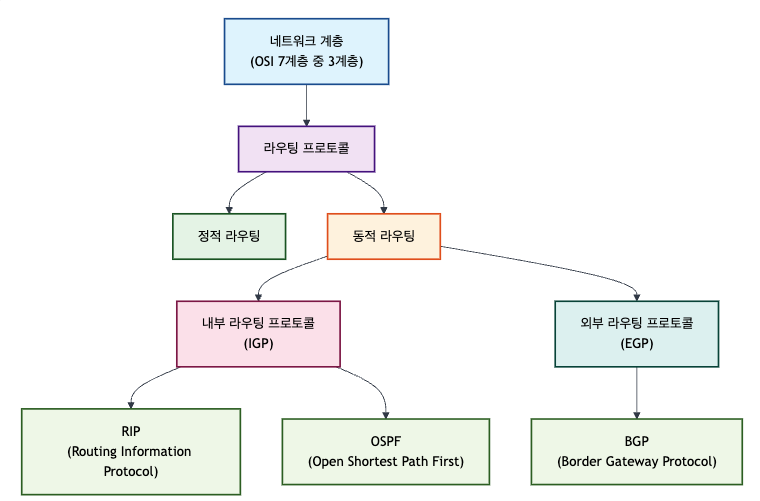
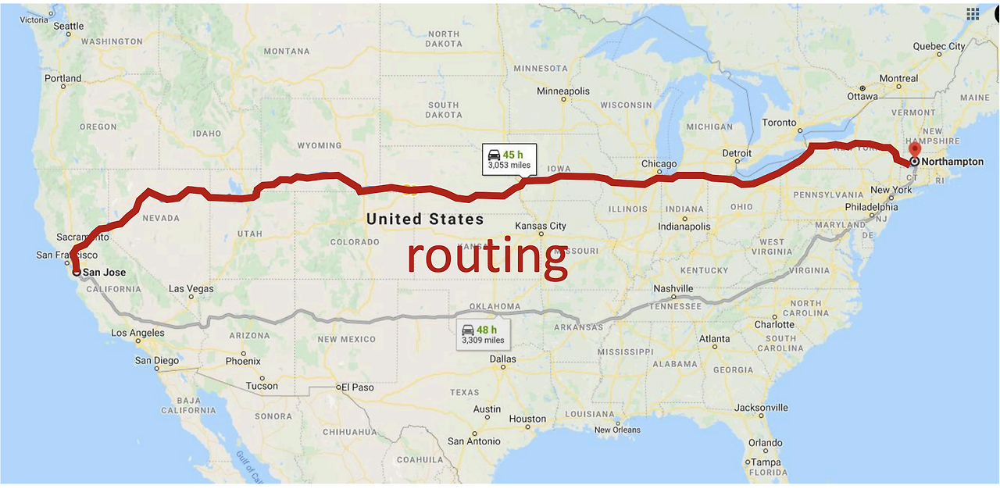
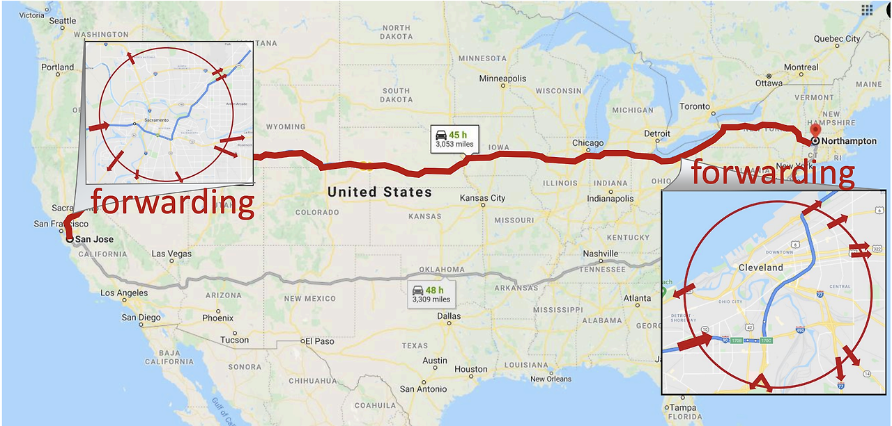

# 17-1. 라우팅과 포워딩의 차이는 무엇인가요?

# 17-1. 라우팅(Routing)과 포워딩(Forwarding)의 차이

라우터의 역할은 크게 **라우팅(Routing)** 과 **포워딩(Forwarding)** 으로 나눌 수 있다.

- **라우팅(Routing)** : 패킷이 목적지까지 도달하기 위한 **최적의 경로를 계산**하는 과정

- **포워딩(Forwarding)** : 계산된 경로를 이용하여 **실제로 패킷을 전달**하는 과정

쉽게 말하면 **내비게이션이 길을 찾는 것이 라우팅**, **찾은 길을 따라 실제로 운전하는 것이 포워딩**이다.

---

# 1. 라우팅(Routing)



## 개념

라우팅은 **패킷이 목적지까지 도달하기 위한 최적의 경로를 계산하는 과정**이다.

라우터는 **RIP, OSPF, BGP** 등의 라우팅 프로토콜을 이용하여 네트워크 정보를 교환하고, 그 결과를 바탕으로 **라우팅 테이블(Routing Table, RIB)** 을 생성하거나 갱신한다.

## 동작 과정

1. 주변 라우터와 라우팅 정보를 교환한다.

1. 라우팅 프로토콜(RIP, OSPF, BGP)이 최적의 경로를 계산한다.

1. 계산된 경로를 **라우팅 테이블(RIB)** 에 저장한다.

1. 네트워크에 변화가 발생하면 라우팅 테이블을 갱신한다.

## 특징

- 최적의 경로를 계산한다.

- 라우팅 프로토콜을 사용한다.

- 라우팅 테이블(RIB)을 생성·갱신한다.

- 네트워크 변경 시 수행된다.

- **Control Plane**에서 동작한다.

---

## 정적 라우팅 vs 동적 라우팅

### 정적 라우팅(Static Routing)

관리자가 직접 경로를 설정하는 방식이다.

**장점**

- 설정이 간단하다.

- 예측 가능한 경로를 사용할 수 있다.

- 소규모 네트워크에 적합하다.

**단점**

- 네트워크 변경 시 직접 수정해야 한다.

- 대규모 네트워크에서는 관리가 어렵다.

---

### 동적 라우팅(Dynamic Routing)

라우팅 프로토콜을 이용하여 경로를 자동으로 계산하고 갱신하는 방식이다.

**장점**

- 네트워크 변화에 자동으로 대응한다.

- 대규모 네트워크에서 효율적이다.

**단점**

- 라우팅 정보 교환에 따른 오버헤드가 발생한다.

- 정적 라우팅보다 구성이 복잡하다.

---

## IGP와 EGP

### IGP (Interior Gateway Protocol)

같은 **AS(Autonomous System)** 내부에서 사용하는 라우팅 프로토콜이다.

대표 프로토콜

- RIP

- OSPF

- IS-IS

예시

- 회사 내부 네트워크

- 학교 캠퍼스 네트워크

---

### EGP (Exterior Gateway Protocol)

서로 다른 AS 간에 사용하는 라우팅 프로토콜이다.

대표 프로토콜

- BGP

예시

- KT ↔ SKT

- Google ↔ AWS

- ISP 간 연결

---

## 라우팅 알고리즘 비교

| 구분 | 거리 벡터 | 링크 상태 | 경로 벡터 |
| --- | --- | --- | --- |
| 대표 프로토콜 | RIP | OSPF | BGP |
| 알고리즘 | Bellman-Ford | Dijkstra | Path Vector |
| 기준 | Hop Count | Cost | 정책 + AS Path |
| 사용 범위 | 소규모 | 대규모 | AS 간 |

---

# 2. 포워딩(Forwarding)

## 개념

포워딩은 **라우팅을 통해 계산된 경로를 이용하여 실제 패킷을 전달하는 과정**이다.

라우터는 패킷이 도착하면 **포워딩 테이블(FIB)** 을 조회하여 적절한 출력 인터페이스를 결정한다.

## 동작 과정

1. 입력 인터페이스에서 패킷을 수신한다.

1. 목적지 IP 주소를 확인한다.

1. 포워딩 테이블(FIB)을 조회한다.

1. Longest Prefix Match를 통해 최적의 경로를 선택한다.

1. 다음 홉(Next Hop)을 결정한다.

1. 필요하면 ARP를 이용해 MAC 주소를 조회한다.

1. TTL을 감소시키고 체크섬을 갱신한다.

1. 출력 인터페이스를 통해 패킷을 전달한다.

## 특징

- 실제 패킷을 전달한다.

- 포워딩 테이블(FIB)을 사용한다.

- 패킷마다 수행된다.

- **Data Plane**에서 동작한다.

---

# 라우팅과 포워딩의 관계

```plain text
라우팅 프로토콜
(RIP, OSPF, BGP)
        │
        ▼
라우팅 테이블(RIB)
(경로 계산)
        │
        ▼
포워딩 테이블(FIB)
(최종 경로 저장)
        │
        ▼
패킷 포워딩
```

> **라우팅은 경로를 계산하고, 포워딩은 계산된 경로를 이용하여 실제 패킷을 전달한다.**

---

# 라우팅 vs 포워딩

| 구분 | 라우팅(Routing) | 포워딩(Forwarding) |
| --- | --- | --- |
| 목적 | 최적 경로 계산 | 실제 패킷 전달 |
| 사용 정보 | RIP, OSPF, BGP | 포워딩 테이블(FIB) |
| 사용 테이블 | 라우팅 테이블(RIB) | 포워딩 테이블(FIB) |
| 수행 시점 | 네트워크 변경 시 | 패킷마다 수행 |
| 수행 위치 | Control Plane | Data Plane |

## 한 줄 요약

- **라우팅(Routing)** : 패킷이 목적지까지 도달하기 위한 **최적의 경로를 계산하는 과정**

- **포워딩(Forwarding)** : 계산된 경로를 이용하여 **실제로 패킷을 전달하는 과정**

### 라우팅 포워드 예시

라우팅(Routing) 예시



포워딩(Forwarding) 예시



내비게이션을 설정할 때, 전체적인 관점에서 가장 효율적인 경로를 결정하는 것이 라우팅이고, 그 경로를 따라 이동하면서 특정 구간에서 어디로 갈지를 결정하는 것이 포워딩이다.
