# [CI/CD] 인프라 하지 마세요…

## 🏗️ 배포(Deployment)란 무엇인가?

배포는 내가 만든 코드를 내 컴퓨터(Local)를 벗어나 전 세계 사람들이 접속할 수 있는 **공용 컴퓨터(Server)**로 옮기는 과정이다.

- **비유**: 예쁜 인테리어 가구를 만드는 것이 **'개발'**이라면, 그 가구들을 트럭에 실어 새집으로 옮기고 손님을 맞이할 대문을 여는 것이 **'배포'**이다.

- **인프라 담당자의 역할**: 가구가 옮겨지는 길(Pipeline)을 닦고, 집의 보안 시스템과 안내 데스크를 구축하는 일을 한다.

---

## PART 1. 수동 배포 환경 구축: 인프라 기초 공사

자동화 시스템을 올리기 전, 서버가 스스로 돌아갈 수 있는 '기초 체력'을 만드는 단계다.

### 1. AWS EC2: 빈 땅 분양받기

- **개념**: 아마존(AWS)이라는 땅 주인에게 돈을 내고 빌린 **24시간 켜져 있는 가상 컴퓨터**다.

- **설정**: 보안 그룹(Security Group)을 통해 특정 포트(Port, 통로)만 열어 손님을 맞이한다.

### 2. Nginx: 서버의 친절한 '안내 데스크'

- **개념**: 사용자가 서버 주소로 찾아왔을 때, 요청에 따라 프론트엔드나 백엔드로 길을 안내해주는 **Reverse Proxy** 역할을 한다.

- **핵심 기능**:

  - **도메인 연결**: 숫자로 된 IP 주소 대신 예쁜 이름의 주소를 연결한다.

  - **HTTPS(SSL)**: cert봇을 이용하여 통신을 암호화하여 보안을 강화한다.

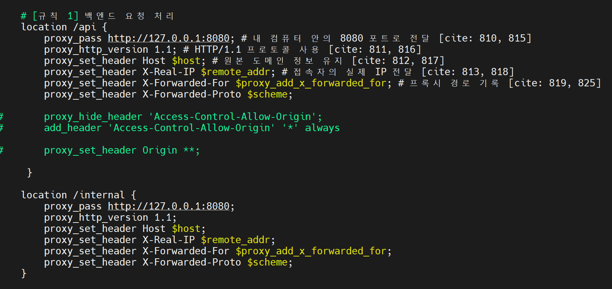

80포트(http)와 443포트(https) 에 대한 설정을 각각 해줘야 함.

### 3. Docker: "어디서나 똑같이 돌아가는 도시락통"

- **개념**: 코드와 실행 환경(OS, 라이브러리 등)을 하나로 묶어 **컨테이너(Container)**라는 독립된 통에 담는 도구다.

- **장점**: "내 컴퓨터에서는 되는데 서버에서는 안 되네?"라는 환경 차이 문제를 완벽히 해결한다.

### 4. Docker Compose: "설계도 한 장으로 여러 통 관리하기"

- **개념**: 백엔드, 프론트엔드, DB 등 여러 개의 컨테이너를 **하나의 실행 버튼**으로 동시에 띄우는 관리 도구다.

- **실제 활용**: `docker-compose.yml` 파일에 어떤 도시락통(컨테이너)을 몇 번 포트에 띄울지 적어두면 명령어 한 줄로 전체 시스템이 가동된다. 

---

## PART 2. CI/CD 자동화 환경 구축: 무인 공장 만들기

수동 배포에 성공했다면, 이제 사람이 개입하지 않아도 코드가 수정될 때마다 서버에 즉시 반영되는 **자동화 파이프라인**을 구축한다.

### 1. GitLab & Webhook: 자동화의 '신호탄'

- **GitLab**: 우리 팀의 코드를 모아두는 저장소다.

- **Webhook**: 개발자가 코드를 수정해서 올리면(Push), GitLab이 자동으로 "야, 젠킨스! 코드 바뀌었으니까 일 시작해!"라고 신호를 보낸다.

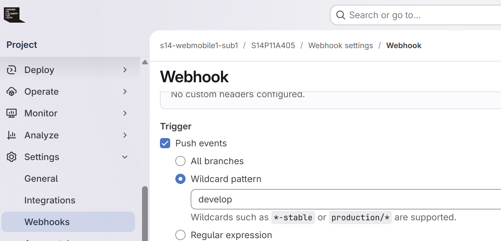

### 2. Jenkins: 자동화 공정의 '지휘자'

- **역할**: 전체 배포 과정을 관리하는 **공장장**이다.

- **파이프라인 단계**:

  1. **Build**: 최신 코드를 내려받아 실행 파일로 만든다.

  1. **Image Build**: 코드를 Docker 도시락통(이미지)으로 포장한다.

  1. **Push**: 완성된 도시락통을 창고(Docker Hub)에 보낸다.

  1. **Deploy**: 실제 서버(EC2)에게 새 도시락통으로 교체하라고 명령한다.

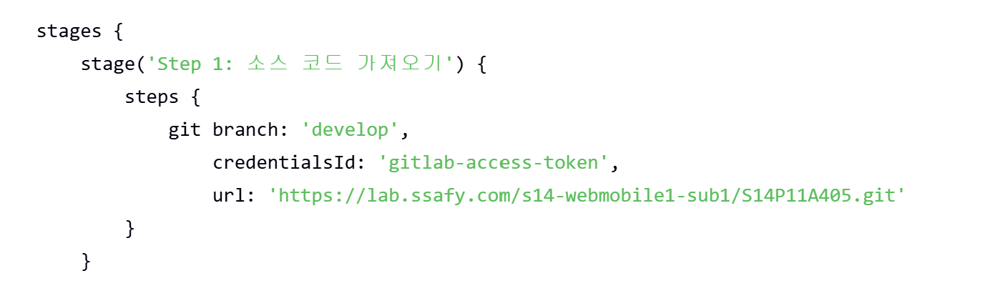

### 3. Docker Hub: 도시락통 전용 '중앙 창고'

- **개념**: 빌드된 Docker 이미지들을 보관하는 클라우드 저장소다.

- **흐름**: 젠킨스가 이미지를 만들어 이곳에 올리면, 실제 배포 서버(EC2)는 이 창고에서 최신 이미지만 쏙 뽑아간다.

---

## PART 3. 실전 트러블슈팅: 이론과 현실의 차이

실제 프로젝트(CS-AI)를 진행하며 겪은 돌발 상황과 해결 방법들이다.

- **포트 차단 문제**: 교육기관 WiFi 환경에서 특정 포트가 막혀있어, LiveKit 서버 포트를 **8000~8999 범위**로 조정하여 통신 문제를 해결했다.

- **볼륨 마운트 에러**: 설정 파일(`livekit.yaml`)을 주입할 때 호스트에 파일이 없으면 Docker가 이를 디렉토리로 오인하는 고질적인 문제를 **환경 변수 주입 방식**으로 전환하여 해결했다.

- **보안 정보 관리**: API Key나 DB 비밀번호처럼 깃허브에 올리면 안 되는 민감 정보는 **Jenkins Credentials** 기능을 통해 배포 시점에만 안전하게 주입했다.

---

## 🏁 마무리하며

인프라와 CI/CD 구축은 단순히 서버를 띄우는 것 이상의 가치를 가진다. 팀원들이 배포 과정에 신경 쓰지 않고 **'오직 개발에만 집중할 수 있는 환경'**을 만들어주는 것이 이 역할의 가장 큰 보람이다.

---

[https://www.genspark.ai/agents?id=6061509e-166f-43c4-9f79-36c38e534631](https://www.genspark.ai/agents?id=6061509e-166f-43c4-9f79-36c38e534631)

---

## PPT 슬라이드

ppt 슬라이드

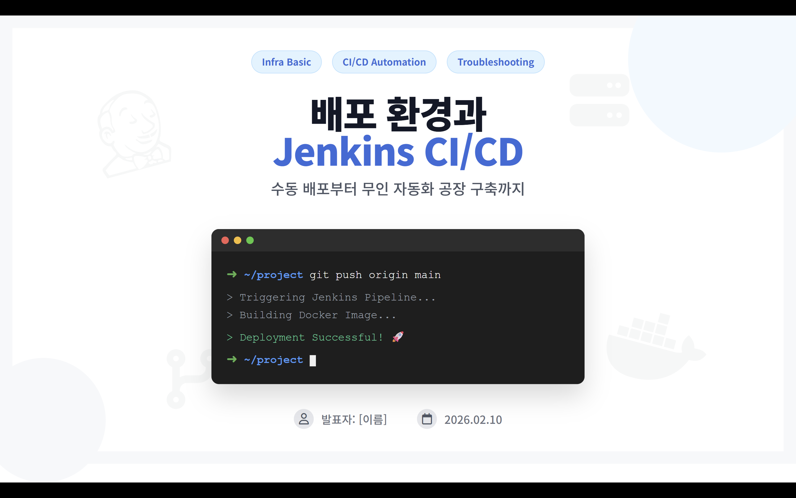

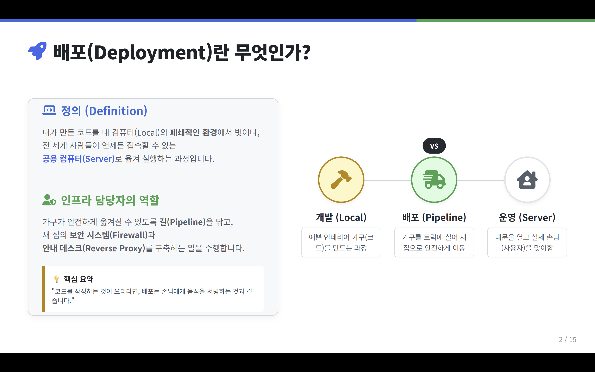

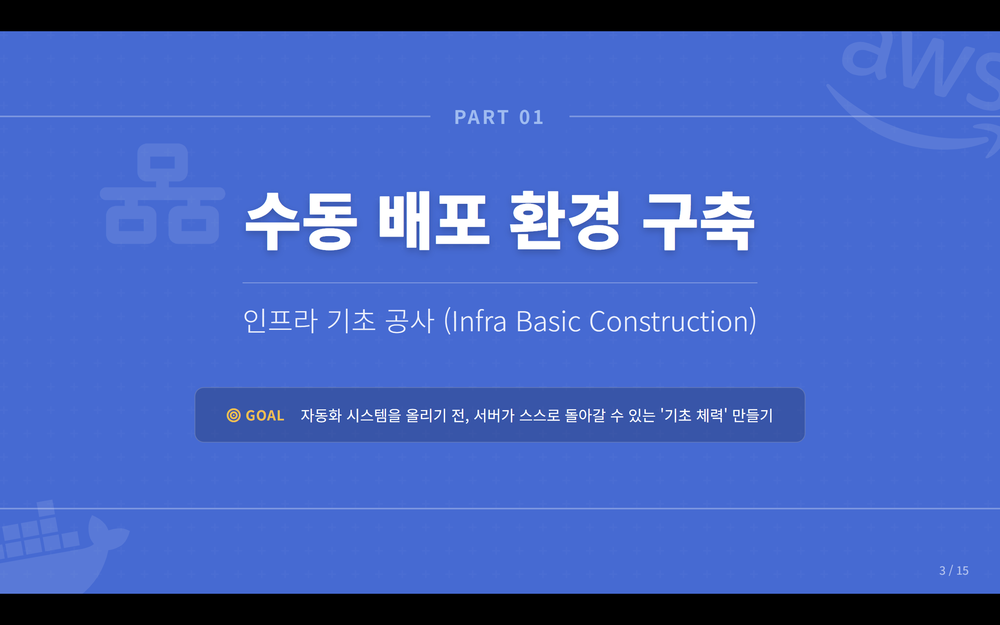

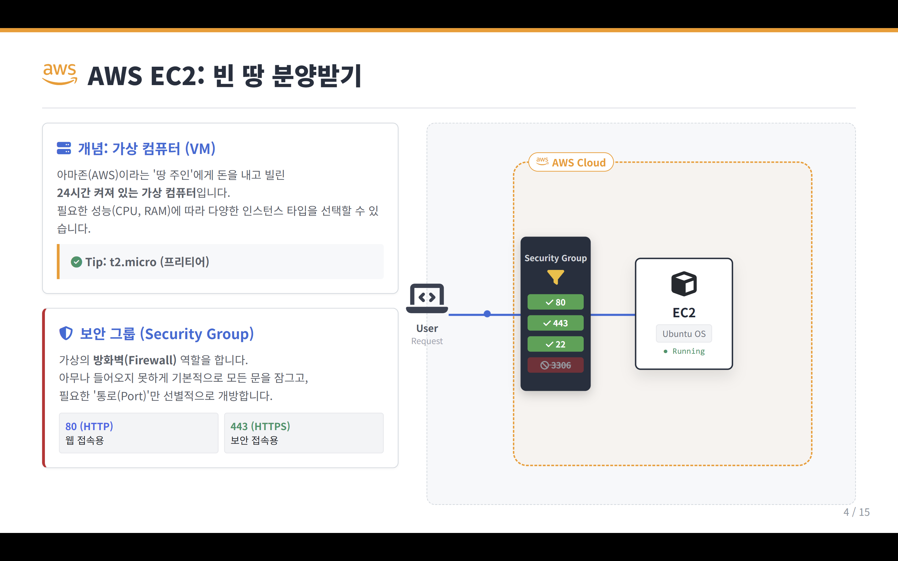

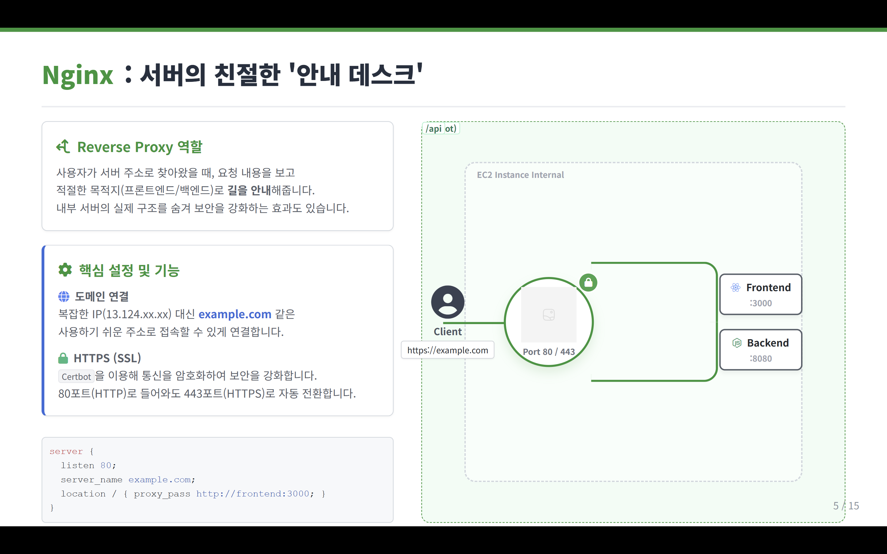

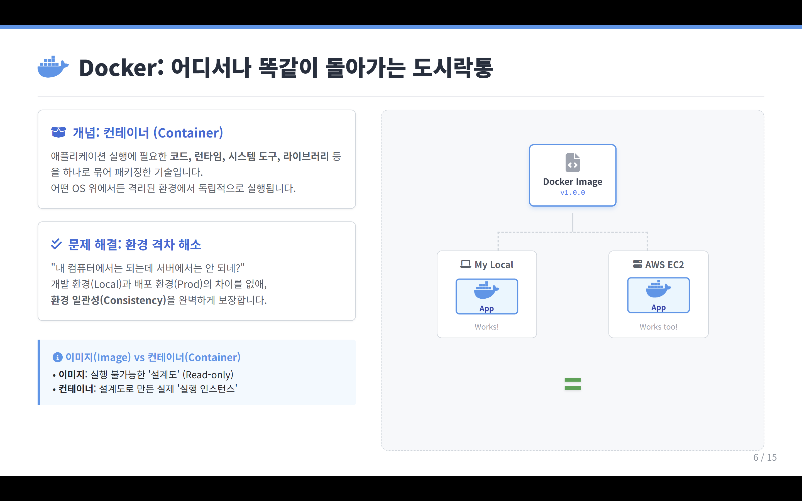

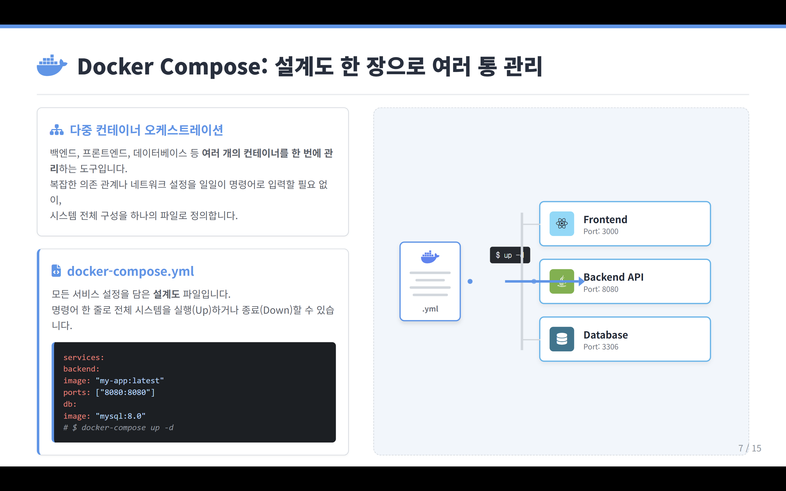

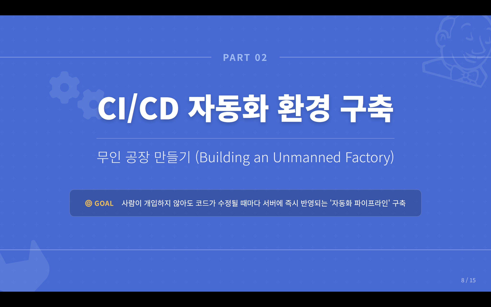

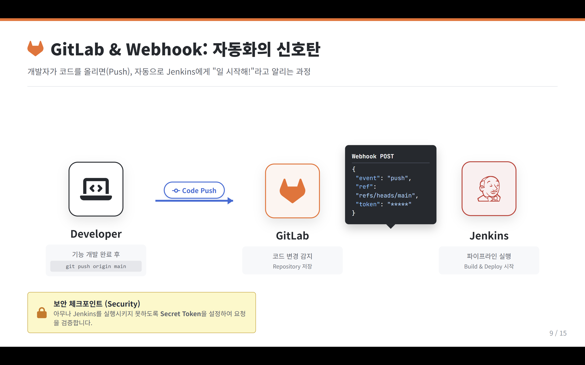

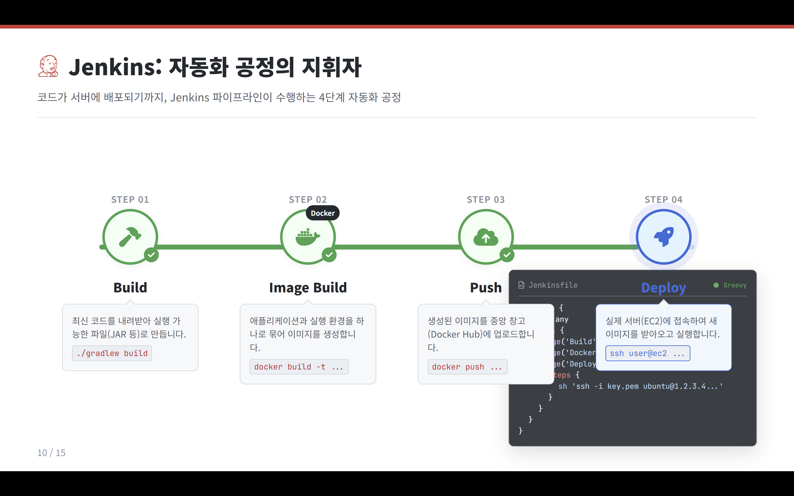

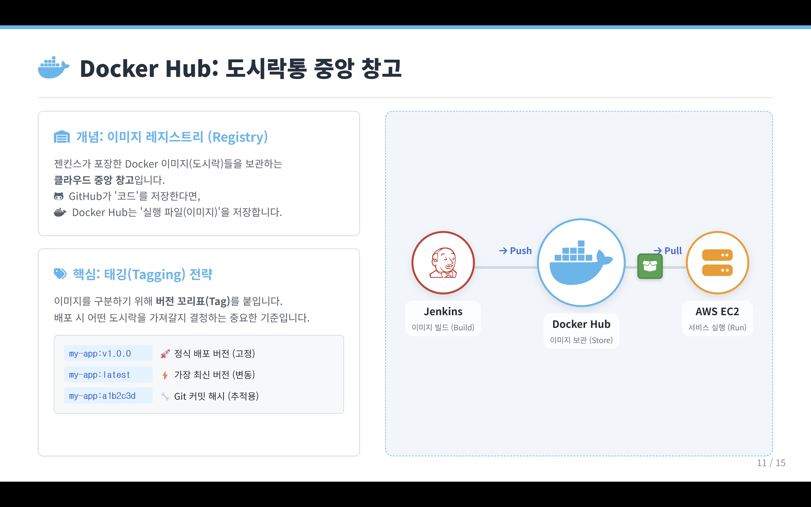

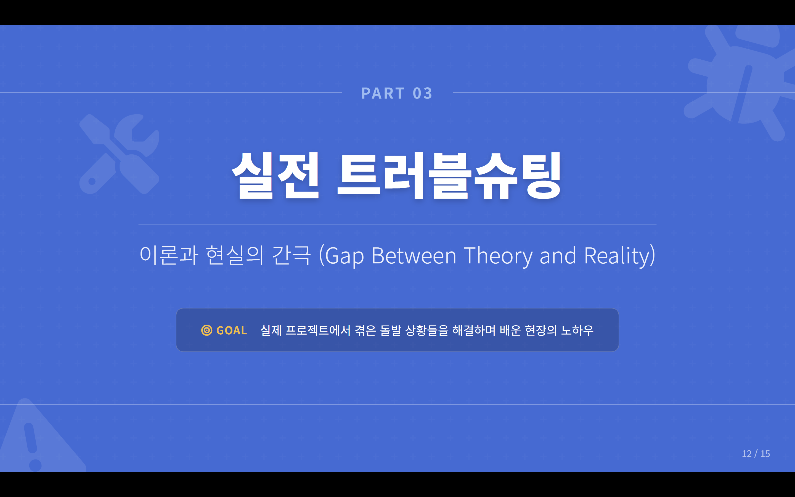

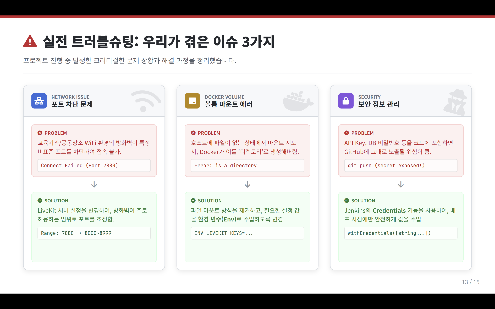

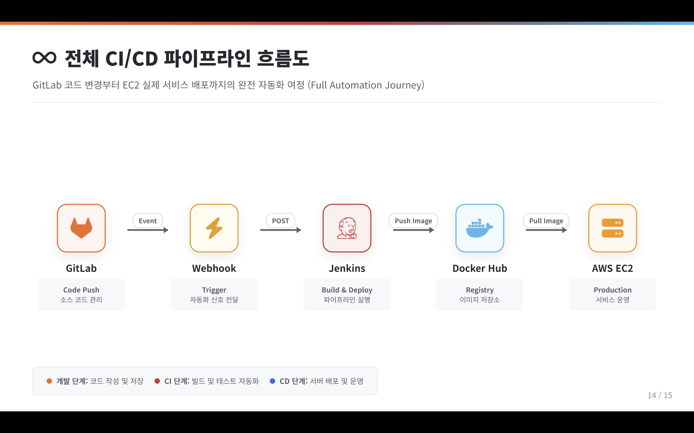

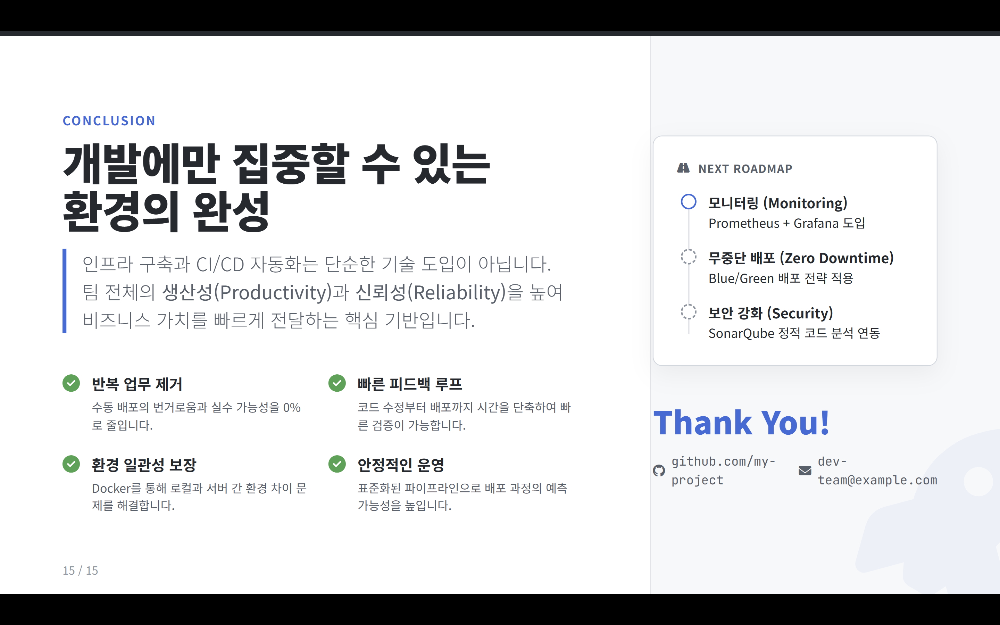

