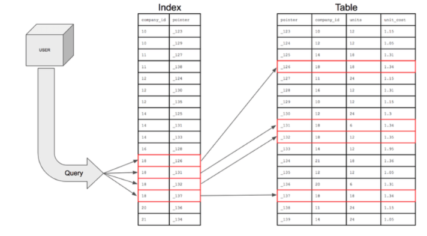
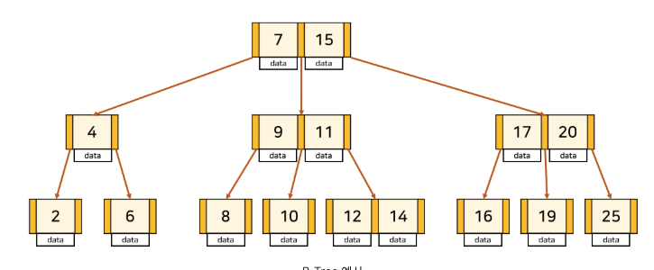
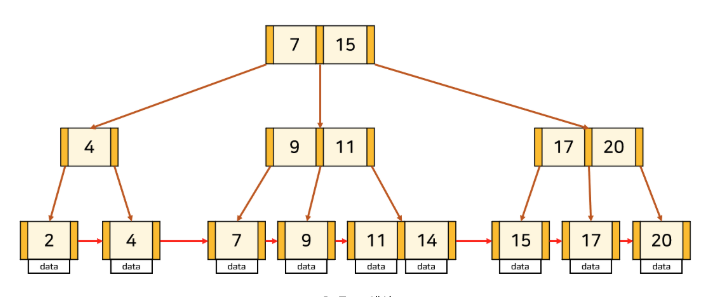

# 5-0. 인덱스가 무엇이고, 언제 사용하는지 설명해 주세요.

# 1. 인덱스란?

데이터베이스의 테이블에 대한 검색 속도를 향상시켜주는 자료구조로,

테이블의 특정 컬럼에 인덱스를 생성하면 해당 컬럼의 데이터를 정렬한 후 별도의 메모리 공간에 데이터 물리주소와 함께 저장된다.



- 데이터 : 책 내용

- 인덱스 : 책 목차

- 물리주소 : 책 페이지 번호

---

# 2. 인덱스의 장단점

### 장점

- 테이블 검색 속도 / 성능 향상

인덱스에 의해 데이터들이 정렬된 형태를 가짐

기존 → `WHERE` 문으로 특정 조건 데이터를 찾기위해 `Full Table Scan`(전체조건과 비교)

인덱스 사용 → 정렬되어 있는 데이터 덕에 빠르게 조건에 맞는 데이터 찾기 가능

(`ORDER BY`, `MIN/MAX` 도 빠르게 수행 가능)

- 시스템의 전반적인 부하 감소

---

### 단점

- 인덱스 관리를 위한 추가 작업 필요

  - `INSERT` : 새로운 데이터에 인덱스 추가

  - `DELETE` : 삭제하는 데이터의 인덱스를 사용하지 않는다는 작업 수행

  - `UPDATE` : 기존 인덱스를 사용하지 않음 처리 후 갱신된 데이터에 대한 인덱스 추가

⇒ 즉, 데이터 수정이 잦은 경우 성능이 낮아짐 !

- 추가 저장 공간 필요

⇒ 인덱스는 제거되는 것이 아니라 ‘사용하지 않음’ 처리 후 남겨두기 때문에 **인덱스가 과도하게 커지는 문제**

- 잘못 사용하는 경우 검색 성능 저하

⇒  전체 데이터의 10 ~ 15% 이상의 데이터 처리 or 데이터의 형식에 따라 오히려 성능이 낮아질 수 있음

ex. 나이/성별 등 range가 적은 컬럼의 경우 : 인덱스를 읽고 나서 다시 많은 데이터를 조회해야 함

---

# 3. 인덱스를 사용하면 좋은 경우

데이터 range가 넓고 중복이 적은 경우 혹은 조회가 많거나 정렬된 상태가 유용한 컬럼에 사용하는 것이 좋다.

- 규모가 큰 테이블

- 삽입/수정/삭제가 자주 발생하지 않는 컬럼

- WHERE/ORDER BY/JOIN이 자주 사용되는 컬럼

- 데이터 중복도가 낮은 컬럼

---

# 4. 인덱스 자료구조

### 1) 해시 테이블

`Key`, `Value` 를 한 쌍으로 데이터를 저장하는 자료구조로, 해시충돌이라는 변수가 존재하지만 평균적으로 `O(1)` 이라는 매우 빠른 시간안에 데이터 탐색이 가능

이 때, 인덱스는 `key = 컬럼의 값` / `value = 데이터 위치` 로 구현되는데, 실제로 인덱스에서 잘 사용되진 X

→ 등호 연산에 최적화되어있기 때문.

실 DB에선 부등호(<, >) 연산이 자주 사용되는데 해시 테이블 내 데이터들은 정렬되어 있지 않으므로 특정 기준보다 크거나 작은 값을 빠른 시간 내에 찾을 수 X

---

### 2) B+ Tree

기존의 `B-Tree` 는 어느 한 데이터 검색에는 효율적이지만, 모든 데이터 순회에는 비효율적(모든 노드를 방문해야 하므로)

<details>
<summary>B-Tree 설명</summary>



탐색 성능을 높이기 위해 균형 있게 높이를 유지하는 `Balanced Tree` 의 일종으로, 모든 리프노드가 같은 레벨로 유지되도록 자동으로 밸런스를 맞춰줌

  - 주황색 부분은 자식 노드를 가리키는 **포인터**

  - 살구색 부분은 **각 노드의 키**

⇒ 키와 데이터가 1:1 대응하고 있음

최악의 경우에도 **`O(logN)`**시간이 보장

**B-Tree 조건**

```plain text
1. node의 key의 수가 k개라면, 자식 node의 수는 k+1개
2. node의 key는 반드시 정렬된 상태여야
3. 자식 node들의 key는 현재 node의 key를 기준으로 크기 순으로 나뉨
4. root node는 항상 2개 이상의 자식 node를 가짐(root node가 leaf node인 경우 제외)
5. M차 트리일 때, root와 leaf를 제외한 모든 node는 최소 M/2, 최대 MM개의 서브 트리를 가짐
6. 모든 leaf node들은 같은 level에 있어야
```
</details>

→ **B-Tree를 인덱스에 더 적합하게 개선한 트리 구조 : ****`B+Tree`**

- B-Tree :

  - 내부 노드와 Leaf 노드 모두 데이터 존재 가능

- B+Tree :

  - 실제 데이터는 Leaf 노드에만 존재

  - 내부 노드는 탐색을 위한 Key + Pointer 역할

  - Leaf 노드들은 Linked List로 연결



⇒ 리프노드에만 데이터가 저장되기 때문에 중간노드에서 key를 올바르게 찾아가기 위해서 key가 중복될 수 있음

---

### B+Tree가 B-Tree보다 인덱스에 적합한 이유

### ① 트리 높이를 낮출 수 있음

B+Tree의 내부 노드는 실제 데이터를 저장하지 않고 **Key와 Pointer 중심으로 구성**

따라서 같은 크기의 페이지에 더 많은 포인터를 저장할 수 있음

```plain text
한 노드에 더 많은 자식
        ↓
트리가 더 넓게 퍼짐
        ↓
트리 높이 감소
        ↓
디스크 접근 횟수 감소
```

DB 인덱스에서는 트리 연산 자체보다 **디스크 페이지를 몇 번 읽느냐**가 매우 중요하기 때문에 큰 장점 !

---

### ② 범위 검색에 유리함

B+Tree의 가장 중요한 장점으로, Leaf 노드들은 순서대로 연결(Linked list)되어 있으므로

```sql
WHERE age BETWEEN 30 AND 70
```

을 수행하면 먼저 `30`을 트리 탐색으로 찾고,

```plain text
30 찾기
 ↓
[30,40] → [50,60] → [70,80]
```

이후에는 Leaf 노드를 순서대로 따라가면 됨.

그래서 `>`, `<`, `BETWEEN`, `ORDER BY` 같은 **범위/순차 검색에 매우 유리함 ! **

이게 Hash Index와 비교했을 때도 중요한 차이임

```plain text
Hash
= 특정 값 검색에 강함
WHERE id = 100

B+Tree
= 특정 값 + 범위 검색 모두 가능
WHERE id = 100
WHERE id > 100
WHERE id BETWEEN 100 AND 200
ORDER BY id
```

---

### B+Tree의 단점

B-Tree에서는 운이 좋으면 Root에서 바로 데이터를 찾을 수도 O

```plain text
B-Tree

       [50]  ← 여기 데이터가 있으면 바로 끝
      /    \
   [...]  [...]
```

하지만 B+Tree의 내부 노드는 **탐색용**이기 때문에 실제 데이터를 찾으려면 기본적으로 Leaf까지 내려가야 함

```plain text
B+Tree

       [50]       ← 탐색용
      /    \
   [20]    [70]   ← 탐색용
    ↓       ↓
 [실제 데이터]    ← Leaf
```

하지만 DB에서는 이 단점보다 **낮은 트리 높이와 범위 검색 성능**의 장점이 훨씬 굿

---

# 5. 면접용 핵심

> **왜 DB 인덱스에는 B-Tree보다 B+Tree를 많이 사용할까요?**

> B+Tree는 실제 데이터를 Leaf 노드에만 저장하기 때문에 내부 노드에 더 많은 Key와 Pointer를 저장할 수 있고, 그 결과 트리의 높이를 낮춰 디스크 접근 횟수를 줄일 수 있습니다. 또한 Leaf 노드들이 Linked List 형태로 연결되어 있어 `BETWEEN`, `<`, `>` 같은 범위 검색과 순차 접근에 효율적입니다. 이러한 특성 때문에 데이터베이스 인덱스에 적합합니다.

“B+Tree = `낮은 트리 높이 + Leaf에 데이터 집중 + Leaf 간 연결 → 디스크 I/O 감소 + 범위 검색에 강함` ”
