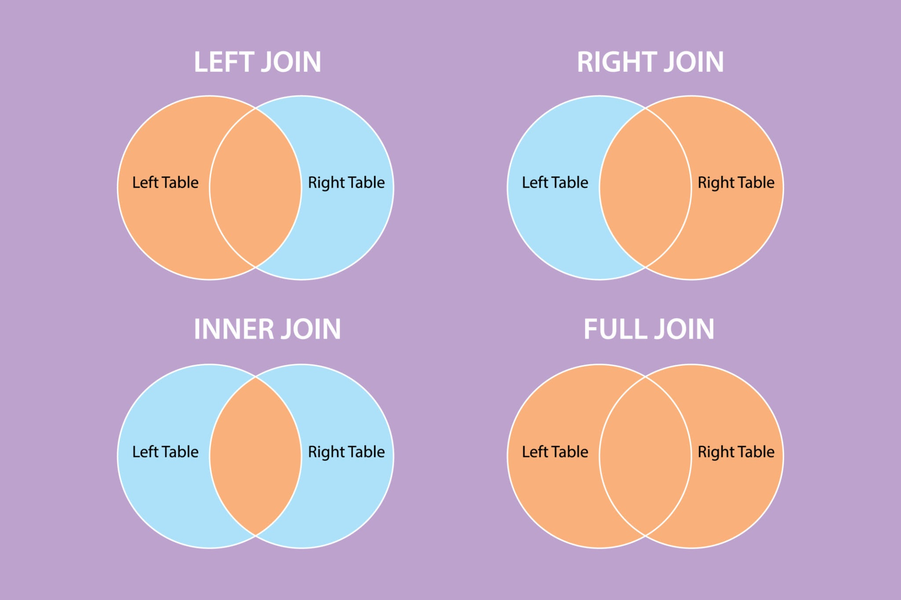

# 9-0. DB Join이 무엇인지 설명하고, 각각의 종류에 대해 설명해 주세요.

# 1. DB Join이란?

> Note 관계형 데이터베이스(RDBMS)에서 **두 개 이상의 테이블을 연결하여 하나의 결과 집합**으로 만들어내는 작업으로 여러가지 형태가 존재한다.

---

# 2. DB Join의 종류

> Note DB Join은 여러 종류가 있으며 아래는 대표적인 Join의 예시입니다.

또한 각 RDBMS의 경우 지원하는 Join이 다를 수 있습니다.

  - **INNER JOIN (내부 조인)**

  - **LEFT OUTER JOIN (왼쪽 외부 조인)**

  - **RIGHT OUTER JOIN (오른쪽 외부 조인)**

  - **FULL OUTER JOIN (완전 외부 조인)**

  - **CROSS JOIN (교차 조인)**

  - **SELF JOIN (셀프 조인)**

1. INNER JOIN (내부 조인)

> Note 두 테이블에서 교집합에 해당하는 데이터만 추출합니다.

연결 기준이 되는 컬럼의 값이 양쪽 테이블에 모두 존재하는 행만 결과로 반환됩니다.

쿼리문 예시)

SELECT A.column, B.column
FROM TableA A
INNER JOIN TableB B
ON A.key = B.key;

1. LEFT OUTER JOIN (왼쪽 외부 조인)

> Note 왼쪽 테이블의 모든 데이터를 포함하고, 오른쪽 테이블에서는 왼쪽 테이블과 일치하는 데이터만 가져옵니다.

오른쪽 테이블에 일치하는 값이 없으면 빈 공간은 NULL로 채워집니다.

쿼리문 예시)

SELECT A.column, B.column
FROM TableA A
LEFT JOIN TableB B
ON A.key = B.key;

1.  RIGHT OUTER JOIN (오른쪽 외부 조인)

> Note 오른쪽 테이블의 모든 데이터를 포함하고, 왼쪽 테이블에서는 오른쪽 테이블과 일치하는 데이터만 가져옵니다.

왼쪽 테이블에 일치하는 값이 없으면 NULL로 채워집니다.

쿼리문 예시)

SELECT A.column, B.column
FROM TableA A
RIGHT JOIN TableB B
ON A.key = B.key;

1. FULL OUTER JOIN (완전 외부 조인)

> Note 두 테이블의 합집합을 구합니다. 양쪽 테이블의 모든 데이터를 포함하며, 일치하지 않는 부분은 NULL로 표시됩니다.

일부 데이터베이스(MySQL 등)에서는 지원하지 않아 LEFT JOIN과 RIGHT JOIN을 UNION 연산자로 합쳐서 사용하기도 합니다.

쿼리문 예시)

SELECT A.column, B.column
FROM TableA A
FULL OUTER JOIN TableB B
ON A.key = B.key;

1. CROSS JOIN (교차 조인)

> Note 두 테이블의 모든 행을 조합하여 가능한 모든 경우의 수를 반환합니다.

조건(ON 절) 없이 결합하며, 결과 행의 수는 두 테이블의 행 수를 곱한 값과 같습니다.

카테시안 곱이라고도 부릅니다.

쿼리문 예시)

SELECT A.column, B.column
FROM TableA A
CROSS JOIN TableB B;

1. SELF JOIN (셀프 조인)

> Note 자기 자신을 조인하는 방식입니다.

하나의 테이블을 두 번 참조하여 동일한 테이블 내에서 데이터 간의 관계를 파악할 때 사용합니다. (예: 직원 테이블에서 직원과 관리자 관계 조회)

쿼리문 예시)

SELECT A.EmployeeName, B.ManagerName
FROM Employee A
LEFT JOIN Employee B
ON A.ManagerID = B.EmployeeID;
