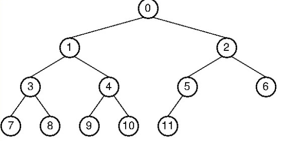

# 10-3. 오름차순으로 정렬된 인덱스가 있다고 할 때, 내림차순 정렬을 시도할 경우 성능이 어떻게 될까요? B-Tree/B+Tree의 구조를 기반으로 설명해 주세요.

# 0. 결론

질문의 뜻 : 오름차순 인덱스가 있는데 내림차순 결과가 필요하면, 인덱스를 재정렬해야 하는가? 아니면 역방향으로 읽을 수 있는가? B-Tree와 B+Tree에서는 어떻게 처리되는가?

오름차순으로 구성된 B-Tree/B+Tree 인덱스가 있을 때 `ORDER BY ... DESC`를 수행한다고 해서 반드시 별도의 정렬이 발생하는 것은 아니며,

1. **Backward Index Scan** : 인덱스 순회만으로 원하는 순서를 만들 수 있는 경우

인덱스를 뒤에서 읽는 방법 → **정렬 X**

  - `B-Tree` : 오른쪽부터 방문하는 역중위 순회로 내림차순 조회(큰 Key 쪽부터 방문)

```sql
오른쪽 자식 → 현재 Key → 왼쪽 자식
```

  - `B+Tree` : DBMS가 지원만 한다면, 역방향 리프 탐색으로 반대 방향으로 조회

```sql
가장 오른쪽 리프 → 이전 리프 → 이전 리프
```

1. **실제 내림차순 정렬 발생** : 인덱스 순회만으로 원하는 순서를 만들 수 없는 경우

→ 이때 정렬하는 주체는 B-Tree나 B+Tree가 아니며 DBMS의 별도 정렬 연산이다.

    - 정렬 대상 행 수

    - 사용하는 정렬 알고리즘

    - 메모리 크기

    - 정렬 Key의 크기

    - `LIMIT` 유무

    - 임시 디스크 파일 사용 여부

    - Merge 횟수

에 따라 정렬 비용이 결정된다.

의 두 가지 경우가 존재한다.

> 내림차순 결과를 인덱스의 역방향 스캔으로 만드는 경우에는 B-Tree와 B+Tree의 역방향 탐색 구조를 비교할 수 있다. 
반면 실제 별도 Sort가 발생한 경우에는 B-Tree와 B+Tree가 정렬을 수행하는 것이 아니므로, 두 자료구조의 차이가 Sort 성능을 직접 결정하지 않는다.

---

# 1. 정렬이 일어나는 경우와 일어나지 않는 경우

### Case 1. 인덱스를 역방향으로 읽어서 내림차순 조회(정렬 X) : 

옵티마이저가 **`Backward Index Scan`****을 선택한다면 별도의 정렬 없이 인덱스를 뒤에서부터 읽을 수 있음**

```sql
CREATE INDEX idx_age ON users(age ASC);

SELECT *
FROM users
ORDER BY age DESC;
```

→ DBMS에 따라 Forward Scan과 Backward Scan 성능은 다를 수 있음

### Case 2. 인덱스로 원하는 정렬 순서를 만들 수 없어 **실제 내림차순 Sort가 발생하는 경우**

예를 들어

```sql
INDEX(A ASC, B ASC)     -- 인덱스 설정

ORDER BY A ASC, B DESC  -- 실제 조회하고 싶은 것
```

가 필요한 경우,

```sql
A ASC, B ASC   -- 정방향(O)
A DESC, B DESC -- 역방향(O)

A ASC, B DESC  -- 만들 수 없음. .. ㅠㅠ
```

이렇게 **인덱스로 ****`ORDER BY`****를 만족시키지 못하면 DBMS는 상황에 따라 별도 정렬 연산을 수행**

→ CPU, 메모리 및 경우에 따라 디스크 I/O 비용이 추가될 수 있음

---

# 2. 정렬 발생 X - 역방향 순회

단일 인덱스 사용 등 `Backward Index Scan` 이 가능한 경우

<details>
<summary>순회방법 리마인드</summary>



**⊙ 전위 순회(preorder traverse) : ****root****를 먼저 방문(루트 전)**

0->1->3->7->8->4->9->10->2->5->11->6

**⊙ 중위 순회(inorder traverse) : ****왼쪽 하위 트리****를 방문 후 root를 방문(루트 중)**

7->3->8->1->9->4->10->0->11->5->2->6

**⊙ 후위 순회(postorder traverse) : ****하위 트리 모두 방문 후**** root를 방문(루트 후)**

7->8->3->9->10->4->1->11->5->6->2->0
</details>

## B-Tree vs B+Tree

`B+` : `B-`의 확장된 개념으로,

- 모든 데이터 리프에 저장:  internal nodes 에는 리프로 향하는 포인터(`key`)만 → 빠른 디스크 IO 효과

- 범위 탐색과 순차적 스캔이 빠름(**Linked List 로 연결)**

- 풀 스캔 시, `B-Tree` 는 모든 노드를 탐색해야 하지만 `B+Tree` 는 리프노드만 탐색

## B-Tree : 역방향 Key 탐색

```sql
                 [30 | 60]
                /    |    \
         [10,20]  [40,50]  [70,80]
```

- **일반적인 오름차순 순회 : 중위 순회**

```sql
왼쪽 자식 → 현재 노드 → 오른쪽 자식
```

`10 → 20 → 30 → 40 → 50 → 60 → 70 → 80`

- **내림차순 순회 : 역중위 순회**

```sql
오른쪽 자식 → 현재 노드 → 왼쪽 자식
```

`80 → 70 → 60 → 50 → 40 → 30 → 20 → 10`

특정 key 찾기 : `O(log N)`

범위에서 K개 결과 읽기 : `O(log N + K)`

## B+Tree : 역방향 리프 스캔

```sql
                    [30 | 50]
                   /    |    \
                  /     |     \
             [10,20] [30,40] [50,60]
```

- **일반적인 오름차순 순회 ****`O(log N)`**** : 왼쪽부터 순차 탐색**

```sql
[10,20] → [30,40] → [50,60]
```

`10 → 20 → 30 → 40 → 50 → 60`

- **내림차순 순회 : 오른쪽부터 순차 탐색**

```sql
[10,20] ← [30,40] ← [50,60]
```

`60 → 50 → 40 → 30 → 20 → 10`

## 성능 차이는?

Forward Scan과 Backward Scan은 같은 점근적 시간복잡도를 가지지만, 
실제 성능은 DBMS 및 스토리지 엔진의 구현에 따라 다를 수 있다.

자료구조 순회에서의 성능차이 : 시간복잡도는 같음

```plain text
B-Tree 전체 역방향 순회: O(N)
B+Tree 전체 역방향 순회: O(N)
```

> B-Tree와 B+Tree 모두 전체 역방향 순회는 `O(N)`이다. B+Tree는 리프 중심 구조 때문에 실제 범위 스캔에서 B-Tree보다 유리할 수 있지만, 이것은 내림차순에서만 생기는 성능 차이는 아니다.

Backward Scan에서의 성능차이

자료구조의 시간복잡도가 같다고 해서 실제 실행 시간까지 완전히 같다는 의미는 아니다.

Page Lock/Mutex 방향 때문에 5~10% 느릴 수 있다.

MySQL 공식 자료에 따르면,

> 자료구조 자체의 성질 때문이 아니라 특정 DBMS, InnoDB 내부 구현 문제로 인해,
Forward Index Scan이 Backward Scan보다 15% 더 좋은 결과를 보인 테스트가 관찰되었음

→ 하지만 이는 Backward Scan이 항상 성능 패널티를 가진다는 의미는 아니며, 원인 또한 DBMS 및 스토리지 엔진 구현 방법의 차이로 인한 문제 일 수 있음을 유의해야

간단히 설명하자면,

**페이지 잠금**이 왼쪽 → 오른쪽으로 설계되어 있어서, 역방향으로 조회 시 **Mutex 획득이 복잡**해지는 문제로 인한 성능 저하가 나타남을 확인했음

---

# 3. 정렬 발생

인덱스로 원하는 정렬 순서를 만들 수 없는 경우

```sql
INDEX(A ASC, B ASC)

원하는 결과
ORDER BY A ASC, B DESC
```

- Forward Scan 및 Backward Scan으로 해결 X

- 데이터가 많다면 비용이 커질 수 있음

- `(A ASC, B DESC)` 인덱스를 구성하면 Sort를 피할 수 있음

```sql
CREATE INDEX idx_ab ON table(A ASC, B DESC);
```

---

## 실제 내림차순 Sort가 발생하면 왜 느려질까?

```sql
A ASC, B DESC
```

라는 순서는 인덱스 순차 Scan으로 만들 수 없음

⇒ DBMS가 수행 :

데이터 읽기 → **`정렬 대상 행 수집 → 별도의 Sort 수행(추가 cpu/메모리/디스크 비용 발생)`**** **→ 정렬된 결과 반환

이 경우:

- B-Tree/B+Tree가 정렬하는 것이 X

- 정렬 알고리즘과 데이터 크기, 메모리, 디스크 사용 여부가 성능 결정

<details>
<summary>실제 Sort에서 발생하는 비용</summary>

MySQL 공식 문서를 기준으로 보면, 인덱스로 `ORDER BY`를 처리하지 못하면 `filesort`가 수행되고 정렬 대상 행을 읽어서 별도 정렬함

데이터가 메모리에 들어갈 정도라면

```plain text
Rows
 ↓
Sort Buffer
 ↓
Memory Sort
 ↓
Result
```

처럼 메모리에서 처리할 수 있음.

하지만 데이터가 너무 많아 정렬 버퍼에 들어가지 않는다면

```plain text
Rows
 ↓
Sort Buffer
 ↓
일부 결과를 임시 파일로 기록
 ↓
Disk
 ↓
Merge
 ↓
Result
```

처럼 **임시 디스크 파일과 Merge 작업까지 발생할 수 있음**

MySQL 공식 문서에서도 결과가 메모리에 들어가지 않으면 `filesort`가 필요한 만큼 temporary disk files를 사용한다고 명시함. 또한 충분한 `sort_buffer_size`를 사용하면 디스크 쓰기와 merge pass를 줄일 수 있다고 설명

따라서 성능 차이는 데이터가 많아질수록 커질 수 있음
</details>

> **인덱스를 사용할 수 있는 경우에는 이미 정렬된 인덱스를 순차적으로 읽으면 되지만, 
인덱스로 정렬을 만족시키지 못하면 ****별도의 정렬 단계가 추가되어 CPU와 메모리를 사용****하고, 
****데이터가 메모리에 들어가지 않으면 임시 디스크 I/O와 merge 비용까지**** 발생할 수 있다.**

따라서 성능 저하의 원인은

> **B-Tree 전체를 다시 정렬하기 때문이 아니라, 
기존 B-Tree의 정렬 순서를 활용하지 못해 추가적인 Sort 단계가 생기기 때문**

---

# 4. 면접 답변 정리

> **B-Tree/B+Tree 인덱스는 키가 정렬되어 있기 때문에 ****`ORDER BY DESC`****라고 해서 무조건 데이터를 다시 정렬하는 것은 아닙니다. 
단일 컬럼의 오름차순 인덱스라면 DBMS가 ****`Backward Index Scan`****을 지원할 경우 인덱스를 끝에서부터 역방향으로 읽어 내림차순 결과를 만들 수 있어 별도 Sort가 필요하지 않습니다. 다만 DBMS 구현에 따라 역방향 스캔이 정방향보다 다소 비효율적일 수 있습니다.
반면 복합 인덱스의 정렬 방향이 쿼리와 맞지 않는 등 인덱스의 정방향 또는 역방향 Scan으로 원하는 순서를 만들 수 없는 경우에는 별도의 Sort가 필요합니다. 이때 B-Tree/B+Tree 자체를 내림차순으로 재정렬하는 것은 아니며, 기존 인덱스의 정렬된 구조를 활용할 수 없기 때문에 조회한 행을 별도로 정렬합니다. 이 과정에서 CPU와 메모리가 추가로 사용되고, 정렬 대상이 메모리를 초과하면 임시 디스크 I/O와 Merge까지 발생할 수 있어 성능 저하가 커질 수 있습니다.**
