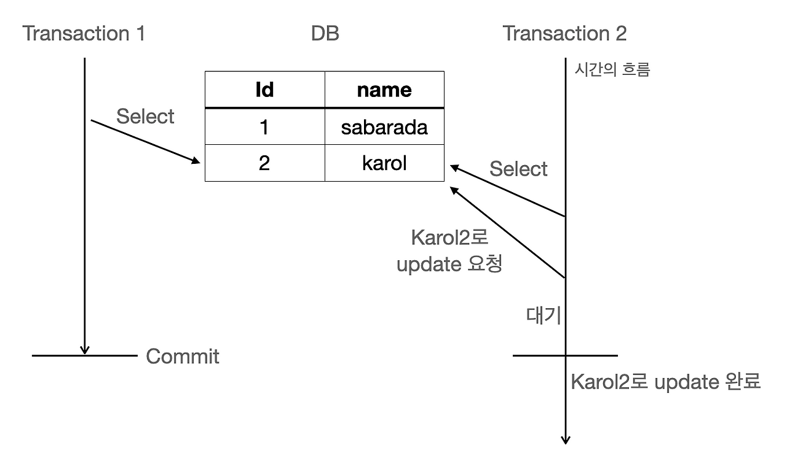
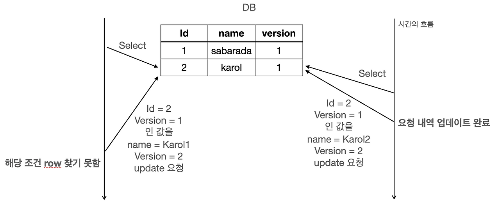

# 11-1. Optimistic Lock/Pessimistic Lock에 대해 설명해 주세요.

### 비관적 락(Pessimistic Lock)

"다른 요청이 동시에 건드릴 가능성이 높으니까 **먼저 잠그자**"는 방식



비관적 락은 충돌이 발생할 것이라고 가정하고, 데이터에 접근할 때 **Shared Lock(S Lock) 또는 Exclusive Lock(X Lock)과 같은 DB의 실제 Lock을 획득하여** 다른 트랜잭션의 접근을 제한한다.

> Note Shared Lock (S Lock)
→ 읽기 Lock
→ 여러 트랜잭션이 동시에 S Lock 획득 가능
→ X Lock과는 충돌

Exclusive Lock (X Lock)
→ 쓰기 Lock
→ 다른 S Lock / X Lock과 충돌
→ 수정할 데이터를 독점적으로 사용

```json
Pessimistic Lock
       ↓
"충돌할 것이라고 가정"
       ↓
DB의 실제 Lock 획득
       ↓
 ┌─────┴─────┐
 ↓           ↓
S Lock      X Lock
공유 락      배타 락
읽기         쓰기
       ↓
다른 트랜잭션의
충돌하는 접근 대기
```

SQL에서는 대표적으로:

```sql
SELECT *
FROM account
WHERE id = 1
FOR UPDATE;
```

트랜잭션 A가 이 데이터를 가져가면:

```plain text
A: SELECT ... FOR UPDATE
       ↓
   Account Row 🔒

B: SELECT ... FOR UPDATE
       ↓
      대기...
```

**A가 ****`COMMIT`**** 또는 ****`ROLLBACK`****하여 Lock을 해제할 때까지, 동일한 데이터를 수정하려는 B는 대기합니다.**

Spring Data JPA에서는 이런 식으로 사용할 수 있습니다.

```java
@Lock(LockModeType.PESSIMISTIC_WRITE)
@Query("SELECT a FROM Account a WHERE a.id = :id")
Optional<Account> findByIdWithLock(Long id);
```

계좌 잔액, 재고 감소, 선착순 처리처럼 **동시에 수정될 가능성이 높고 데이터 정합성이 매우 중요한 경우**에 적합합니다.

단점은 Lock을 잡고 있는 동안 다른 요청이 기다려야 하므로 **성능 저하와 Deadlock 위험**이 있다는 것입니다.

---

### 낙관적 락(Optimistic Lock)



반대로 "충돌은 별로 없을 테니까 일단 작업시키고, **저장할 때 충돌했는지만 확인하자**"는 방식입니다.

보통 `version` 컬럼을 사용합니다.

```java
@Entity
public class Account {

    @Id
    private Long id;

    private Long balance;

    @Version
    private Long version;
}
```

처음 상태가:

```plain text
balance = 100000
version = 1
```

A와 B가 동시에 읽으면 둘 다 `version = 1`을 가지고 있습니다.

```plain text
A → 수정 성공
balance = 70000
version = 2

B → 수정 시도
"내가 읽었을 때 version=1이었는데
 지금 DB는 version=2네?"

→ 충돌 발생 ❌
```

실제로는 대략 다음과 같은 조건을 이용합니다.

```plain text
UPDATE account
SET balance = 70000,
    version = 2
WHERE id = 1
  AND version = 1;
```

이미 다른 트랜잭션이 version을 변경했다면 수정된 행이 없으므로 충돌을 감지할 수 있습니다.

따라서:

```plain text
비관적 락
→ 먼저 잠근다.
→ "너 끝날 때까지 다른 사람 기다려."

낙관적 락
→ 일단 동시에 작업한다.
→ "저장할 때 다른 사람이 먼저 수정했으면 실패시켜."
```

### 언제 무엇을 쓰나?

```json
                   동시성 제어
                       │
             ┌─────────┴─────────┐
             ↓                   ↓
        비관적 락             낙관적 락
     Pessimistic             Optimistic
             │                   │
       실제 DB Lock          Version 확인
             │                   │
       충돌 사전 방지         충돌 사후 감지
             │                   │
       충돌이 많은 경우       충돌이 적은 경우
```

**Optimistic Lock과 Pessimistic Lock은 여러 트랜잭션이 동일한 데이터에 동시에 접근할 때 발생할 수 있는 동시성 문제를 제어하기 위한 방법입니다.**

비관적 락(Pessimistic Lock)은 충돌이 발생할 가능성이 높다고 가정하고, Shared Lock이나 Exclusive Lock과 같은 실제 DB Lock을 획득하여 다른 트랜잭션의 충돌하는 접근을 제한합니다. 충돌 가능성이 높고 데이터 정합성이 중요한 경우에 적합하지만, 다른 트랜잭션의 대기 시간이 증가하고 Deadlock이 발생할 수 있다는 단점이 있습니다.

반면 낙관적 락(Optimistic Lock)은 충돌이 적을 것이라고 가정하여 실제 DB Lock으로 다른 트랜잭션을 미리 막지 않고, Version 등의 값을 이용하여 수정 시점에 충돌 여부를 확인합니다. 충돌이 발생하면 해당 작업을 실패시키고 필요에 따라 재시도합니다. 따라서 충돌 가능성이 낮고 동시 처리량이 중요한 경우에 적합합니다.

또한 `@Transactional`과 `@Lock`은 역할이 다릅니다. `@Transactional`은 작업의 원자성과 트랜잭션 경계를 관리하고, `@Lock`은 해당 트랜잭션에서 데이터에 어떤 잠금 방식을 적용할지를 지정합니다.

`@Transactional`은 데이터베이스 작업을 하나의 **묶음(단위)**으로 처리해 전부 성공하거나 전부 취소(롤백)
`@Lock`은 동시에 같은 데이터를 수정할 때 **충돌을 막기 위해 잠그는** 동시성 제어
