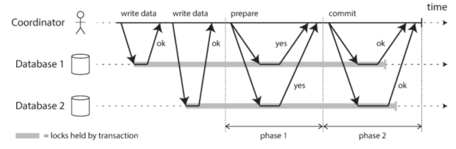

# 12-0. 트래픽이 높아질 때, DB는 어떻게 관리할 수 있을까요?

# 12. 트래픽이 높아질 때, DB는 어떻게 관리할 수 있을까요?

## 1. DB 트래픽이 높아진다는 의미

DB 트래픽이 높아진다는 것은 단순히 요청 수가 많아지는 것만을 의미하지 않는다.

요청이 증가하면 DB 내부에서 다음과 같은 병목이 발생할 수 있다.

- CPU 사용량 증가

- 메모리 부족

- Disk I/O 증가

- DB Connection 증가

- 동일 데이터에 대한 자원 경쟁 증가

- Query 응답 시간 증가

전체적인 흐름은 다음과 같다.

```plain text
사용자 요청 증가
    ↓
Application 요청 증가
    ↓
DB Query 증가
    ↓
CPU / Memory / Disk I/O / Connection 병목
    ↓
Query 응답 시간 증가
    ↓
전체 서비스 응답 시간 증가
```

따라서 DB 트래픽 대응의 핵심은 다음 두 가지로 볼 수 있다.

> DB가 직접 처리해야 하는 작업량을 줄이거나, DB의 처리 능력을 증가시키는 것

---

## 2. DB 트래픽 대응 방법

DB 트래픽에 대응하는 방법은 크게 다음과 같이 나눌 수 있다.

1. DB로 들어가는 요청 자체를 줄인다.

1. 하나의 Query를 더 적은 비용으로 처리한다.

1. 하나의 DB 서버 성능을 높인다.

1. 여러 DB 서버로 부하를 분산한다.

---

## 3. Cache를 통한 DB 요청 감소

반복적으로 조회되는 데이터를 Redis와 같은 Cache에 저장하면 DB까지 도달하는 요청 자체를 줄일 수 있다.

예를 들어 동일한 상품을 10,000번 조회한다고 가정한다.

### Cache가 없는 경우

```plain text
10,000 Request
      ↓
10,000 DB Query
```

### Cache를 사용하는 경우

```plain text
첫 번째 요청
    ↓
   DB
    ↓
Cache 저장

이후 요청
    ↓
  Cache
```

즉, Cache는 DB 자체의 성능을 높이는 것이 아니라 다음과 같은 방식으로 DB 부하를 줄인다.

> DB가 수행해야 할 작업 자체를 줄이는 방식

### 주의점

데이터가 변경되었는데 Cache에는 이전 값이 남아 있는 문제가 발생할 수 있다.

이를 **Cache Invalidation 문제**라고 한다.

따라서 자주 조회되지만 변경 빈도는 상대적으로 낮은 데이터에서 효과적이다.

---

## 4. Connection Pool 관리

요청이 발생할 때마다 새로운 DB Connection을 생성하고 종료하면 큰 비용이 발생한다.

```plain text
Request
   ↓
DB Connection 생성
   ↓
Query 수행
   ↓
Connection 종료
```

일반적으로는 Connection Pool을 사용한다.

```plain text
Application

Connection Pool
┌──────────────┐
│ Connection 1 │
│ Connection 2 │
│ Connection 3 │
│ ...          │
└──────────────┘
       ↓
      DB
```

미리 생성된 Connection을 빌려 사용하고 작업이 끝난 뒤 다시 Pool에 반환한다.

Spring Boot에서는 대표적으로 **HikariCP**를 사용한다.

### Connection Pool의 역할

- Connection 생성 및 종료 비용 감소

- Connection 재사용

- DB로 동시에 전달되는 요청 수 제한

특히 Connection Pool은 단순한 재사용뿐 아니라 DB로 유입되는 동시 요청을 제한하는 **Backpressure 역할**도 할 수 있다.

### Connection Pool은 클수록 좋은가?

그렇지 않다.

DB가 동시에 100개의 Query를 안정적으로 처리할 수 있는데 1,000개의 Connection을 생성하면 다음과 같은 문제가 발생할 수 있다.

- CPU 경쟁 증가

- 메모리 사용량 증가

- Context Switching 증가

- DB 내부 자원 경쟁 증가

따라서 Application의 처리량과 DB가 감당할 수 있는 동시 작업량을 고려하여 적절하게 설정해야 한다.

---

## 5. Scale-Up

DB 서버 자체의 하드웨어 성능을 높이는 방법이다.

이를 **Vertical Scaling, 수직 확장**이라고 한다.

```plain text
CPU      4 Core  → 32 Core
Memory   16GB    → 128GB
Disk     SSD     → 고성능 NVMe
```

특히 DB는 메모리가 증가하면 자주 사용하는 데이터를 Buffer Pool 등에 더 많이 저장할 수 있기 때문에 Disk 접근을 줄일 수 있다.

### 장점

기존 시스템 구조를 크게 변경하지 않고 성능을 높일 수 있다.

```plain text
Application
     ↓
    DB
```

### 단점

물리적이고 경제적인 한계가 존재한다.

```plain text
16GB → 32GB → 64GB → 128GB → ...
```

서버의 CPU와 Memory를 무한하게 증가시킬 수는 없으며, 고사양 장비일수록 비용도 크게 증가한다.

따라서 Scale-Up으로 해결하기 어려워지면 Scale-Out을 고려한다.

---

## 6. Read Replica

실제 서비스에서는 일반적으로 Write보다 Read 요청이 많은 경우가 많다.

예를 들어 다음과 같은 서비스가 있다고 가정한다.

```plain text
SELECT                     90%
INSERT / UPDATE / DELETE   10%
```

이 경우 SELECT 요청을 여러 DB에 분산할 수 있다.

```plain text
                  ┌→ Replica DB
Application ──────┼→ Replica DB
                  └→ Replica DB

Write
  ↓
Primary DB
```

일반적으로 역할을 다음과 같이 분리한다.

```plain text
INSERT / UPDATE / DELETE
          ↓
       Primary

SELECT
   ↓
Replica
```

이를 **Read/Write Splitting**이라고 한다.

### 장점

조회 요청을 여러 서버로 분산하여 Primary DB의 부하를 줄일 수 있다.

### Replication Lag

Primary DB의 변경 사항이 Replica DB에 즉시 적용되지 않을 수도 있다.

```plain text
Primary
name = "Kim"

      ↓ Replication

Replica
name = "Lee"
```

짧은 시간 동안 Replica에서 이전 데이터를 조회할 가능성이 있다.

이를 **Replication Lag**이라고 한다.

따라서 반드시 최신 데이터가 필요한 조회는 Primary DB에서 수행하는 방식도 사용할 수 있다.

---

## 7. Sharding

Read Replica를 사용하더라도 Write 요청은 기본적으로 Primary DB에 집중된다.

```plain text
SELECT → Replica 1
SELECT → Replica 2
SELECT → Replica 3

INSERT ─┐
UPDATE ─┼→ Primary
DELETE ─┘
```

Write 자체가 너무 많아 Primary DB가 병목이 된다면 데이터를 여러 DB에 분산하는 **Sharding**을 고려할 수 있다.

### 범위 기반 Sharding

```plain text
user_id 1 ~ 1,000,000
        ↓
      DB 1

user_id 1,000,001 ~ 2,000,000
        ↓
      DB 2

user_id 2,000,001 ~ 3,000,000
        ↓
      DB 3
```

### Hash 기반 Sharding

```plain text
hash(userId) % 3

0 → DB 1
1 → DB 2
2 → DB 3
```

이 경우 Read뿐 아니라 Write 부하도 여러 DB로 분산할 수 있다.

### 단점

Sharding은 시스템 복잡도를 크게 증가시킨다.

예를 들어 서로 다른 Shard에 데이터가 존재하면 다음 작업들이 어려워진다.

<details>
<summary>Cross-Shard JOIN</summary>

## 개념

Cross-Shard JOIN은 JOIN 대상 데이터가 서로 다른 Shard에 존재하는 경우를 의미한다.

단일 DB라면 다음과 같이 JOIN을 수행할 수 있다.

```plain text
SELECT *
FROM users u
JOIN orders o
    ON u.id = o.user_id;
```

DBMS가 두 테이블을 모두 가지고 있기 때문에 내부적으로 JOIN을 수행할 수 있다.

하지만 Sharding 환경에서는 데이터가 서로 다른 DB에 존재할 수 있다.

```plain text
Shard 1
└─ users

Shard 2
└─ orders
```

이 경우 하나의 DBMS가 두 데이터를 모두 가지고 있지 않기 때문에 일반적인 JOIN처럼 간단하게 처리하기 어렵다.

---

## 처리 방법

애플리케이션이 각각의 Shard를 조회한 뒤 결과를 직접 합칠 수 있다.

```plain text
Application
    ↓
Shard 1 조회
    ↓
Shard 2 조회
    ↓
Application에서 결과 병합
```

예를 들어:

```plain text
User user = shard1.findUser(userId);
List<Order> orders = shard2.findOrdersByUserId(userId);
```

DB가 수행하던 JOIN 역할 일부를 애플리케이션이 담당하게 되는 것이다.

---

## 문제점

  - 여러 DB에 Query를 보내야 함

  - Network I/O 증가

  - 응답 시간 증가

  - Application 로직 복잡도 증가

  - JOIN 대상 데이터가 많을수록 성능 저하 가능

---

## 해결 방향

서로 자주 JOIN되는 데이터는 가능하면 같은 Shard에 저장하도록 설계한다.

예를 들어 `user_id`를 Shard Key로 사용해서 사용자와 해당 사용자의 주문을 같은 Shard에 저장할 수 있다.

```plain text
Shard 1

User 100
 ├─ Order 1
 ├─ Order 2
 └─ Order 3
```

이처럼 관련 데이터를 같은 위치에 배치하는 것을 **Colocation** 관점으로 볼 수 있다.

### 핵심

> Sharding에서는 데이터를 어떻게 나눌 것인지가 JOIN 성능에 직접적인 영향을 준다.
</details>

<details>
<summary>전체 데이터 집계</summary>

Sharding 환경에서는 `COUNT`, `SUM`, `AVG`, `MAX`, `GROUP BY`와 같은 전체 데이터 집계도 복잡해질 수 있다.

예를 들어 전체 사용자 수를 구한다고 가정한다.

단일 DB라면:

```plain text
SELECT COUNT(*)
FROM users;
```

하나의 Query로 처리할 수 있다.

하지만 사용자가 여러 Shard에 나뉘어 있다면:

```plain text
Shard 1 → 1,000,000명
Shard 2 →   800,000명
Shard 3 → 1,200,000명
```

각 Shard에 개별적으로 Query를 보내야 한다.

```plain text
Application
   ├─ Shard 1 → COUNT
   ├─ Shard 2 → COUNT
   └─ Shard 3 → COUNT
```

그 후 결과를 다시 합쳐야 한다.

```plain text
1,000,000
+ 800,000
+1,200,000
-----------
3,000,000
```

---

## Scatter-Gather

이러한 방식은 **Scatter-Gather** 형태로 볼 수 있다.

### Scatter

여러 Shard에 Query를 보낸다.

### Gather

각 Shard의 결과를 다시 모아 최종 결과를 계산한다.

```plain text
              Application
            /      |      \
           ↓       ↓       ↓
       Shard 1  Shard 2  Shard 3
           ↓       ↓       ↓
          100     200     300
            \      |      /
             \     |     /
                 600
```

---

## AVG는 더 복잡할 수 있다

Shard별 평균을 단순히 다시 평균 내면 잘못된 결과가 나올 수 있다.

예를 들어:

```plain text
Shard 1
100명
평균 50

Shard 2
10명
평균 100
```

단순 계산:

```plain text
(50 + 100) / 2
= 75
```

이 값은 실제 전체 평균이 아니다.

정확한 계산은 각 Shard의 합계와 개수를 함께 사용해야 한다.

```plain text
Shard 1 합계 = 5,000
Shard 2 합계 = 1,000

전체 합계 = 6,000
전체 인원 = 110

전체 평균
= 6,000 / 110
≈ 54.5
```

### 핵심

> Sharding 환경에서는 전체 통계를 구할 때 각 Shard의 중간 결과를 모아서 다시 계산해야 한다.

---

## 실무적인 해결 방법

전체 집계가 매우 자주 필요하다면 매번 모든 Shard를 조회하지 않고 별도의 분석 시스템을 사용하기도 한다.

```plain text
Shard DB
   ↓
CDC / Message Queue
   ↓
Data Warehouse
   ↓
통계 / 분석
```

즉, OLTP DB에서 직접 전체 통계를 계산하지 않고 분석용 시스템으로 데이터를 모아서 처리할 수 있다.
</details>

<details>
<summary>Distributed Transaction</summary>

## 단일 DB Transaction

하나의 DB에서는 DBMS가 Transaction을 통해 ACID를 보장할 수 있다.

예를 들어 계좌이체가 있다고 가정한다.

```plain text
A 계좌 -10,000원
B 계좌 +10,000원
```

```plain text
BEGIN;

UPDATE account
SET balance = balance - 10000
WHERE id = 'A';

UPDATE account
SET balance = balance + 10000
WHERE id = 'B';

COMMIT;
```

두 작업 중 하나가 실패하면 전체 Transaction을 Rollback할 수 있다.

---

## 서로 다른 Shard에 존재하는 경우

```plain text
Shard 1                  Shard 2

A 계좌                    B 계좌
100,000원                 50,000원
```

A 계좌 차감은 성공했는데 B 계좌 입금이 실패할 수 있다.

```plain text
Shard 1
A: 100,000 → 90,000

Shard 2
B: 50,000 그대로
```

결과적으로 데이터 정합성이 깨진다.

```plain text
10,000원이 사라진 상태
```

단일 DB였다면 하나의 Transaction으로 Rollback하면 되지만 서로 다른 DB이기 때문에 처리가 복잡해진다.

이를 **Distributed Transaction 문제**라고 한다.

---

## 해결 방법 1. Two-Phase Commit

대표적인 분산 Transaction 처리 방법 중 하나가 **2PC(Two-Phase Commit)**이다.



### Phase 1. Prepare

Coordinator가 각 DB에 Commit 가능한 상태인지 확인한다.

```plain text
Coordinator

"Commit 준비됐어?"

   ↓                ↓
Shard 1          Shard 2

READY            READY
```

### Phase 2. Commit

모든 DB가 준비되었다면 Commit한다.

```plain text
Coordinator
     ↓
   COMMIT
   ↓    ↓
DB 1  DB 2
```

하나라도 준비되지 않았다면 Rollback한다.

### 단점

  - Network 통신 증가

  - Lock 유지 시간 증가

  - 처리량 감소

  - Coordinator 장애 처리 필요

  - 여러 DB가 서로 기다리는 상황 발생 가능

> 💡 Java에서 XA/2PC 기반 분산 트랜잭션을 사용하기 위한 API = **JTA**

|   | Atomikos / 2PC | Kafka 기반 |
| --- | --- | --- |
| 목적 | 여러 DB를 하나의 트랜잭션으로 관리 | 분산 시스템 간 이벤트 전달 |
| DB Commit | Coordinator가 조정 | 각 DB가 독립적으로 Commit |
| 일관성 | 강한 일관성 지향 | 보통 최종적 일관성 |
| 실패 처리 | Commit / Rollback | Retry / 보상 Transaction |
| 중앙 Coordinator | 있음 | 반드시 있는 것은 아님 |
| 대표 구조 | JTA + XA + 2PC | Saga, CDC, Outbox |

---

## 해결 방법 2. Saga Pattern

Saga는 각각의 작업을 독립적인 Transaction으로 Commit한 뒤, 실패하면 **보상 Transaction**을 수행하는 방식이다.

예를 들어:

```plain text
1. A 계좌 -10,000 성공

2. B 계좌 +10,000 실패

3. 보상 Transaction
   A 계좌 +10,000
```

즉, 기존 Transaction을 직접 Rollback하는 것이 아니라 이미 수행한 작업을 반대로 실행해 이전 상태와 유사하게 되돌린다.

### 핵심

> Shard가 나뉘면 하나의 ACID Transaction으로 처리하기 어려워지고, 2PC나 Saga 같은 분산 Transaction 전략이 필요할 수 있다.
</details>

<details>
<summary>Shard 간 데이터 이동</summary>

Sharding을 운영하다 보면 특정 Shard의 데이터가 지나치게 많아져 일부 데이터를 다른 Shard로 이동해야 할 수 있다.

예를 들어:

```plain text
Shard 1
user_id 1 ~ 1,000,000

Shard 2
user_id 1,000,001 ~ 2,000,000
```

Shard 1의 용량이 지나치게 커졌다고 가정한다.

```plain text
Shard 1
████████████████████ 95%

Shard 2
██████████           50%
```

Shard 1의 일부 데이터를 새로운 Shard로 이동할 수 있다.

```plain text
Shard 1
   \
    \ user_id 700,000 ~ 1,000,000
     \
      → Shard 3
```

---

## 문제점

서비스가 운영 중이라면 데이터 이동 중에도 새로운 Write가 계속 발생한다.

예를 들어 데이터 이동 시작 시점에는:

```plain text
Shard 1
User 800000
name = Kim
```

이었는데 복사하는 동안 사용자가 이름을 변경했다고 하자.

```plain text
Kim → Lee
```

동기화 처리가 제대로 되지 않으면:

```plain text
Shard 1
name = Lee

Shard 3
name = Kim
```

처럼 서로 다른 값이 존재할 수 있다.

---

## 고려해야 할 사항

  - 이동 중 새로운 Write를 어디에 기록할 것인가

  - 기존 데이터와 신규 데이터를 어떻게 동기화할 것인가

  - 어느 시점에 Routing 정보를 변경할 것인가

  - 이동 도중 장애가 발생하면 어떻게 복구할 것인가

  - 기존 Shard의 데이터를 언제 삭제할 것인가

### 핵심

> Shard 간 데이터 이동은 단순히 데이터를 복사하는 문제가 아니라 서비스 운영 중 데이터 정합성을 유지하면서 이동해야 하는 문제다.
</details>

<details>
<summary>Rebalancing</summary>

## 개념

Rebalancing은 Shard 간 데이터나 트래픽이 한쪽으로 지나치게 몰렸을 때 이를 다시 균등하게 분배하는 작업이다.

---

## 왜 필요한가?

데이터 개수가 비슷하더라도 실제 트래픽은 균등하지 않을 수 있다.

```plain text
Shard 1
Traffic 10%

Shard 2
Traffic 20%

Shard 3
Traffic 70%
```

Shard 3에 요청이 지나치게 몰리고 있다.

이를 **Hot Shard** 문제라고 한다.

```plain text
Shard 1      Shard 2      Shard 3

██           ████         ███████████████
10%          20%          70%
```

이 경우 새로운 Shard를 추가할 수 있다.

```plain text
Shard 4 추가
```

하지만 Shard를 추가한다고 기존 데이터가 자동으로 균등하게 재배치되는 것은 아니다.

```plain text
Shard 1  30%
Shard 2  30%
Shard 3  40%
Shard 4   0%
```

따라서 일부 데이터를 Shard 4로 이동시켜야 한다.

```plain text
Shard 1  25%
Shard 2  25%
Shard 3  25%
Shard 4  25%
```

이 과정이 **Rebalancing**이다.

---

# 단순 Modulo Hashing의 문제

Hash 기반 Sharding에서 다음과 같이 구현했다고 가정한다.

```plain text
hash(user_id) % 3
```

```plain text
0 → DB 1
1 → DB 2
2 → DB 3
```

Shard를 하나 추가하면:

```plain text
hash(user_id) % 4
```

가 된다.

그러면 많은 데이터의 위치가 바뀔 수 있다.

예를 들어:

```plain text
hash(user_id) = 10
```

Shard가 3개일 때:

```plain text
10 % 3 = 1
→ DB 2
```

Shard가 4개일 때:

```plain text
10 % 4 = 2
→ DB 3
```

같은 데이터인데 Shard 위치가 달라진다.

사용자가 수억 명이라면 대량의 데이터 이동이 필요할 수 있다.

---

## Consistent Hashing

이러한 문제를 완화하기 위한 방법 중 하나가 **Consistent Hashing**이다.

Consistent Hashing은 Shard를 추가하거나 제거할 때 전체 데이터를 다시 배치하는 것이 아니라 영향을 받는 일부 데이터만 이동하도록 설계하는 방식이다.

```plain text
        Shard A
          ●
      /       \
   Data       Data

●               ●
Shard D       Shard B

      \       /
        Data
         ●
       Shard C
```

새로운 Shard가 추가되면 해당 구간의 일부 데이터만 이동시킨다.

### 핵심

> Shard 추가·삭제 시 데이터 이동 비용을 줄이기 위해 Consistent Hashing 같은 방법을 사용할 수 있다.
</details>

따라서 일반적으로 처음부터 Sharding을 적용하기보다는 다른 최적화 방법을 먼저 사용한 후 필요한 경우 도입한다.

---

## 7-1. Sharding 전후 비교

### 단일 DB

```plain text
JOIN
→ DBMS가 처리

Transaction
→ DBMS가 처리

COUNT / SUM
→ DBMS가 처리

데이터 위치
→ DBMS가 관리
```

### Sharding 이후

```plain text
JOIN
→ 여러 Shard 조회 및 결과 병합

Transaction
→ Distributed Transaction 필요

COUNT / SUM
→ Scatter-Gather 필요

데이터 위치
→ Shard Routing 필요

부하 불균형
→ Rebalancing 필요
```

---

# DB Scaling의 전체적인 흐름

```plain text
트래픽 증가
    ↓

1. DB 요청 감소
   ├─ Cache
   └─ 불필요한 Query 제거

    ↓

2. 단일 DB 최적화
   ├─ Connection Pool
   ├─ Query 최적화
   └─ DB 설정 튜닝

    ↓

3. Scale-Up
   ├─ CPU
   ├─ Memory
   └─ Disk

    ↓

4. Scale-Out
   ├─ Read Replica
   │      ↓
   │   Read 분산
   │
   └─ Sharding
          ↓
      Read + Write 분산
```

### 핵심

> 트래픽이 증가했다고 해서 처음부터 DB 서버를 여러 대로 늘리는 것이 아니다.

먼저 DB가 처리해야 하는 요청을 줄이고 단일 DB의 성능을 최대한 활용한 후 Scale-Out을 고려하는 것이 일반적이다.
