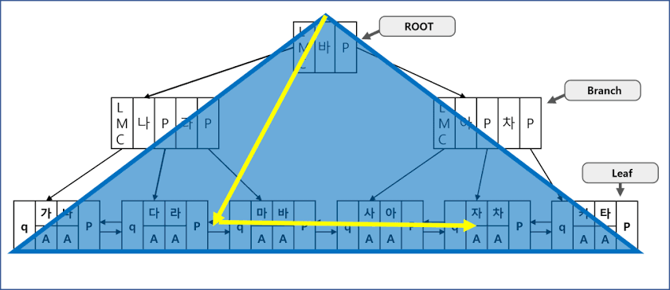

# 15-0. Table Full Scan, Index Range Scan에 대해 설명해 주세요.

# 1. Table Full Scan (테이블 풀 스캔)

1. Table Full Scan이란?

> Note 테이블에 할당된 모든 블록을 처음부터 끝까지 순차적으로 읽어들여 조건에 맞는 데이터를 찾는 방식

1. 작동 원리

> Note 

  - 디스크에서 데이터를 읽을 때, 한 번의 I/O 요청으로 여러 개의 블록을 한꺼번에 메모리로 가져오는 Multiblock I/O 방식을 사용합니다.

  - 테이블에 데이터가 입력된 적이 있는 최고 수위선(HWM, High Water Mark)까지만 스캔을 진행합니다.

1. 장단점

> Note 

  - 장점

조건에 맞는 데이터가 테이블 전체 데이터의 상당 부분을 차지할 때, 인덱스를 거쳐 테이블에 접근하는 것보다 I/O 비용이 적게 들어 오히려 빠릅니다. 인덱스 구조를 참조하지 않으므로 부가적인 오버헤드도 없습니다.

  - 단점

대용량 테이블에서 극히 적은 수의 데이터를 찾고자 할 때도 전체 테이블을 스캔해야 하므로, 불필요한 시스템 자원 낭비와 심각한 성능 저하를 유발합니다.

---

# 2. Index Range Scan (인덱스 레인지 스캔)

1. Index Range Scan이란?

> Note B+Tree 인덱스 구조를 이용하여 특정 범위의 데이터만 빠르게 찾아내는 방식

1. 작동 원리

> Note 

  - 트리의 루트(Root) 블록에서 시작하여 브랜치(Branch) 블록을 거쳐, 원하는 데이터의 시작점이 있는 리프(Leaf) 블록을 수직적으로 먼저 찾습니다.

  - 그 후 조건을 만족하는 범위가 끝날 때까지 리프 블록을 수평적으로 스캔합니다.

1. 데이터 추출

> Note 

  - 인덱스에는 실제 데이터가 아닌 데이터의 고유 물리적 주소(Row ID)가 저장되어 있습니다.

  - 따라서 인덱스 스캔 후, 이  데이터의 고유 물리적 주소를 이용해 실제 테이블 블록에 한 건씩 접근하는 랜덤 액세스(Random Access) 과정이 필수적입니다.

  - 이때 한 번에 하나의 블록만 읽어오는 Single Block I/O 방식을 사용합니다.

1. 장단점

> Note 

  - 장점

대용량 테이블에서 소량의 특정 데이터(주로 전체 데이터의 10~15% 미만)를 검색할 때 응답 속도가 매우 뛰어납니다. 리프 블록 자체가 이미 정렬된 상태이므로, 정렬된 결과가 필요할 때 별도의 정렬 작업 비용을 절약할 수 있습니다.

  - 단점

읽어야 할 데이터 양이 많아지면, 인덱스에서 테이블로 찾아가는 랜덤 액세스 횟수가 기하급수적으로 늘어나 오히려 Table Full Scan보다 처리 속도가 크게 떨어지게 됩니다.

---

# 3. 핵심 요약 비교

| **구분** | **Table Full Scan** | **Index Range Scan** |
| --- | --- | --- |
| 탐색 방법 | 테이블 전체를 처음부터 끝까지 순차 스캔 | 인덱스 트리 탐색 후 테이블 랜덤 액세스 |
| I/O 방식 | Multiblock I/O (한 번에 여러 블록 읽음) | Single Block I/O (한 번에 한 블록 읽음) |
| 비용 발생 지점 | 디스크 대량 스캔 비용 | 인덱스를 통한 테이블 랜덤 액세스 비용 |
| 최적 사용처 | 대량의 데이터 조회 (보통 전체의 10~15% 이상) | 소량의 데이터 조회 (보통 전체의 10~15% 미만) |
