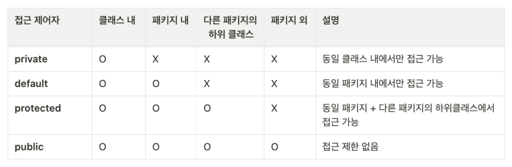

# 4-0. 객체지향 프로그래밍이 무엇인가요

| **용어** | **키워드** |
| --- | --- |
| **객체지향 프로그래밍(OOP)** | 객체, 상태, 행동, 객체 간 상호작용 |
| **객체(Object)** | 상태(필드), 행동(메서드) |
| **클래스(Class)** | 객체를 생성하기 위한 설계도 |
| **캡슐화** | 데이터 + 메서드, 정보 은닉 |
| **상속** | 기존 클래스 재사용·확장 |
| **다형성** | 같은 인터페이스, 다른 구현 |
| **추상화** | 핵심 특성만 표현, 구현 세부사항 숨김 |

## 객체지향 프로그래밍이란?

객체지향 프로그래밍(Object-Oriented Programming, OOP)은 프로그램을 **객체들의 집합으로 구성하고, 객체들이 서로 메시지를 주고받으며 동작하도록 설계하는 프로그래밍 패러다임**입니다.

```java
class Account {
    private int balance;  // 상태

    public void deposit(int amount) {  // 행동
        balance += amount;
    }
}
```

`Account` 객체가 `balance`라는 상태를 가지고, `deposit()`이라는 행동을 수행하는 구조입니다.

---

## 객체(Object)와 클래스(Class)

**클래스**는 객체를 만들기 위한 **설계도**이고, **객체**는 클래스를 기반으로 실제 메모리에 생성된 **인스턴스**입니다.

```java
class Car {
    String model;

    void drive() {
        System.out.println("주행합니다.");
    }
}

Car car = new Car();
```

- `Car` → 클래스

- `car` → 객체(인스턴스)

- `model` → 상태

- `drive()` → 행동

> **클래스는 정의이고, 객체는 그 정의를 기반으로 생성된 실체입니다.**

---

## 객체지향의 4가지 특징

### 1. 캡슐화(Encapsulation)

데이터와 데이터를 처리하는 메서드를 하나의 객체로 묶고, **외부에서 내부 상태에 직접 접근하지 못하도록 제한**하는 것입니다.



```java
private int balance;

public void deposit(int amount) {
    if (amount > 0) {
        balance += amount;
    }
}
```

외부에서 `balance`를 마음대로 변경하지 못하게 하여 **객체 스스로 자신의 상태를 관리**하도록 합니다.

---

### 2. 추상화(Abstraction)

객체의 복잡한 내부 구현은 숨기고 **사용자에게 필요한 핵심적인 기능만 제공**하는 것입니다.

```java
interface Payment {
    void pay(int amount);
}
```

사용자는 `pay()`가 내부적으로 어떻게 결제를 처리하는지 몰라도 사용할 수 있습니다.

---

### 3. 상속(Inheritance)

기존 클래스의 속성과 기능을 다른 클래스가 물려받아 **재사용하거나 확장**하는 것입니다.

```java
class Animal {
    void eat() {}
}

class Dog extends Animal {
    void bark() {}
}
```

`Dog`는 `Animal`의 `eat()`을 사용할 수 있습니다.

다만 실무에서는 무조건 상속을 사용하는 것보다 **강한 결합을 피하기 위해 합성(Composition)을 선호하는 경우도 많습니다.**

---

### 4. 다형성(Polymorphism)

**같은 타입이나 인터페이스를 통해 서로 다른 객체가 각기 다른 동작을 수행할 수 있는 성질**입니다.

```java
interface Payment {
    void pay();
}

class CardPayment implements Payment {
    public void pay() {
        System.out.println("카드 결제");
    }
}

class KakaoPayment implements Payment {
    public void pay() {
        System.out.println("카카오 결제");
    }
}
```

```java
Payment payment = new CardPayment();
payment.pay();
```

`Payment`라는 동일한 타입을 사용하면서 실제 객체에 따라 다른 `pay()`가 실행됩니다.

→ 객체지향에서 **확장성과 유연성을 만드는 핵심 특징**입니다.

---

## 객체지향을 사용하는 이유는?

객체마다 **역할과 책임을 분리**할 수 있기 때문입니다.

예를 들어 주문 시스템을

```plain text
Order
 ├─ Payment
 ├─ Product
 ├─ Member
 └─ Delivery
```

처럼 각각의 객체로 나누면 결제 방식이 변경되더라도 주문 전체 코드를 수정하기보다 **Payment와 관련된 부분을 중심으로 변경**할 수 있습니다.

따라서 객체지향 설계는 일반적으로 다음을 목표로 합니다.

- **유지보수성** 향상

- **확장성** 향상

- **재사용성** 향상

- 객체 간 **결합도는 낮추고 응집도는 높이는 구조**

---

## 절차지향과 객체지향의 차이는?

**절차지향**은 프로그램을 **처리 순서와 함수 중심**으로 바라보고, **객체지향**은 프로그램을 **상태와 행동을 가진 객체와 객체 간 관계 중심**으로 바라봅니다.

```plain text
절차지향
데이터 → 함수 → 함수 → 함수

객체지향
객체 ↔ 객체 ↔ 객체
```

단, **객체지향이 항상 절차지향보다 좋은 것은 아닙니다.**

객체지향은 규모가 커지고 변경이 많은 시스템에서 역할과 책임을 분리하기 좋지만, 작은 프로그램에서는 오히려 구조가 복잡해질 수도 있습니다.

---

## 💬 면접 답변

> 객체지향 프로그래밍은 프로그램을 상태와 행동을 가진 객체들의 상호작용으로 구성하는 프로그래밍 방식입니다. 객체마다 역할과 책임을 분리하고, 캡슐화·추상화·상속·다형성과 같은 특징을 활용합니다. 이를 통해 객체 간 결합도를 낮추고 변경에 유연한 구조를 만들어 유지보수성과 확장성을 높이는 것이 주요 목적입니다.

### 🔥 꼬리질문

**Q. 클래스와 객체의 차이는 무엇인가요?**

→ 클래스는 객체를 생성하기 위한 설계도이고, 객체는 클래스를 기반으로 실제 생성된 인스턴스입니다.

**Q. 객체지향의 4가지 특징은?**

→ **캡슐화, 추상화, 상속, 다형성**입니다.

**Q. 객체지향의 장점은?**

→ 역할과 책임을 객체 단위로 분리하여 **유지보수성, 재사용성, 확장성**을 높일 수 있습니다.

**Q. 객체지향 설계를 잘한다는 것은?**

→ 단순히 클래스를 많이 만드는 것이 아니라 **각 객체의 책임을 적절히 분리하고 객체 간 의존성을 최소화하는 것**이라고 볼 수 있습니다.

**Q. 좋은 객체지향 설계를 위한 대표적인 원칙은?**

→ 바로 다음에 정리한 **SOLID 원칙**입니다.
